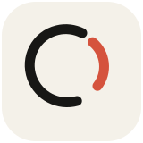
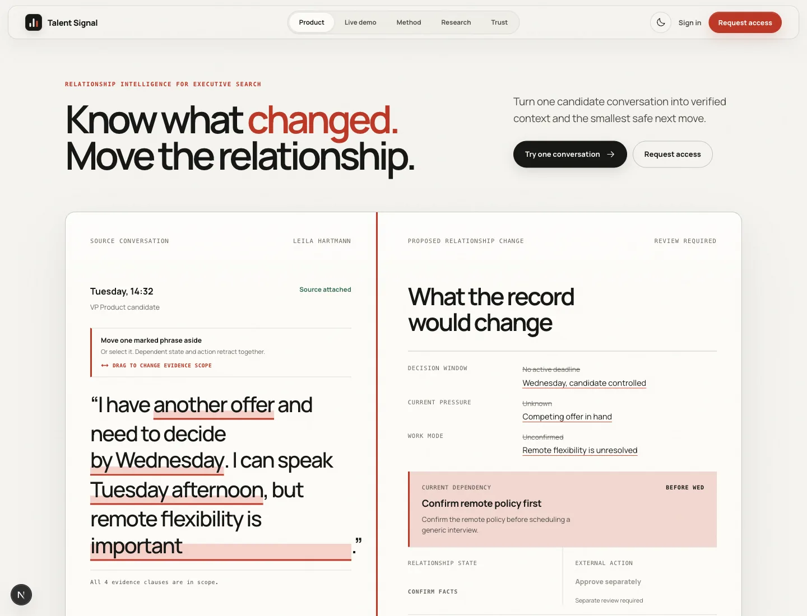
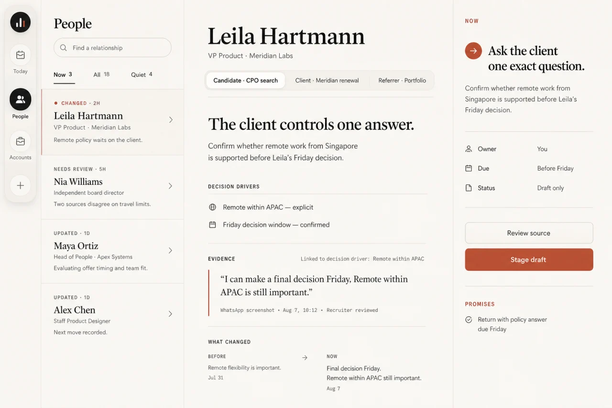
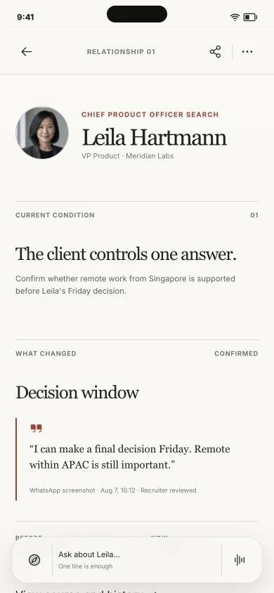

<div align="center">



# Talent Signal

**Evidence-first relationship intelligence for independent recruiters.**

Capture a meaningful conversation. Review exactly what changed. Decide the
next action. Carry verified context forward.

[Explore the product](https://gettalentsignal.com) ·
[Open the 60-second demo](https://gettalentsignal.com/demo) ·
[See the product loop](#the-product-loop) ·
[Run it locally](#quick-start)

[Trust contract](#trust-is-product-behavior) ·
[Implementation status](#what-exists-today) ·
[Architecture](#system-architecture) ·
[Contributing](#contributing)

[](https://github.com/getyak/talent-signal/actions/workflows/ci.yml)
[](https://github.com/getyak/talent-signal/actions/workflows/security.yml)

<a href="https://gettalentsignal.com" aria-label="Explore the Talent Signal product">
  <picture>
    <source media="(prefers-color-scheme: dark)" srcset="docs/readme/home-dark.webp">
    
  </picture>
</a>

<sub>Real product surface · synthetic people and conversations · no private
candidate data · understanding never grants execution authority</sub>

</div>

---

## Never lose a strong candidate between conversations

Independent recruiters build momentum through details that rarely fit neatly
inside an ATS: a changed priority, an unspoken dependency, a promised follow-up,
or the exact reason timing matters.

Talent Signal turns recruiter-controlled conversation evidence into:

- reviewable facts, ambiguity, and change;
- one current relationship dependency;
- one smallest useful next step—or an intentional `no_action`;
- durable context that remains traceable to its source.

It is not an ATS replacement, a generic CRM, a candidate-ranking engine, or an
autonomous recruiter. It exists to reduce context reconstruction without
replacing relationship judgment.

> [!IMPORTANT]
> Talent Signal is an early product foundation and governed reference
> implementation. It is not yet a production candidate-data system. The
> repository demonstrates the product language, review states, safety
> boundaries, and a cross-platform evidence-to-action loop using synthetic
> fixtures.

### From buried context to a governed decision

> **Before:** “I think she mentioned a deadline and another offer somewhere in
> our last conversation.”
>
> **After:** “Decision window: Wednesday · Current pressure: competing offer” —
> proposed from exact source evidence, reviewed one fact at a time, and still
> unable to authorize an external action.

## One relationship, continuous by design

The desktop is a quiet relationship desk, not another pipeline. The phone keeps
the same evidence, current dependency, and approved next step close to the
conversation—without compressing the person into a score.

<table>
  <tr>
    <td width="72%">
      <a href="apps/web/public/marketing/signal-journey/web-relationship-output.webp">
        
      </a>
    </td>
    <td width="28%">
      <a href="apps/web/public/marketing/signal-journey/iphone-relationship-output.webp">
        
      </a>
    </td>
  </tr>
  <tr>
    <td><sub><strong>Living Desk</strong> · relationships ordered by deserved attention, with evidence one gesture away</sub></td>
    <td><sub><strong>In the conversation</strong> · continuity without a miniature CRM</sub></td>
  </tr>
</table>

<sub>Concept surfaces use synthetic fixtures. Click either image to inspect it
at full resolution.</sub>

<details>
<summary><strong>Try the trust boundary in 60 seconds</strong> — exact evidence, independent fact decisions, and an intentional <code>no_action</code></summary>

<br>

1. [Open the deterministic evidence review](https://gettalentsignal.com/demo).
2. Use the included synthetic conversation—no account or candidate data is
   required.
3. Inspect the exact source attached to each proposed fact.
4. Confirm, edit, or dismiss facts independently.
5. Verify that fact confirmation still does not approve an external action.
6. Change the note to produce insufficient evidence or `no_action`, then reset
   the demo without persisting the text.

</details>

## The product loop

```text
intentional capture
→ inspectable evidence
→ proposed understanding
→ recruiter confirmation
→ one approved action or no_action
→ observed outcome
→ relationship continuity
```

[](docs/talent-signal-product-architecture.png)

The solid route is the V1 contract. Dashed surfaces are later extensions.
The editable source lives in
[`talent-signal-product-architecture.excalidraw`](docs/talent-signal-product-architecture.excalidraw).

### Capture in flow

Start from an intentional screenshot, share sheet, paste, or upload—where the
recruiter already works. Every surface enters one governed capture inbox.

### Separate evidence from interpretation

The system keeps exact evidence, proposed state, confirmed state, action intent,
and observed outcome distinct. Weak evidence becomes clarification or
`no_action`, never silent certainty.

### Put the human at consequence

Fact confirmation and action approval are independent decisions. Every
write-capable action previews the target, before-and-after value, timing, and
impact before execution.

### Carry forward only what earned trust

Confirmed facts and verified outcomes become relationship memory. Living pages,
timelines, and briefs are rebuildable views over that state—not new sources of
truth.

## Trust is product behavior

| Boundary | Product guarantee |
| --- | --- |
| Evidence | Every consequential claim can resolve to its source, speaker, time, purpose, and scope. |
| Understanding | Proposed, ambiguous, edited, confirmed, dismissed, expired, and superseded states remain distinct. |
| Action | A model may propose an action; only a current, exact human approval can authorize its effect. |
| Outcome | A connector call is not success. The destination must be observed or the result remains explicitly unknown. |
| Memory | Pages, summaries, embeddings, and Agent memory are derived and rebuildable. They cannot confirm themselves or grant permission. |
| Human dignity | The system ranks work attention, never a person's worth, personality, protected traits, culture fit, or acceptance probability. |
| Recovery | Retry, reconciliation, reversal, retention, and derivative deletion are part of the normal contract. |

Read the canonical [product principles](docs/principles.md),
[capture-to-action contract](docs/capture-to-action.md), and
[integration boundaries](docs/integrations.md).

## What exists today

Talent Signal is strongest today as a governed, production-shaped reference
implementation. The core authority boundaries are executable; production data,
real connector writes, and a general open-ended Agent runtime are not yet
claimed.

| Area | Executable today | Current boundary |
| --- | --- | --- |
| Web | Product narrative, deterministic evidence demo, authenticated relationship workspace and People directory, plus gated Ark/OpenRouter screenshot analysis with review receipts. | The configured-provider, multi-channel flow still needs fresh end-to-end proof through review, commit, and workspace readback. |
| Shared backend | Fastify and PostgreSQL authority core for captures, evidence, identity review, temporal facts, Wiki compilation, context manifests, action approval, audit, retention, deletion, and recovery workers. | It is a local shared backend, not a deployed production candidate-data service. |
| iOS | SwiftUI screenshot import, on-device text review, identity comparison and relationship binding, Wiki receipt, the synthetic momentum loop, and app-owned events with optional one-way Apple Calendar sync. | The image remains device-owned; Calendar is write-only and device-local in this slice, while ATS, CRM, and messaging writes are not implemented. |
| Browser capture | Manifest V3 screenshot or selected-text review, redaction, idempotent localhost handoff, retry, and receipt reconciliation. | Fixture and package behavior are verified; the real toolbar gesture and cross-surface backend journey still need final integration proof. |
| Contracts | Versioned TypeBox schemas and an HTTP client cover the shared authority API. | [`packages/domain/`](packages/domain/) remains a placeholder until native and API domain shapes stabilize. |
| Agent system | The governed continuity loop, immutable Wiki/context compilation, specialized recoverable public research, and derived relationship Agent history are executable. | The generic Definition/Task/Run/Event/Checkpoint runner is designed but not implemented. |
| Project knowledge | Checked canonical docs, editable architecture diagrams, a compiled Wiki workflow, dated evaluations, and pre-push enforcement. | Evaluation artifacts demonstrate synthetic and local behavior, not field value or production readiness. |

<details>
<summary><strong>Engineering deep dive: implemented Agent Loop versus proposed runtime</strong> — inspect what is executable, simulated, designed, or absent</summary>

<br>

Two different mechanisms are easy to call the “Agent Loop.” Their maturity is
not the same.

| Layer | Status | What the code proves |
| --- | --- | --- |
| Governed continuity workflow | Implemented | Capture, exact evidence, model or fixture proposal, independent fact decision, confirmed temporal state, action proposal, exact approval, effect attempt, destination observation, and outcome remain separate, idempotent records. |
| Context and memory | Implemented | A gold relationship Wiki snapshot is compiled from governed state; each Chat task pins a bounded Context Manifest with inclusion reasons and evidence dependencies. |
| Bounded public research | Implemented as a specialized worker | One recruiter-approved domain and page budget can be retrieved with SSRF controls, leases, partial results, retry, restart recovery, provenance, freshness, and deletion lineage. |
| Relationship Agent history | Implemented as a derived view | Durable domain audit events are projected into person-and-relationship operation receipts and unresolved-effect follow-ups. This is not a Run event store. |
| External-effect boundary | Implemented as a local deterministic simulation | Current facts, exact preview digest, short-lived human approval, capability grant, idempotent attempt, readback, reconciliation, and explicit `unknown` are enforced. No production connector is implied. |
| Open-ended Agent runner | Designed only | Versioned Agent Definitions, immutable Tasks and Runs, append-only typed Run events, reducer, checkpoints, first-class artifacts, general budgets, cancellation, stop reasons, and a capability registry are still missing. |
| External Agent access | Not implemented | Codex, Claude, Manus, OpenClaw, n8n, or another client does not yet receive a production scoped Agent protocol. |

The executable core currently follows this path:

```text
capture
→ exact evidence
→ proposal
→ recruiter fact decision
→ confirmed temporal state
→ gold Wiki snapshot + Context Manifest
→ action proposal
→ exact human approval
→ local deterministic effect attempt
→ destination readback or explicit unknown
→ observed outcome and durable relationship history
```

The existing Chat endpoint is therefore a deterministic context compiler, not
an iterative LLM runner. Public research supplies the closest reusable worker
primitive, but it remains a task-specific workflow rather than a shared Agent
kernel.

| Agent-loop concern | Executable owner |
| --- | --- |
| Proposal validation | [`apps/backend/src/modules/proposals.ts`](apps/backend/src/modules/proposals.ts) |
| Fact authority | [`apps/backend/src/modules/decisions.ts`](apps/backend/src/modules/decisions.ts) |
| Knowledge compilation and bounded Chat context | [`apps/backend/src/modules/wiki.ts`](apps/backend/src/modules/wiki.ts) and [`apps/backend/src/modules/chat.ts`](apps/backend/src/modules/chat.ts) |
| Recoverable public research | [`apps/backend/src/modules/research.ts`](apps/backend/src/modules/research.ts) |
| Approval, attempt, observation, and reconciliation | [`apps/backend/src/modules/actions.ts`](apps/backend/src/modules/actions.ts) |
| Derived relationship operation history | [`apps/backend/src/modules/agentHistory.ts`](apps/backend/src/modules/agentHistory.ts) |

Read the stable boundaries in [Agent system](docs/agent-system.md), the
code-to-design gap in the [Agent module blueprint](docs/research/talent-signal-agent-module-blueprint.md),
and the pending milestones in the [Agent foundation plan](plans/2026-08-07-agent-module-foundation.md).

</details>

### What you can verify today

| Claim | Observable proof |
| --- | --- |
| Proposed facts stay attached to exact evidence | Open any fact in the [synthetic review](https://gettalentsignal.com/demo) and inspect its source text. |
| Understanding and execution authority are separate | Complete fact review; the exact external effect still requires its own decision. |
| Uncertainty is a supported result | Run the public demo with insufficient evidence, then inspect the deterministic [`no_action`](apps/web/lib/candidateMomentum.test.ts) and [ambiguity](apps/web/lib/ai-evidence.test.ts) contracts. |
| Failure does not masquerade as success | Inspect the executable [stale, retry, and outcome-state contract](apps/web/lib/integrationState.test.ts) and its screenshot evidence under [`docs/evaluations/`](docs/evaluations/). |
| The same contract crosses surfaces | Compare the deterministic [Web tests](apps/web/lib/) with the native [iOS capture and review tests](apps/ios/Tests/). |

See [Delivery](docs/delivery.md) for the evidence-gated sequence from the current
foundation to a production relationship system.

## Quick start

### Web

Requirements:

- Node.js 22.19.0 or newer;
- pnpm 11.18.0.

```bash
pnpm install --frozen-lockfile
pnpm dev
```

Open [http://localhost:3000](http://localhost:3000).

- `/` — product narrative and interactive candidate library;
- `/demo` — deterministic evidence extraction and review states;
- `/login` — optional configured authentication;
- `/workspace` — authenticated sample living page and candidate library.

The local demo processes its deterministic flow in the browser and does not
persist conversation text. Optional server-side AI review is disabled unless
explicitly configured; see the [Web guide](apps/web/README.md).

### iOS

Requirements:

- Xcode 26 or newer;
- XcodeGen 2.45 or newer.

```bash
pnpm ios:generate
open apps/ios/TalentSignal.xcodeproj
```

Select the `TalentSignal` scheme and an iOS 16+ simulator. See the
[iOS guide](apps/ios/README.md) for signing and TestFlight boundaries.

### Verify the repository

```bash
pnpm check
pnpm ios:check
```

`pnpm check` validates documentation, the compiled Wiki, lint, types, tests,
and the production Web build. `pnpm ios:check` regenerates the project, builds
without signing, boots an available simulator, and runs the iOS tests.

## System architecture

Talent Signal uses one governed relationship state across mobile capture,
desktop review, future channels, and external Agents.

[](docs/talent-signal-system-architecture.png)

Read the diagram from top to bottom:

1. **Client surfaces** capture intent and display governed state; they do not
   own candidate truth.
2. **Trust and API boundary** binds identity, assignment scope, request
   lifecycle, and private payload handling.
3. **Deterministic runtime** compiles evidence, resolves context, drafts a
   proposal, waits for approval, and guards execution.
4. **Data and memory plane** separates source evidence, temporal relationship
   state, audit, outcomes, and rebuildable Wiki projections.
5. **External adapters** remain replaceable and least-privileged; only the
   connector executor may cross the write boundary.

The editable source lives in
[`talent-signal-system-architecture.excalidraw`](docs/talent-signal-system-architecture.excalidraw).
The full rationale is in [Architecture](docs/architecture.md) and
[Agent system](docs/agent-system.md).

## Repository map

| Path | Owns |
| --- | --- |
| [`apps/web/`](apps/web/) | Next.js narrative, sample workspace, and evidence-review demo |
| [`apps/ios/`](apps/ios/) | Native SwiftUI capture, review, and timely briefing |
| [`apps/backend/`](apps/backend/) | Fastify/PostgreSQL shared authority core, recovery workers, and synthetic runtime evaluations |
| [`apps/browser-extension/`](apps/browser-extension/) | Governed browser capture, review, retry, and receipt flow |
| [`apps/chrome-extension/`](apps/chrome-extension/) | Chrome extension packaging and browser-specific integration surface |
| [`packages/contracts/`](packages/contracts/) | Versioned shared API schemas, identity utilities, and typed HTTP client |
| [`packages/domain/`](packages/domain/) | Placeholder for a future stable cross-platform domain package |
| [`plugins/talent-signal/`](plugins/talent-signal/) | Proposal-only Codex skill package and deterministic fixture validation |
| [`brand/`](brand/README.md) | Canonical brand mark, controlled exports, and usage guidance |
| [`docs/`](docs/README.md) | Canonical product, architecture, design, delivery, and operating knowledge |
| [`_index/`](_index/README.md) | Raw sources, notes, drafts, and editable Wiki pages |
| [`.agents/skills/`](.agents/skills/) | Reusable product, safety, design, review, and project methods |
| [`evals/`](evals/) | Synthetic cross-surface behavior and safety cases |
| [`.github/`](.github/) | CI, security, release, and contribution policy |

Start documentation work from the task-routed
[project knowledge map](docs/README.md), not from a full-directory read.

## Knowledge that compounds

Talent Signal treats project knowledge as infrastructure:

- `AGENTS.md` stays small and always-on;
- canonical docs own stable product and architecture judgment;
- `.agents/skills/` owns reusable methods;
- plans preserve resumable state for substantial work;
- code, schemas, tests, and checks own deterministic truth;
- repeated corrections become the narrowest durable prevention, then stale
  guidance is removed.

Raw articles begin in `_index/` and compile into checked, portable Markdown:

```bash
pnpm wiki:build
pnpm wiki:test
pnpm wiki:check
pnpm hooks:install
```

See the [Wiki authoring workflow](docs/wiki-workflow.md).

## Contributing

Contributions are most valuable when they improve one complete
evidence-to-outcome slice:

- evidence correctness and ambiguity handling;
- recruiter correction and control;
- safe action preview, approval, observation, and recovery;
- relationship continuity across Web and iOS;
- privacy, deletion, accessibility, and deterministic verification.

Before opening a pull request:

```bash
pnpm install --frozen-lockfile
pnpm wiki:build
pnpm wiki:test
pnpm check
```

For iOS changes, also run `pnpm ios:check`.

Read [Contributing](CONTRIBUTING.md), [Security](SECURITY.md), and the
[review standard](REVIEW.md). Use synthetic data only—never commit private
candidate conversations, credentials, certificates, or production records.

---

<div align="center">

**Signals, not scores. Evidence, not theater. Momentum, with the recruiter in control.**

[Star Talent Signal](https://github.com/getyak/talent-signal) ·
[Open an issue](https://github.com/getyak/talent-signal/issues/new/choose) ·
[Review the roadmap](docs/delivery.md)

</div>
