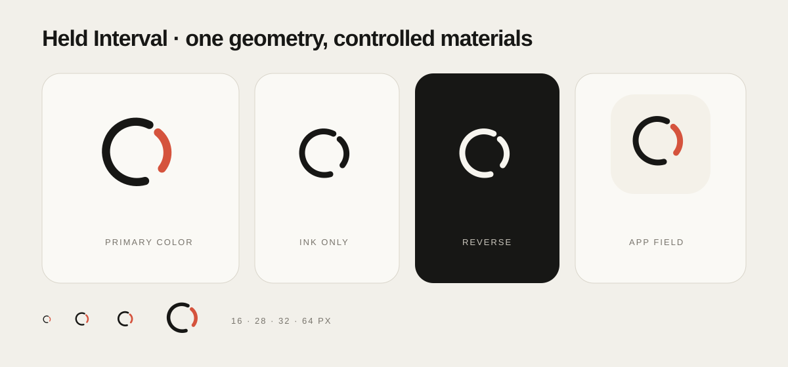

# Talent Signal brand

## Held Interval

The Talent Signal mark protects the living interval between people while
making one consequential change visible.

- The **ink stroke** holds the relationship field without reducing a person to
  a profile or score.
- The **vermilion stroke** is the signal: a change that deserves evidence,
  review, and a deliberate response.
- The **open intervals** preserve human authority. The system can surface and
  connect evidence; it does not silently close the decision.

This is one geometry with controlled material treatments, not a family of
interchangeable logo ideas.

## Approved assets

| Need | Asset | Use |
| --- | --- | --- |
| Default symbol | [`svg/talent-signal-symbol-color.svg`](svg/talent-signal-symbol-color.svg) | Light or warm neutral surfaces |
| One-color reproduction | [`svg/talent-signal-symbol-ink.svg`](svg/talent-signal-symbol-ink.svg) | Engraving, stamps, monochrome print |
| Dark surface | [`svg/talent-signal-symbol-reverse.svg`](svg/talent-signal-symbol-reverse.svg) | Dark fields when the vermilion distinction cannot be preserved |
| Application icon | [`svg/talent-signal-app-icon.svg`](svg/talent-signal-app-icon.svg) | App stores and large square icon sources |
| Repository header | [`svg/talent-signal-readme-mark.svg`](svg/talent-signal-readme-mark.svg) | Small, theme-safe documentation display |
| Raster exports | [`png/`](png/) | Fixed-size integrations that cannot use SVG |

Prefer SVG whenever the destination supports it. Raster exports cover the
practical 16–1024 pixel range and are enumerated in
[`assets.json`](assets.json).

## Color

| Role | Value | Meaning |
| --- | --- | --- |
| Ink | `#171715` | Relationship field and primary structure |
| Signal vermilion | `#d5533d` | Consequential, reviewable change |
| Warm paper | `#f4f1e9` | App-icon field and quiet neutral support |
| Reverse | `#f7f5ef` | Monochrome mark on dark fields |

Product surfaces may use their existing accessible light- and dark-theme
vermilion tokens. Do not recolor the ink stroke while leaving the signal stroke
arbitrary: their relationship carries the meaning.

## Space and scale

- Preserve clear space equal to at least one stroke width around the visible
  geometry.
- Use the primary symbol at 16 pixels or larger.
- Use the color distinction at 24 pixels or larger when the display and export
  pipeline can preserve it.
- Keep both open intervals visible. Never close, rotate, crop, or redraw the
  strokes to fit a container.
- Pair the symbol with the product name in live text. Do not stretch the symbol
  into a horizontal lockup.

## Runtime integration

| Surface | Implementation |
| --- | --- |
| Web navigation and workspace | [`apps/web/components/brand-mark.tsx`](../apps/web/components/brand-mark.tsx) |
| Web favicon | [`apps/web/app/icon.tsx`](../apps/web/app/icon.tsx) |
| Browser extension | [`apps/browser-extension/load-unpacked/`](../apps/browser-extension/load-unpacked/) |
| iOS application icon | [`apps/ios/Resources/Assets.xcassets/AppIcon.appiconset/`](../apps/ios/Resources/Assets.xcassets/AppIcon.appiconset/) |

Run `pnpm brand:check` after changing any canonical or runtime asset. The check
verifies the approved paths, raster dimensions, runtime geometry, and iOS
source parity.

## Do not

- add a dark technology badge behind the navigation mark;
- turn the strokes into bars, a chart, a target, a loading ring, or a `TS`
  monogram;
- add gradients, glow, shadow, or decorative motion;
- use vermilion as a confidence, ranking, or candidate-quality signal;
- create campaign variants without a new structural comparison against the
  product truth.

The selection evidence, rejected direction, before-and-after renders, and
reconsideration signal are retained in the dated
[brand mark evaluation](../docs/evaluations/2026-08-07-brand-mark-redesign/README.md).
