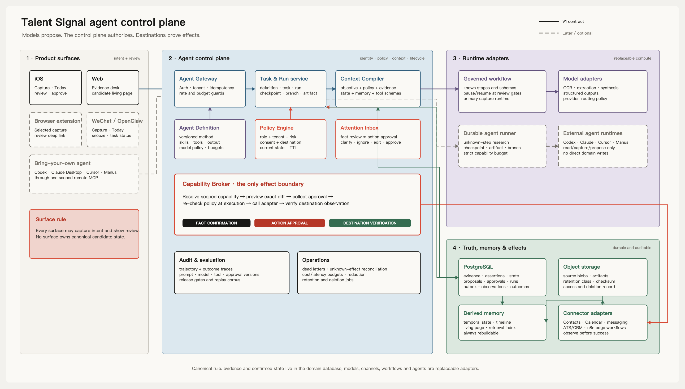
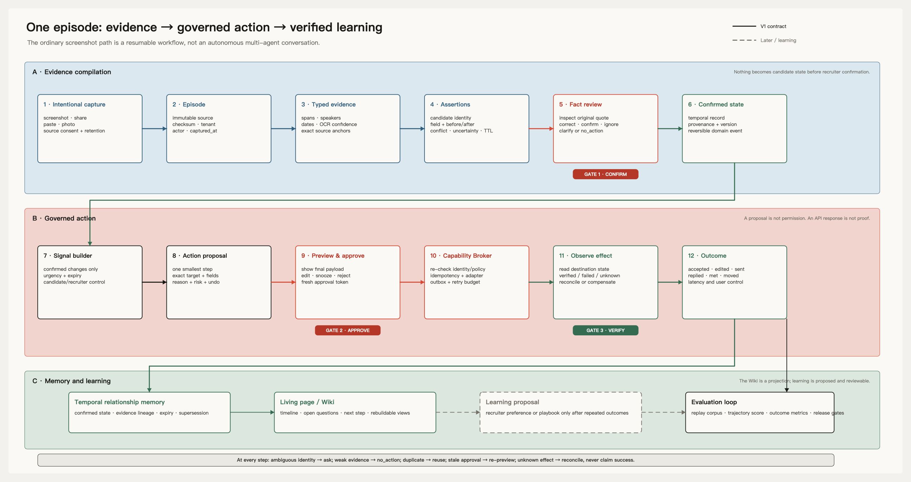

# Agent system

## Purpose

Talent Signal uses agents to extend human judgment, not replace ownership of
relationship truth or consequential action.

The system is:

> an evidence compiler, temporal relationship memory, and governed action
> control plane, with open-ended agents attached only where flexibility creates
> measurable value.

## Architecture



The editable source is
[`talent-signal-agent-control-plane.excalidraw`](talent-signal-agent-control-plane.excalidraw).

The control plane separates four concerns:

- method: reusable Skills and policies;
- context: authorized evidence and current state;
- runtime: the process performing the work;
- effect: a governed capability with independent verification.

This separation allows models, agent providers, and channels to change without
changing product truth or authorization.

## Two runtime classes

### Governed workflow

Use a governed workflow when the stages, review points, and outcome checks are
known.

The capture-to-action loop belongs here because identity, time, evidence,
permission, and recovery are consequential. A workflow may call several
models, but deterministic state decides what happens next.

### Open-ended agent task

Use an open-ended agent when the sources or number of steps cannot be known in
advance and partial artifacts remain useful.

Good uses include:

- company and market research;
- meeting preparation;
- contradiction investigation;
- client-update or interview-question drafts;
- repository and product work.

An open-ended agent may produce an artifact or proposal. It cannot confirm a
fact, merge identity, or execute a consequential action.

## Governed loop



The editable source is
[`talent-signal-agent-runtime-flow.excalidraw`](talent-signal-agent-runtime-flow.excalidraw).

Every run follows the same conceptual discipline:

1. authorize one immutable objective, Pursuit or subject scope, and budget;
2. compile the smallest relevant context;
3. choose or revise a short plan;
4. request one bounded read, artifact, clarification, proposal, or stop;
5. validate the request outside the model;
6. record the observation and checkpoint;
7. continue, wait for a decision, or stop.

The runtime stops when the outcome is complete, a human decision is required,
authority changes, the budget ends, repeated failure exceeds policy, or the
task is cancelled.

## Agent control plane

The control plane needs durable concepts, regardless of implementation:

### Definition

A versioned description of one recognizable job: its method, eligible
capabilities, context policy, output expectations, and stop conditions.

### Task

One user-authorized objective with subject scope, purpose, time horizon,
retention, and budget.

### Run

One attempt against one immutable task version. It may run, wait, resume,
branch, finish, fail, expire, or be cancelled.

### Checkpoint

A restorable boundary containing completed progress, current plan, unresolved
questions, observations, artifacts, and remaining budget.

### Artifact

A useful output that can exist without becoming truth: a brief, research
packet, question set, draft, proposed state patch, or proposed playbook.

### Proposal

A request for a fact decision, action decision, or learning decision. A
proposal carries provenance but no authority.

These concepts belong to Talent Signal even when a provider supplies the
underlying session.

## Capability boundary

Capabilities progress through increasing consequence:

| Class | Meaning | Default posture |
| --- | --- | --- |
| Scoped read | Retrieve authorized evidence or state | Automatic within task scope |
| Internal reversible | Create attention or an artifact | Reviewable and undoable |
| Device or external write | Change Contacts, Calendar, ATS, CRM, or communication | Exact-effect approval and verification |
| Prohibited | Judge people, infer protected traits, or expose generic production access | Never available |

The model proposes intent. The control plane determines whether a capability
exists, is in scope, is currently allowed, and can be executed safely.

## Three decisions

The system preserves three independent gates:

1. Fact confirmation: is this understanding supported and correctly scoped?
2. Action approval: should this exact effect happen now?
3. Outcome verification: did the intended destination actually change?

No model result collapses these gates.

## Context engineering

Context is compiled for a task, not concatenated from every available source.

Use this order:

1. immutable platform and safety boundaries;
2. current objective, scope, budget, and completion criteria;
3. eligible capability interfaces;
4. current plan and unresolved questions;
5. relevant confirmed state;
6. clearly labeled interpretations;
7. exact evidence excerpts;
8. prior observations and artifacts.

Every included item should have a reason, version, authorization scope, and
restorable reference. Large observations belong in artifacts, not the active
prompt.

Each run pins a knowledge snapshot and records a context manifest: the task
version, Pursuit and subject scope, included references, inclusion reasons,
authorization scope, and content identity needed to explain or replay what the
Agent could know. The manifest points to governed content rather than copying another unbounded
transcript.

Screenshots, web pages, files, connector results, and generated wiki text remain
untrusted content. They cannot modify policy, permissions, or approval
requirements.

## Memory and Agent Wiki

Do not flatten memory into one page or one retrieval index.

The system distinguishes:

- source memory: what was captured;
- episodic memory: what happened and in what order;
- semantic memory: what is currently understood;
- procedural memory: what action may work in a recurring situation;
- operational memory: how an Agent should perform a task.

New model output enters as a proposal or hypothesis. Confirmed facts and
verified outcomes may update active relationship memory. Repeated corrections
or outcomes may propose a playbook, but learning remains reviewable.

The Agent Wiki is a versioned semantic compilation over governed state. It is a
first-class shared memory product and the primary way people and Agents recover
longitudinal context, not merely a human-facing page.

Wiki pages may be durable, linked, searched, cited, and optimized for Agent
reading while remaining rebuildable after correction, conflict, expiry,
permission change, or deletion. They do not replace the evidence, fact
versions, outcomes, or approved procedures from which they were compiled.

Pages contain addressable knowledge blocks rather than one generated essay.
Material blocks preserve status, time, authorization scope, provenance, and
references. They may combine confirmed understanding, relevant history,
explicit interpretations and conflicts, approved procedures, and
freshness-bounded research without sharing one permission or retention rule.

```text
workspace or subject map
→ compact page summary
→ relevant knowledge blocks
→ supporting fact or event versions
→ exact source evidence when verification requires it
```

The context assembler may combine structured state, Wiki blocks, and exact
evidence. It must not dump the whole Wiki into a prompt or treat vector
similarity alone as sufficient grounding.

Each run reads an immutable knowledge snapshot, whether exposed through a
service or an Agent-readable file bundle. A provider session, compacted chat,
or sandbox is working state, not long-term product memory.

Agents write artifacts and proposed knowledge patches against the snapshot.
They do not silently overwrite a page or promote their own summary to fact.
Validation checks identity, provenance, conflict, time, scope, and deletion.
Facts require confirmation, external results require observation, and
procedural learning requires review. Accepted changes update governed state
before compiling a new Wiki version; temporary scratchpads and hypotheses
expire unless preserved as reviewable artifacts.

Identity retrieval applies both source authorization and identity-handle
freshness at use time. An expired handle may supply a masked, account-scoped
candidate for structured human review, but it cannot act as confirmed identity
context for an Agent run. Reconfirmation requires a fresh governed source and a
human binding decision; an Agent may open and explain that review but cannot
extend the deadline or promote the clue itself.

For a handle with current and expired historical owners, the Agent preserves
the service's temporal order and reasons; it may explain and open review but
cannot preselect, collapse records, bind to history, or retry after failure.

## External agents and channels

Codex, Claude, Cursor, Manus, OpenClaw, and future runtimes should connect
through one provider-neutral Talent Signal boundary.

Initial external abilities should remain narrow:

- read a scoped Pursuit brief or evidence excerpt;
- submit intentional capture;
- create an artifact;
- propose a fact or action;
- create or snooze internal attention;
- return a signed review handoff.

External agents should not directly confirm facts, merge identities, send
messages, change calendars or contacts, update an ATS, query the production
database, or obtain a generic browser or shell over candidate data.

Channels such as WeChat are capture and attention surfaces, not tenant
boundaries or systems of record.

## V1 bounded runtime

`@talent-signal/agent` is the provider-neutral runner. Its Claude adapter pins
Claude Agent SDK `0.3.241`, one explicit model, no built-in tools, settings,
plugins, Skills, subagents, or session persistence, and exactly four in-process
capabilities: `read_pursuit`, `read_evidence`, `stage_pursuit_proposal`, and
`record_no_action`. A second permission check rejects every other tool.

The backend freezes one workspace, user, Pursuit revision, Capture, evidence
manifest, objective, and budget. Migration `023_agent_control_plane` stores run,
event, tool-call fingerprints, validated output, usage, and one terminal
receipt without raw tool payload columns. A successful run creates only a
`needs_review` Proposal or durable `no_action`; external effects are
database-constrained to empty. Startup and request-level recovery close
interrupted runs from durable state rather than provider session memory.

## Evaluation

Evaluate layers independently:

- evidence quality and support;
- identity and temporal-state correctness;
- proposal usefulness and `no_action` judgment;
- review effort and user control;
- effect correctness, reconciliation, and recovery;
- memory grounding, staleness, and deletion;
- open-ended trajectory, artifact quality, and budget;
- relationship and workflow outcomes.

Evaluate both trajectory and outcome. An agent saying it is finished is not
evidence that the environment is correct.

Release boundaries include:

- every consequential write has specific approval and provenance;
- ambiguous identity, speaker, date, or scope cannot trigger an automatic
  write;
- unsupported or prohibited inference cannot become active state;
- duplicate and unknown-result writes remain safe;
- source deletion reaches every governed derivative.

## V1 proof boundary

The deterministic suite runs six critical cases five times through the real
database control plane. Live Claude trials use the same protocol only when an
explicit credential and pinned model are present; otherwise the artifact says
`not_run_missing_credentials` and `missing_proof`. Neither result authorizes
production rollout, real candidate data, or broader tools.

The rationale for treating the Wiki as an Agent-facing compiled knowledge layer
is recorded in
[ADR 0004](decisions/0004-agent-wiki-knowledge-layer.md).

## Research

The cross-system research and source links live in
[Agent systems research](research/agent-systems.md).

## Reconsider when

Revisit this design when evidence shows that a governed workflow cannot express
the core product, users can safely delegate a broader consequence class, or a
runtime-specific capability creates durable value that a provider-neutral
boundary cannot preserve.
