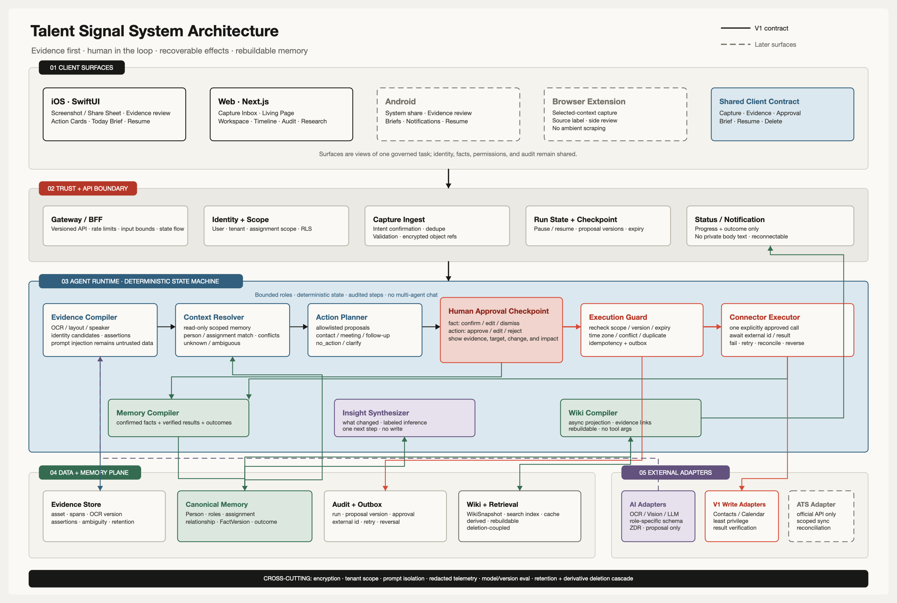
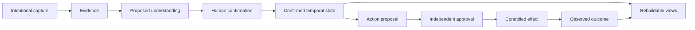

# Architecture

## Purpose

Talent Signal needs one trustworthy Pursuit and relationship state across
mobile capture, desktop review, future channels, and external agents.

The architecture therefore separates:

- where intent enters;
- where evidence and confirmed state live;
- where models reason;
- where humans decide;
- where external effects occur;
- where outcomes are observed.

No client, model, channel, connector, or generated document is the source of
truth.

## System shape

The system has five conceptual layers:

### Surfaces

iOS, Web, browser capture, channels, and external agents provide different
interaction modes. They share identity, evidence, review, and action state
through one backend rather than synchronizing directly with each other.

### Control plane

The control plane governs intent, task lifecycle, authorization, context,
review, approval, and audit. It decides what may proceed; it does not invent
candidate truth.

### Truth, memory, and knowledge

The canonical layer preserves Pursuits, contextual roles, source evidence,
reviewed temporal state, gaps, actions, observations, and outcomes. It retains
provenance and scope so current understanding and target progress can be
reconstructed.

A versioned knowledge projection compiles that governed state into navigable
pages and addressable blocks for both people and Agents. It is a durable
semantic interface, but it cannot confirm its own claims or grant permission.

### Model and agent runtimes

Models perform bounded extraction, comparison, synthesis, or open-ended
research. They are replaceable compute and never own lifecycle or permission.

### Effect boundary

Device and server connectors receive only a reviewed, currently authorized
effect. A connector result becomes an outcome only after the destination can be
observed or the uncertainty is made explicit.

The editable source is
[`talent-signal-system-architecture.excalidraw`](talent-signal-system-architecture.excalidraw).

## Canonical flow

The new source is stored before it is understood, but it does not become active
relationship truth before review.

The import itself, asset identity, capture time, and disclosed retention choice
may be recorded as observed system events. Model-derived person, speaker,
relationship, assignment, fact, motivation, commitment, deadline, or
interpretation remain proposals even when automatically filed into a contact
space. Proposed placement does not widen the source's retrieval scope.
Confidence changes review priority, not authority.

Fact confirmation and action approval remain independent. Rejecting an action
does not erase the evidence that motivated it. Confirming a fact does not grant
permission to act.

### Mobile capture boundary

The iOS image remains device-owned while local recognition produces an editable
draft. Only recruiter-reviewed text, source metadata, and explicitly entered
identity and relationship clues cross into the shared backend. The reviewed
text is a governed source fragment with unknown speaker attribution, not a
lossless replacement for an image that the backend never retained.

Photos selection and App Shortcuts converge on one durable pending-capture
inbox and the same review state machine. Interruption preserves the on-device
draft; retry reuses stable intent keys; neither path can bypass evidence review,
identity review, or relationship selection. Binding compiles a derived Wiki
projection only after the backend returns a person and purpose-scoped
relationship. Leaving identity unresolved is a valid terminal state.

## Truth model

Architecture follows five durable rules.

### Pursuits own outcome context

A Pursuit owns outcome, horizon, milestone, contextual roles, criteria, gaps,
and actions, not a second person or source. Recruiting is the flagship template;
a sales fixture reuses the contract without a parallel domain model.

Pursuit progress derives from evidence-backed gaps and owner-recorded outcomes.
An unknown completion response locks until exact-ID readback; completion is
revisioned, idempotent, effect-free, and never a score.

Roles, criteria, gaps, and actions retain authored canonical display order; a
reviewed Proposal appends after current items and UUIDs never determine order.

### Account access is server-verified

Only the shared backend verifies a platform identity assertion, binds its stable
provider subject, and owns replay, nonce, audience, expiry, revocation, and
account scope. The device stores the protected session; provider identity is
never relationship evidence.

### Identity is stable; roles are contextual

One person may participate in several organizations, assignments, and
relationships. Shared identity does not imply shared visibility or one
permanent role.

Identity repair is a versioned transition, not deletion; a merge keeps a redirect,
records moved contexts and resources, and invalidates projections. It requires a
current preview digest and fails closed on unresolved identity or effects.
Reversal restores only recorded identifiers while no new evidence depends on
them; otherwise it returns to review. Every reopen recomputes current ownership
and dependencies; neither direction widens authorization or changes an external system.

Identity handles and stable record IDs are temporal source-linked clues, never
name-based keys. After expiry they identify a prior owner for review but cannot
bind evidence. A fresh governed source and explicit decision start a new
interval. Raw values stay governed; indexes use a normalized hash and hint.

One normalized handle may have different historical and current owners.
Retrieval puts current ownership and its temporal reason first. A historical
owner receives no fresh evidence; correction restores no expired owner.

The Web projection preserves `current`, `historical`, or `name_only`, never a
match score. Current ownership needs human selection; historical is comparison
only. No selection may create review but cannot bind, confirm, create, or act.

Confirmation snapshots policy version, deadline, basis, and reason. Published
policy is immutable, retirement one-way, intervals non-overlapping, and
successors affect only later confirmation.

### State is temporal

Important values can be proposed, confirmed, contested, expired, or superseded.
Each current field points to its exact latest authority-owning operation; matching
an older value never restores older evidence. State remains explainable by history.

### Evidence is scoped

Every consequential claim preserves source, purpose, authorization, and retention. Retrieval is authorized at use time, not only at storage time.

Chat citation readback binds account, task, manifest, snapshot, person, context, and authorization scope. Every fragment must be active, reviewed,
attribution-confirmed, inspectable, and authorized in that exact scope. The client rechecks before recording, when Ask opens, on foreground return,
and each minute while visible; failure makes the local turn stale. Readback grants no write authority.
Agent Sessions use an account-hashed, protected, backup-excluded device container holding scoped questions and response identity, never answer blocks or excerpts. Drafts expire at seven days and Sessions at thirty through exact-timer, read, and foreground pruning.
In-flight Ask retains its draft and idempotency key; restored answers hide citations until a fresh scoped Ask.
Before source review, the same container stores fragment, expected state, decision, reason, task, and an authority-bound idempotency key, never the excerpt; failed persistence blocks the request.
Pending, failed, outcome-unknown, and applied states survive relaunch and reuse that key. A new authority cycle gets a new key; reinstatement appends a reviewed decision against rejected state.
Sign-out tombstones and verifies deletion. Neither review path makes an old answer current.

Owned-action outcome drafts, operation IDs, and receipts use a separate account-hashed, protected, backup-excluded container with a thirty-day limit.
The operation ID must be durably saved before the canonical POST can begin; otherwise the client fails closed without sending. Relaunch reconciles the
same operation by canonical readback, and sign-out tombstones and verifies deletion of this recovery state before the account session is revoked.

Pursuit roles, gaps, and Proposal items return durable evidence references and
computed authority: `available`, `partial`, `unavailable`, or `not_required`
for explicit user authorship. Availability requires an active reviewed
fragment, confirmed attribution and identity, active capture/resource, and
current authorization. Dependency loss changes authority without rewriting the
reference or pretending user authorship.

Deletion supersedes open Proposals and redacts source-derived narratives, cached
writes, and rationale. Applied state retains value, revision, confirmer, time,
Receipt, and unavailable authority; Today invents no conclusion.

Recoverable typed-signal drafts use a one-way workspace directory component.
iOS verifies canonical workspace readback before opening a payload; a mismatch
reveals no saved text and authorizes no sync.

Raw-asset retention and evidence authorization are separate clocks. Raw purge
does not withdraw reviewed, purpose-scoped evidence. Authorization loss makes
the source and every dependent claim, state, action, Wiki block, and Agent
context unavailable; restoration returns evidence to review, not prior
conclusions or execution authority.

An authorization deadline is enforced when evidence is used, so a delayed
worker never becomes a permission grace period. The durable expiry transition
then records the system actor, retracts derivatives, invalidates Agent context,
and recompiles the relationship projection. A human may renew that scope, but
renewal starts a new review cycle and cannot resurrect prior authority.

Identity freshness is a third independent clock. A source can remain
authorized while its identity clue is no longer current, and a still-fresh
clue cannot be used when its source authorization is unavailable. Both
conditions are enforced at use time. Periodic expiry records the durable
identity lifecycle transition, but a delayed worker never extends matching
authority.

The authorization transition and its recompilation job commit in the same
database transaction. Workers claim jobs with bounded leases and
`FOR UPDATE SKIP LOCKED`; a new process reclaims an expired lease after a crash.
Compilation uses a decision-derived idempotency key, and only the current lease
owner may complete or reschedule a running job. The backend runs an overdue
sweep after startup and on the lifecycle interval. This makes projection
recovery eventually complete across restarts without weakening the independent
use-time authorization boundary.

Authorization loss cannot reverse an effect that already reached an external
system. Relationship projections therefore preserve each affected action,
destination, attempt, observation, and outcome as a separate follow-up record.
Verified completion stays completed; an unobserved result stays unknown. The
projection may rank unresolved delivery first, but it only asks the recruiter
to decide the follow-up and carries no execution authority.

### Views are derived

Today, search, timelines, graphs, insights, and living pages are disposable
projections rebuilt after correction, conflict resolution, or deletion.

Derived does not mean human-facing or operationally unimportant. An Agent Wiki
may be the primary way an Agent navigates longitudinal context, provided every
material claim can resolve to authorized governed state and the projection can
be recompiled without becoming a second source of truth.

## Shared backend decision

Use a managed modular system with one transactional source of truth and a
durable boundary for work that may pause, retry, or wait for review.

Keep raw private assets separate from relationship state. Send identifiers,
not private payloads, through general job and event infrastructure whenever
possible.

Start with the smallest operational shape that preserves auditability,
recovery, and multi-surface consistency. Add specialized databases,
orchestrators, or distributed services only after measured need.

The rationale is recorded in
[ADR 0003](decisions/0003-shared-backend-topology.md).

## Trust boundaries

- Imported and retrieved content is untrusted data, never policy.
- Models may propose understanding or action but cannot grant themselves
  authority.
- Consequential writes require an exact, current user decision.
- Unknown external results remain unknown until reconciled.
- Cross-context identity does not widen evidence access.
- Source deletion propagates through every registered derivative.
- Candidate quality, personality, protected traits, culture fit, and acceptance probability are outside the inference boundary.

## Failure philosophy

The safe response to uncertainty is visible incompleteness:

- ambiguous identity becomes a question;
- weak evidence becomes `no_action` or review;
- stale approval becomes a new preview;
- duplicate intent reuses prior state;
- partial execution becomes reconciliation;
- missing destination proof never becomes optimistic success.

Recovery is part of the ordinary product, not an operational exception.

## Product architecture

The product view shows how capture, Agent drafting, recruiter confirmation, and
relationship continuity fit together. The editable source is
[`talent-signal-product-architecture.excalidraw`](talent-signal-product-architecture.excalidraw).

Solid paths represent the current contract. Dashed paths are evidence-gated
extensions.

The dated diagram reviews are stored in:

- [Architecture panel](evaluations/architecture-diagrams-panel-2026-08-04.json)
- [Visual acceptance review](evaluations/architecture-diagrams-visual-review-2026-08-04.md)

## Reconsider when

Revisit this architecture when:

- one source of truth cannot meet observed reliability or scale needs;
- a specialized runtime removes more risk than complexity;
- offline or regional data constraints require a different ownership boundary;
- multi-hop relationship retrieval demonstrates value that simpler projections
  cannot provide;
- connector recovery can no longer be expressed safely through the shared
  effect boundary.

## Related documents

- [Agent system](agent-system.md)
- [ADR 0004: Agent Wiki knowledge layer](decisions/0004-agent-wiki-knowledge-layer.md)
- [Capture to action](capture-to-action.md)
- [Integrations](integrations.md)
- [Delivery](delivery.md)
