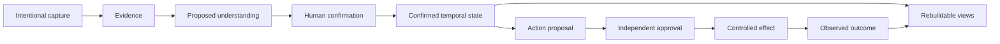

# Architecture

## Purpose

Talent Signal needs one trustworthy relationship state across mobile capture,
desktop review, future channels, and external agents.

The architecture therefore separates:

- where intent enters;
- where evidence and confirmed state live;
- where models reason;
- where humans decide;
- where external effects occur;
- where outcomes are observed.

No client, model, channel, connector, or generated document is the source of
truth.

## System shape

The system has five conceptual layers:

### Surfaces

iOS, Web, browser capture, channels, and external agents provide different
interaction modes. They share identity, evidence, review, and action state
through one backend rather than synchronizing directly with each other.

### Control plane

The control plane governs intent, task lifecycle, authorization, context,
review, approval, and audit. It decides what may proceed; it does not invent
candidate truth.

### Truth, memory, and knowledge

The canonical layer preserves source evidence, reviewed temporal state,
actions, observations, and outcomes. It retains provenance and scope so current
understanding can be reconstructed.

A versioned knowledge projection compiles that governed state into navigable
pages and addressable blocks for both people and Agents. It is a durable
semantic interface, but it cannot confirm its own claims or grant permission.

### Model and agent runtimes

Models perform bounded extraction, comparison, synthesis, or open-ended
research. They are replaceable compute and never own lifecycle or permission.

### Effect boundary

Device and server connectors receive only a reviewed, currently authorized
effect. A connector result becomes an outcome only after the destination can be
observed or the uncertainty is made explicit.

The editable source is
[`talent-signal-system-architecture.excalidraw`](talent-signal-system-architecture.excalidraw).

## Canonical flow

The new source is stored before it is understood, but it does not become active
relationship truth before review.

The import itself, asset identity, capture time, and disclosed retention choice
may be recorded as observed system events. Model-derived person, speaker,
relationship, assignment, fact, motivation, commitment, deadline, or
interpretation remain proposals even when automatically filed into a contact
space. Proposed placement does not widen the source's retrieval scope.
Confidence changes review priority, not authority.

Fact confirmation and action approval remain independent. Rejecting an action
does not erase the evidence that motivated it. Confirming a fact does not grant
permission to act.

### Mobile capture boundary

The iOS image remains device-owned while local recognition produces an editable
draft. Only recruiter-reviewed text, source metadata, and explicitly entered
identity and relationship clues cross into the shared backend. The reviewed
text is a governed source fragment with unknown speaker attribution, not a
lossless replacement for an image that the backend never retained.

Photos selection and App Shortcuts converge on one durable pending-capture
inbox and the same review state machine. Interruption preserves the on-device
draft; retry reuses stable intent keys; neither path can bypass evidence review,
identity review, or relationship selection. Binding compiles a derived Wiki
projection only after the backend returns a person and purpose-scoped
relationship. Leaving identity unresolved is a valid terminal state.

## Truth model

Architecture follows four durable rules.

### Identity is stable; roles are contextual

One person may participate in several organizations, assignments, and
relationships. Shared identity does not imply shared visibility or one
permanent role.

Identity repair is a versioned ownership transition, not deletion or profile
flattening. A merge preserves the source subject as a redirectable merged
identity, reassigns recorded relationship contexts and their governed
resources to an explicitly retained subject, invalidates every affected
knowledge projection, and records the exact moved identifiers. The mutation
requires an optimistic preview digest and fails closed when identity review or
unresolved effects are still active. Reversal restores those recorded
identifiers only while no new evidence depends on a moved context; otherwise it
returns to human review. An applied merge is addressable from durable Agent
history, but every reopen recomputes person status, context ownership, and
post-merge dependencies before proposing reversal. A historical event never
authorizes the mutation. When reversal moves the currently open relationship
back to the source person, the Web scope, URL, and Agent history follow that
restored owner instead of leaving a stale target-person view. Neither direction
widens evidence authorization or changes external systems.

Identity handles are temporal, source-linked clues rather than permanent person
keys. A confirmed email, phone, WeChat ID, source-native ID, or public profile
has its own freshness deadline. At and after that deadline it may identify a
prior owner for human review, but it cannot bind new evidence or act as a
confirmed directory match. A fresh governed source plus an explicit person and
relationship decision starts a new confirmation interval; the system preserves
confirmed, expired, and reconfirmed events instead of rewriting the prior
ownership history. Raw handle values stay in the governed source when needed;
the account-scoped identity index, search response, audit event, and Agent
history use a normalized hash and masked hint.

One normalized handle may therefore have an expired historical owner and a
different current owner. Retrieval ranks the current confirmed owner before
historical owners and carries that temporal reason into the review case; it
must not re-sort candidates by activity, name, or opaque identifier. A fresh
source cannot be bound to a historical owner while another person has current
authority. Correction or deletion retracts only the authority supported by the
affected source and never silently restores an expired owner.

The Web projection preserves this evidence order as typed presentation state:
`current`, `historical`, or `name_only`. The first two are not generic match
scores. A current owner is selectable only after a human action; a historical
owner is comparison-only while any current owner exists. With no explicit
selection, the source may enter a durable identity-review case, but it cannot
create a new person, bind a relationship, confirm a clue, or authorize an
effect. Selecting the current relationship stages source attachment and
changes no canonical state until the governed source operation is submitted.

Every confirmation snapshots the effective freshness-policy version, final
deadline, policy-default or human-override basis, and any override reason on
both the handle and lifecycle event. Published policy content is immutable;
retirement is one-way and successor intervals cannot overlap. A new policy
affects only later confirmation and never recomputes or extends earlier
authority.

### State is temporal

Important values can be proposed, confirmed, contested, expired, or
superseded. Current state must remain explainable from its history.

### Evidence is scoped

Every consequential claim preserves its source, purpose, authorization, and
retention boundary. Retrieval is authorized at use time, not only at storage
time.

Raw-asset retention and evidence authorization are separate clocks. Purging an
original screenshot or file does not by itself withdraw already reviewed,
purpose-scoped evidence. Revoking or expiring evidence authorization makes the
source and every dependent claim, state, action, Wiki block, and Agent context
unavailable; restoring authorization returns evidence to review rather than
restoring prior conclusions or execution authority.

An authorization deadline is enforced when evidence is used, so a delayed
worker never becomes a permission grace period. The durable expiry transition
then records the system actor, retracts derivatives, invalidates Agent context,
and recompiles the relationship projection. A human may renew that scope, but
renewal starts a new review cycle and cannot resurrect prior authority.

Identity freshness is a third independent clock. A source can remain
authorized while its identity clue is no longer current, and a still-fresh
clue cannot be used when its source authorization is unavailable. Both
conditions are enforced at use time. Periodic expiry records the durable
identity lifecycle transition, but a delayed worker never extends matching
authority.

The authorization transition and its recompilation job commit in the same
database transaction. Workers claim jobs with bounded leases and
`FOR UPDATE SKIP LOCKED`; a new process reclaims an expired lease after a crash.
Compilation uses a decision-derived idempotency key, and only the current lease
owner may complete or reschedule a running job. The backend runs an overdue
sweep after startup and on the lifecycle interval. This makes projection
recovery eventually complete across restarts without weakening the independent
use-time authorization boundary.

Authorization loss cannot reverse an effect that already reached an external
system. Relationship projections therefore preserve each affected action,
destination, attempt, observation, and outcome as a separate follow-up record.
Verified completion stays completed; an unobserved result stays unknown. The
projection may rank unresolved delivery first, but it only asks the recruiter
to decide the follow-up and carries no execution authority.

### Views are derived

Today, search, timelines, graphs, insights, and living pages are disposable
projections. They may be rebuilt after correction, conflict resolution, or
deletion.

Derived does not mean human-facing or operationally unimportant. An Agent Wiki
may be the primary way an Agent navigates longitudinal context, provided every
material claim can resolve to authorized governed state and the projection can
be recompiled without becoming a second source of truth.

## Shared backend decision

Use a managed modular system with one transactional source of truth and a
durable boundary for work that may pause, retry, or wait for review.

Keep raw private assets separate from relationship state. Send identifiers,
not private payloads, through general job and event infrastructure whenever
possible.

Start with the smallest operational shape that preserves auditability,
recovery, and multi-surface consistency. Add specialized databases,
orchestrators, or distributed services only after measured need.

The rationale is recorded in
[ADR 0003](decisions/0003-shared-backend-topology.md).

## Trust boundaries

- Imported and retrieved content is untrusted data, never policy.
- Models may propose understanding or action but cannot grant themselves
  authority.
- Consequential writes require an exact, current user decision.
- Unknown external results remain unknown until reconciled.
- Cross-context identity does not widen evidence access.
- Source deletion propagates through every registered derivative.
- Candidate quality, personality, protected traits, culture fit, and acceptance
  probability are outside the system's inference boundary.

## Failure philosophy

The safe response to uncertainty is visible incompleteness:

- ambiguous identity becomes a question;
- weak evidence becomes `no_action` or review;
- stale approval becomes a new preview;
- duplicate intent reuses prior state;
- partial execution becomes reconciliation;
- missing destination proof never becomes optimistic success.

Recovery is part of the ordinary product, not an operational exception.

## Product architecture

The product view shows how capture, Agent drafting, recruiter confirmation, and
relationship continuity fit together. The editable source is
[`talent-signal-product-architecture.excalidraw`](talent-signal-product-architecture.excalidraw).

Solid paths represent the current contract. Dashed paths are evidence-gated
extensions.

The dated diagram reviews are stored in:

- [Architecture panel](evaluations/architecture-diagrams-panel-2026-08-04.json)
- [Visual acceptance review](evaluations/architecture-diagrams-visual-review-2026-08-04.md)

## Reconsider when

Revisit this architecture when:

- one source of truth cannot meet observed reliability or scale needs;
- a specialized runtime removes more risk than complexity;
- offline or regional data constraints require a different ownership boundary;
- multi-hop relationship retrieval demonstrates value that simpler projections
  cannot provide;
- connector recovery can no longer be expressed safely through the shared
  effect boundary.

## Related documents

- [Agent system](agent-system.md)
- [ADR 0004: Agent Wiki knowledge layer](decisions/0004-agent-wiki-knowledge-layer.md)
- [Capture to action](capture-to-action.md)
- [Integrations](integrations.md)
- [Delivery](delivery.md)
