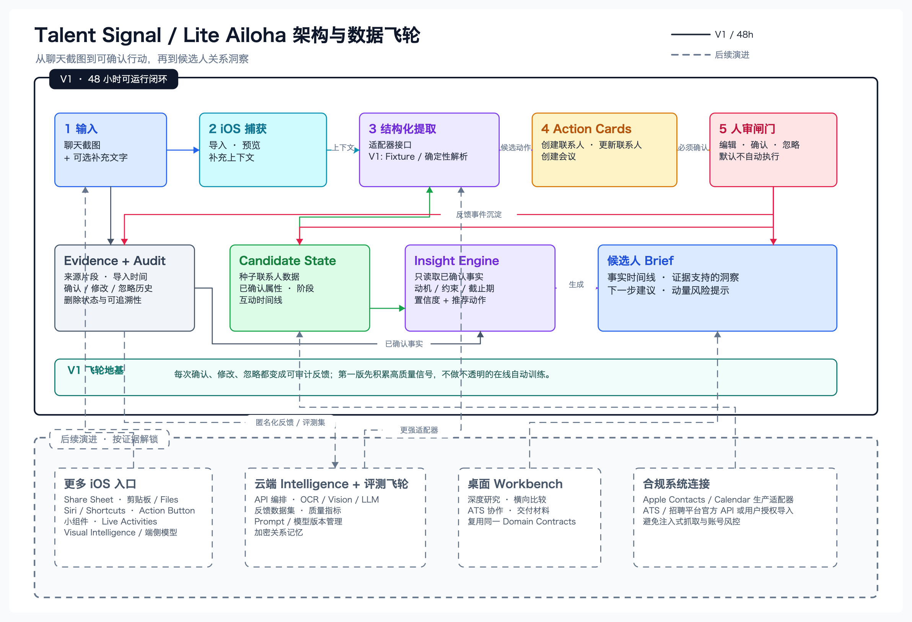
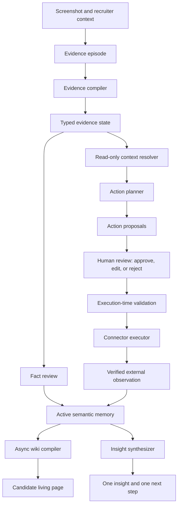

# Architecture decision record

Use a shared, auditable domain model behind an iOS-first client. Keep OCR, LLM, contact, and calendar integrations behind adapters.

The detailed import surfaces, evidence-compilation stages, device-versus-server
capability routing, iOS system integrations, failure contract, and delivery
sequence are defined in
[`import-to-action-technical-design.md`](import-to-action-technical-design.md).

## Architecture diagram



- Solid shapes and connections are the 48-hour V1.
- Dashed shapes and connections are evidence-gated follow-on work.
- The editable source is [`talent-signal-architecture.excalidraw`](talent-signal-architecture.excalidraw).

```text
apps/ios       SwiftUI client, import, card review, candidate brief
apps/web       future desktop workbench
packages/domain Person, Role, AssignmentParticipation, Relationship, Evidence,
                ActionProposal, and Insight contracts
services/api   authentication, orchestration, audit log
services/ai    OCR and structured extraction adapters
```

The first implemented adapter is the opt-in web route at
`apps/web/app/api/analyze/route.ts`. It uses an OpenRouter-compatible structured
output contract, validates exact evidence spans in code, and returns proposals
only. It does not persist candidate text or execute contact/calendar writes.
See [`integrations.md`](integrations.md) for its model and credential boundary.

## Shared backend and deployment decision

The first real multi-surface workflow requires one shared backend. iOS, the
browser/plugin importer, and the web workbench synchronize through that backend
and never directly with one another. Local drafts and caches may remain
device-specific, while submitted evidence, review state, confirmed facts,
actions, outcomes, and audit history have one authorized system of record.

The MVP backend is a managed modular monolith:

- managed PostgreSQL for domain state, versions, authorization, and audit;
- managed object storage for intentionally uploaded screenshots, audio, and
  attachments;
- one shared API for ingestion, review, synchronization, and safe command
  execution;
- a durable database-backed job/outbox boundary for extraction and connectors;
- derived, rebuildable candidate, Today, search, and wiki projections.

Own the application code, schema, cloud project, credentials, retention policy,
and backups. Do not operate a physical server, manually maintained VPS,
Kubernetes cluster, graph database, or separate vector database for the MVP.

The complete topology, client responsibility matrix, data placement rules,
sync protocol, and conditions for later self-hosting are recorded in
[`ADR 0003`](decisions/0003-shared-backend-topology.md).

## Core entities

- `Person`: stable resolved identity shared across authorized contexts. A person
  does not have one permanent product role.
- `OrganizationRole`: a typed, time-bounded, evidence-backed role held by a
  person at an organization, such as founder or product manager.
- `AssignmentParticipation`: a typed, permission-scoped participation in a
  search or assignment, such as candidate, client stakeholder, recruiter, or
  referrer, including stage and contextual state when applicable.
- `Relationship`: a typed, directed when necessary, time-bounded connection
  among people, organizations, roles, and assignments with provenance and
  append-only history.
- `Tag`: a user-controlled discovery and grouping label. It is not an identity,
  identity-resolution signal by default, verified role, or permission grant.
- `Candidate`: the MVP compatibility projection of a `Person` plus a candidate
  `AssignmentParticipation`; it is not a separate human identity.
- `EvidenceEpisode`: one intentional import with source, capture context,
  retention policy, and deletion state.
- `EvidenceSpan`: exact text, speaker, image coordinates, OCR version, and
  recognition metadata.
- `Assertion`: one atomic model proposal with modality, ambiguity, and exact
  evidence references.
- `FactVersion`: one recruiter-confirmed value with valid time, system time,
  and supersession history.
- `ActionProposal`: a proposed contact or calendar mutation with target,
  arguments, evidence, preconditions, expiry, and idempotency key.
- `ActionExecution`: the approved connector invocation and its verified
  external result.
- `WikiSnapshot`: a versioned, rebuildable candidate-page projection compiled
  from active facts, hypotheses, actions, and outcomes.
- `Insight`: one evidence-backed inference, rationale, and smallest useful next
  step.

## Identity and contextual projection decision

Resolve each human to one `Person`, then attach organizational roles,
assignment participations, and relationships as independently versioned
objects. The same person may simultaneously be a founder, product manager,
candidate, client stakeholder, or referrer. Creating a new lens must not create
a duplicate person or overwrite another current role.

Each role, participation, and relationship assertion carries:

- exact evidence references and assertion state;
- valid time and recorded time;
- confirmation actor and current provenance state;
- scope and visibility inherited from the source and assignment;
- supersession or expiry history.

User-created tags remain useful for retrieval and saved views but never become
identity authority. Identity matching must represent `matched`, `unknown`, and
`ambiguous` states explicitly and require review before merging records.

The candidate brief and `WikiSnapshot` remain the MVP's default working
surface. They are assignment-scoped projections compiled from the authorized
person, role, participation, relationship, fact, action, and outcome objects.
Founder, client, or domain-specialist cards may use different projections later
without changing the underlying identity. Projection code must enforce
contextual privacy so that candidate status or job-search evidence does not
appear in another lens merely because the person identity is shared.

## Agent execution and memory boundary

### Decision

The system is neither wiki-first nor action-first internally. It first compiles
the capture into a typed evidence state. The action and memory paths then
consume that state under different permissions.

- Existing confirmed memory may be read before action planning.
- A new capture is persisted immediately as an evidence episode.
- New assertions remain `proposed` or `ambiguous` until reviewed.
- Action cards are rendered from pending `ActionProposal` objects.
- Only a user-approved proposal may reach a write-capable connector.
- Confirmed facts and verified external results update semantic memory.
- Wiki and candidate-page documents are derived projections and never the
  authority for external writes.
- The insight pass runs after review and may use confirmed memory without
  waiting for Markdown or HTML rendering.



### Typed evidence state

The first model boundary returns structured data, not free-form wiki prose. The
state contains:

- source asset and import intent;
- OCR spans, layout, language, and coordinates;
- speaker and identity candidates with ambiguity;
- atomic assertions and their exact evidence spans;
- normalization candidates for dates and values;
- conflicts with current facts;
- zero or more action candidates;
- an explicit `no_action` or `needs_clarification` result when evidence is
  insufficient.

Recruiter-supplied context remains distinguishable from candidate speech:

```text
candidate_quote
recruiter_annotation
system_derived
external_result
```

Tool arguments must be compiled from this typed state and current source-system
data. They must not be extracted from generated wiki paragraphs.

### Separate fact and action decisions

Fact review and action approval have independent semantics.

For example, rejecting a meeting proposal may mean that the recruiter is not
ready to schedule. It does not mean that the candidate's stated availability
was false. Conversely, approving a meeting does not prove a broader inference
about candidate motivation.

The interface may combine both reviews for speed, but the domain layer records
separate decisions and actors.

Fact lifecycle:

```text
extracted
→ needs_review
→ confirmed | dismissed | ambiguous
→ active
→ contested | superseded | expired
```

Action lifecycle:

```text
proposed
→ edited
→ approved | rejected | expired
→ executing
→ succeeded | failed
→ reconciled | reversed
```

A rendered `ActionCard` is a view over `ActionProposal`, not a storage or
execution primitive.

### Runtime roles and privileges

These are privilege boundaries, not a requirement to deploy multiple agents or
models.

| Runtime role | May read | May write |
| --- | --- | --- |
| Evidence compiler | Imported asset and capture context | Proposed spans, assertions, and ambiguity only |
| Context resolver | Scoped contacts, calendar, assignment, and confirmed memory | Match candidates and conflicts only |
| Action planner | Typed evidence state and resolved context | `create_contact`, `update_contact`, `create_meeting`, or `no_action` proposals only |
| Approval gate | Proposal, exact effect, evidence, and current permission | Approval, edit, rejection, and audit events |
| Connector executor | Exact approved arguments and current source-system state | One idempotent connector invocation and its external result |
| Memory compiler | Confirmed facts, action decisions, external results, and outcomes | Versioned semantic claims and rebuildable wiki snapshots |
| Insight synthesizer | Confirmed state, explicit hypotheses, assignment context, and outcomes | One inference and one next step; no external mutation |

The MVP should use a deterministic orchestrator and database state machines.
The same model may serve multiple read-only stages through separate strict
schemas. A general autonomous loop or multi-agent conversation is not required
for the one-screenshot workflow.

### Action proposal contract

Every proposal must be reviewable without relying on hidden model reasoning.

```json
{
  "action_id": "act_123",
  "type": "create_meeting",
  "target": {
    "candidate_id": "cand_42"
  },
  "arguments": {},
  "evidence_refs": ["ev_12", "ev_13"],
  "preconditions": [],
  "conflicts": [],
  "requires_confirmation": true,
  "expires_at": "2026-08-05T12:00:00Z",
  "idempotency_key": "..."
}
```

The review surface must show the target, exact fields or meeting details,
before-and-after values where applicable, evidence, conflicts, and expected
effect. The user may approve, edit, or reject each proposal independently.

### Execution boundary

Approval authorizes one specific proposal version, not a general capability.
Immediately before execution, deterministic code must re-read and validate:

- candidate and assignment authorization;
- connector permission;
- current contact value or duplicate contact state;
- existing meetings and calendar conflicts;
- normalized date, time, timezone, and attendees;
- proposal version and expiry;
- idempotency and prior execution state.

An edited proposal must pass the same validation again. Use an outbox or
equivalent durable job boundary so transient connector failures do not require
rerunning extraction or reasoning. Show success only after the destination
returns a verifiable external identifier or equivalent result.

### Memory and wiki boundary

Persist evidence immediately, but keep unreviewed claims out of active
candidate truth.

| Input | Memory state |
| --- | --- |
| OCR or model extraction before review | `proposed` |
| Insufficient identity, date, or speaker evidence | `ambiguous` |
| Recruiter-confirmed explicit statement | `confirmed` |
| Model interpretation of motivation or risk | `hypothesis` |
| New evidence disagrees with an active fact | `contested` |
| A later fact replaces an earlier value | previous value `superseded` |
| Connector confirms a mutation | `external_result` |
| User rejects an action | `approval_rejected`, not fact rejection |

Wiki snapshots may summarize active facts, open questions, decision drivers,
relationship history, and actions, but every decision-relevant claim must link
back to exact evidence and its version history. Deleting a source must also
invalidate or delete OCR, assertions, embeddings, caches, and compiled
derivatives according to the retention contract.

### Insight boundary

The final output separates:

1. what changed — confirmed facts;
2. what it may mean — a labeled inference;
3. what to do — one concrete next step with a reason and timeframe.

Do not infer candidate quality, personality, protected or sensitive traits,
culture fit, or acceptance probability. A soft preference must not silently
become a hard constraint. Provisional insight generation may run early for
latency, but it must be regenerated or revalidated after user edits and
connector results.

### Required boundary cases

The workflow must have explicit behavior and tests for:

- cropped screenshots and missing dates;
- quoted, forwarded, or group-chat messages;
- speaker-side inversion;
- recruiter commentary mistaken for candidate speech;
- duplicate imports;
- same-name and partially matched candidates;
- relative dates, missing years, and timezone ambiguity;
- availability mistaken for consent to create a meeting;
- conflicting or superseding evidence;
- no actionable signal;
- stale proposals and changed permissions;
- partial approval of multiple proposals;
- connector timeout after an unknown external result;
- safe retry, reconciliation, and reversal where supported;
- prompt injection inside screenshot text;
- source deletion and derivative deletion;
- attempts to infer sensitive or protected attributes.

Screenshot and wiki content are untrusted data. They may inform facts and
recommendations but may never modify system policy, tool availability,
permission rules, or approval requirements.

### Agent-runtime precedents

This boundary follows the durable approval pattern used by leading agent
runtimes:

- [Claude Code memory](https://docs.anthropic.com/en/docs/claude-code/memory)
  keeps project instructions separate from tool permissions.
- [OpenAI Agents SDK human-in-the-loop](https://openai.github.io/openai-agents-python/human_in_the_loop/)
  persists pending tool calls in resumable run state.
- [LangGraph persistence](https://docs.langchain.com/oss/python/langgraph/persistence)
  checkpoints state around inspect, edit, approve, and resume flows.
- [OpenHands action confirmation](https://docs.openhands.dev/sdk/guides/security)
  separates proposed actions from policy-controlled execution.
- [Letta context hierarchy](https://docs.letta.com/guides/core-concepts/memory/context-hierarchy)
  separates always-in-context memory from files, archival memory, and external
  retrieval.

## Safety decisions

- Save source evidence only with explicit consent.
- Record confirmations and edits in an audit trail.
- Do not infer sensitive demographic attributes.
- Delete source evidence and derivative data together on request.
