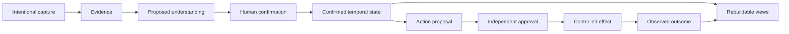

# Architecture

## Purpose

Talent Signal needs one trustworthy relationship state across mobile capture,
desktop review, future channels, and external agents.

The architecture therefore separates:

- where intent enters;
- where evidence and confirmed state live;
- where models reason;
- where humans decide;
- where external effects occur;
- where outcomes are observed.

No client, model, channel, connector, or generated document is the source of
truth.

## System shape

The system has five conceptual layers:

### Surfaces

iOS, Web, browser capture, channels, and external agents provide different
interaction modes. They share identity, evidence, review, and action state
through one backend rather than synchronizing directly with each other.

### Control plane

The control plane governs intent, task lifecycle, authorization, context,
review, approval, and audit. It decides what may proceed; it does not invent
candidate truth.

### Truth, memory, and knowledge

The canonical layer preserves source evidence, reviewed temporal state,
actions, observations, and outcomes. It retains provenance and scope so current
understanding can be reconstructed.

A versioned knowledge projection compiles that governed state into navigable
pages and addressable blocks for both people and Agents. It is a durable
semantic interface, but it cannot confirm its own claims or grant permission.

### Model and agent runtimes

Models perform bounded extraction, comparison, synthesis, or open-ended
research. They are replaceable compute and never own lifecycle or permission.

### Effect boundary

Device and server connectors receive only a reviewed, currently authorized
effect. A connector result becomes an outcome only after the destination can be
observed or the uncertainty is made explicit.

The editable source is
[`talent-signal-system-architecture.excalidraw`](talent-signal-system-architecture.excalidraw).

## Canonical flow

The new source is stored before it is understood, but it does not become active
relationship truth before review.

Fact confirmation and action approval remain independent. Rejecting an action
does not erase the evidence that motivated it. Confirming a fact does not grant
permission to act.

## Truth model

Architecture follows four durable rules.

### Identity is stable; roles are contextual

One person may participate in several organizations, assignments, and
relationships. Shared identity does not imply shared visibility or one
permanent role.

### State is temporal

Important values can be proposed, confirmed, contested, expired, or
superseded. Current state must remain explainable from its history.

### Evidence is scoped

Every consequential claim preserves its source, purpose, authorization, and
retention boundary. Retrieval is authorized at use time, not only at storage
time.

### Views are derived

Today, search, timelines, graphs, insights, and living pages are disposable
projections. They may be rebuilt after correction, conflict resolution, or
deletion.

Derived does not mean human-facing or operationally unimportant. An Agent Wiki
may be the primary way an Agent navigates longitudinal context, provided every
material claim can resolve to authorized governed state and the projection can
be recompiled without becoming a second source of truth.

## Shared backend decision

Use a managed modular system with one transactional source of truth and a
durable boundary for work that may pause, retry, or wait for review.

Keep raw private assets separate from relationship state. Send identifiers,
not private payloads, through general job and event infrastructure whenever
possible.

Start with the smallest operational shape that preserves auditability,
recovery, and multi-surface consistency. Add specialized databases,
orchestrators, or distributed services only after measured need.

The rationale is recorded in
[ADR 0003](decisions/0003-shared-backend-topology.md).

## Trust boundaries

- Imported and retrieved content is untrusted data, never policy.
- Models may propose understanding or action but cannot grant themselves
  authority.
- Consequential writes require an exact, current user decision.
- Unknown external results remain unknown until reconciled.
- Cross-context identity does not widen evidence access.
- Source deletion propagates through every registered derivative.
- Candidate quality, personality, protected traits, culture fit, and acceptance
  probability are outside the system's inference boundary.

## Failure philosophy

The safe response to uncertainty is visible incompleteness:

- ambiguous identity becomes a question;
- weak evidence becomes `no_action` or review;
- stale approval becomes a new preview;
- duplicate intent reuses prior state;
- partial execution becomes reconciliation;
- missing destination proof never becomes optimistic success.

Recovery is part of the ordinary product, not an operational exception.

## Product architecture

The product view shows how capture, Agent drafting, recruiter confirmation, and
relationship continuity fit together. The editable source is
[`talent-signal-product-architecture.excalidraw`](talent-signal-product-architecture.excalidraw).

Solid paths represent the current contract. Dashed paths are evidence-gated
extensions.

The dated diagram reviews are stored in:

- [Architecture panel](evaluations/architecture-diagrams-panel-2026-08-04.json)
- [Visual acceptance review](evaluations/architecture-diagrams-visual-review-2026-08-04.md)

## Reconsider when

Revisit this architecture when:

- one source of truth cannot meet observed reliability or scale needs;
- a specialized runtime removes more risk than complexity;
- offline or regional data constraints require a different ownership boundary;
- multi-hop relationship retrieval demonstrates value that simpler projections
  cannot provide;
- connector recovery can no longer be expressed safely through the shared
  effect boundary.

## Related documents

- [Agent system](agent-system.md)
- [ADR 0004: Agent Wiki knowledge layer](decisions/0004-agent-wiki-knowledge-layer.md)
- [Capture to action](capture-to-action.md)
- [Integrations](integrations.md)
- [Delivery](delivery.md)
