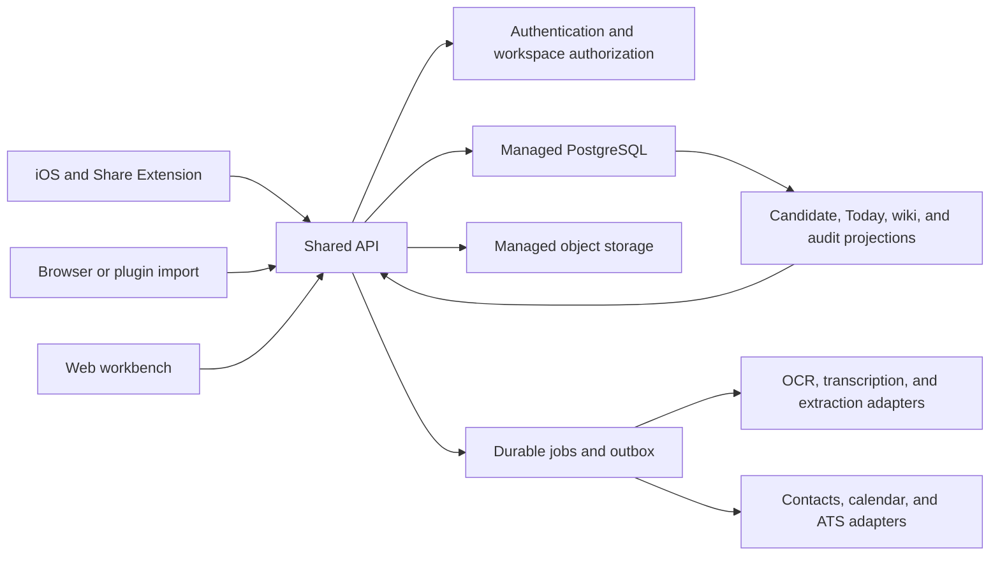

# ADR 0003: Shared backend for multi-surface state

## Status

Accepted for the first production vertical slice.

## Context

Talent Signal has three intentionally different product surfaces:

- iOS and its Share Extension provide fast, intentional screenshot, photo, and
  audio capture plus lightweight review;
- a browser/plugin surface imports selected page or conversation context and
  shows import status;
- the web workbench handles identity resolution, evidence inspection,
  conflicts, longitudinal editing, and deeper candidate review.

These surfaces must not become three separate systems of record. A recruiter
may capture on iOS, finish review on the web, and later see the confirmed state
from a plugin. The same fact or action must not be independently interpreted,
confirmed, or executed by each client.

The current repository is still a prototype boundary: the web demo does not
persist candidate data and the iOS shell uses local seeded state. A shared
backend becomes required when the first cross-device workflow is implemented.

## Decision

Use one shared, account-scoped backend as the authority for submitted evidence,
review state, confirmed facts, action proposals, execution results, and audit
history.

Deploy it as a modular monolith on managed infrastructure. Own the application
code, schema, cloud project, credentials, retention configuration, and backups;
do not operate a physical server, Kubernetes cluster, or manually maintained
VPS for the MVP.

The clients synchronize with the backend, never directly with one another.
They may keep local drafts, upload queues, and caches, but no client-local
database is authoritative after submission.

## Logical topology



This diagram shows logical responsibilities, not required deployment units.
The API, short jobs, and projection builders may initially run in one
application deployment. A separate worker is introduced only when job duration,
retries, throughput, or runtime limits justify it.

## Resource ownership

### PostgreSQL

PostgreSQL is the system of record for:

- users, workspaces, memberships, and authorization scope;
- people, assignments, participations, and relationships;
- evidence episode metadata and retention state;
- evidence spans and their source coordinates or time ranges;
- proposed assertions and recruiter decisions;
- versioned confirmed facts and conflicts;
- action proposals, approvals, executions, and outcomes;
- audit events and rebuildable read-model state.

Use append-only revisions for consequential facts and actions. A current-state
projection may be updated for fast reads, but it must not erase the evidence,
confirmation, supersession, or execution history that produced it.

PostgreSQL is sufficient for the MVP. Do not add a graph database, separate
vector database, or distributed cache until a measured query or scale problem
requires one.

### Object storage

Object storage holds raw binary assets such as screenshots, photos, audio, and
optional document attachments. PostgreSQL stores only metadata and references,
including:

```text
storage_key
content_hash
media_type
byte_size
capture_time
retention_policy
uploaded_by
deleted_at
```

Raw assets are shared logically with authorized surfaces but are not replicated
to every device. Clients request short-lived, authorized access only when a
review screen needs the source.

Uploading a raw asset must be intentional and disclosed. A source deletion or
retention expiry must also remove or invalidate its OCR text, assertions,
embeddings, caches, evaluation copies, and compiled projections according to
the episode's retention contract.

### Derived projections

Candidate briefs, wiki snapshots, Today lists, search indexes, and UI-specific
read models are derived resources. They may be cached and rebuilt, but they are
never the authority for external writes.

An edit made through a wiki or candidate page must compile back into a typed
domain command and a versioned fact or action decision. It must not mutate only
the rendered document.

### Secrets

Model keys, connector credentials, signing secrets, and privileged database
credentials remain server-side in a managed secret store. iOS, plugins, and the
web browser receive only user-scoped session tokens and narrowly authorized
upload or download URLs.

## Surface responsibilities

| Surface | Primary responsibilities | Must not own |
| --- | --- | --- |
| iOS | Intentional capture, crop/redaction, upload queue, lightweight evidence review, Today brief | Canonical candidate state, model keys, connector credentials |
| Browser/plugin | Capture selected content and source context, submit an import, show status, deep-link to review | Independent extraction ontology, direct database writes, silent background collection |
| Web workbench | Identity binding, detailed evidence review, conflict resolution, longitudinal editing, audit and retention controls | A separate candidate database or unreviewed external mutation |
| Backend | Authorization, ingestion, orchestration, versioning, approval gates, audit, deletion, connector execution | Presentation-only state that cannot be rebuilt |

The surface capability may differ, but the meaning of `EvidenceSpan`,
`Assertion`, `FactVersion`, `ActionProposal`, `ActionExecution`, and `Insight`
is shared. Publish one versioned API contract and generate or test the Swift
and TypeScript representations against it.

## Data sharing boundary

| Data class | Cross-surface behavior |
| --- | --- |
| Unsubmitted capture or note | Device-local only |
| Upload progress and retry state | Device-local, with server receipt status |
| Raw screenshot or audio | Server-held only after intentional upload; authorized, on-demand access |
| OCR/transcript and evidence spans | Shared within the authorized workspace and assignment scope |
| Proposed assertions and ambiguity | Shared so review can start on one surface and finish on another |
| Confirmed facts and version history | Fully shared canonical state |
| Action proposals, approval, execution, and outcomes | Fully shared canonical state |
| Wiki, candidate brief, Today list | Shared derived projections |
| UI cache, device permissions, local notification settings | Device-local or user preference data, not domain truth |

Sharing a `Person` identity does not make all evidence globally visible. Reads
must enforce workspace, assignment, relationship, and source scope so that
candidate or job-search evidence does not leak into an unrelated role view.

## Ingestion and review protocol

The first implementation uses a simple asynchronous protocol:

1. The client creates an `EvidenceEpisode` with a client-generated identifier,
   content hash, capture context, intended subject when known, and retention
   choice.
2. The API returns an idempotent receipt and, when needed, a short-lived object
   upload URL.
3. The client uploads the asset and marks the episode ready for processing.
4. A durable job performs OCR/transcription, layout reconstruction, evidence
   extraction, and conflict detection.
5. The backend stores only proposed or ambiguous assertions; it does not place
   them in active candidate truth.
6. Any authorized client may poll or subscribe to the episode status and open
   the same review.
7. A recruiter confirms, edits, dismisses, or marks assertions ambiguous
   against a base version.
8. Confirmed fact revisions update the candidate projection and regenerate
   affected insights and wiki snapshots.
9. An external action remains a separate approval. Execution uses an outbox,
   an idempotency key, execution-time permission and conflict checks, and a
   verified destination result.

Polling is sufficient for the MVP. Real-time subscriptions are optional and do
not change the state model.

## Synchronization and conflict rules

- Every client-generated import and external action carries an idempotency key.
- Every reviewable aggregate carries a monotonically increasing version.
- A mutation includes its `base_version`; stale writes return a conflict for
  explicit reconciliation rather than applying last-write-wins.
- New evidence that disagrees with an active fact creates a contested or
  superseding revision. It never silently overwrites history.
- Rejecting an action does not reject the underlying fact.
- Approving a meeting does not turn availability into consent or prove a
  broader candidate inference.
- Offline clients may queue imports and decisions, but decisions are revalidated
  against current authorization, fact state, proposal expiry, and connector
  state when they reach the server.

A CRDT or peer-to-peer sync layer is not required for this workflow.

## API boundary

Clients do not receive direct, unrestricted database access. Even when managed
database or backend-as-a-service infrastructure is used, consequential commands
pass through the shared API so the product can enforce:

- workspace and assignment authorization;
- identity ambiguity and evidence provenance requirements;
- fact review separate from action approval;
- proposal version, expiry, and duplicate prevention;
- retention and deletion propagation;
- append-only audit events;
- safe external execution and result reconciliation.

Read paths may use generated, scope-safe projections, but service-role database
credentials must never ship to a client.

## Initial deployment shape

The first production slice needs:

1. one web application deployment;
2. one API deployment, which may share the web codebase and runtime initially;
3. one managed PostgreSQL database;
4. one managed object-storage bucket;
5. one durable database-backed job and outbox mechanism;
6. project-specific authentication, secrets, monitoring, backup, retention, and
   deletion configuration.

Redis, Kubernetes, microservices, a graph database, and a dedicated vector
database are explicitly deferred.

The team should use separate development/staging and production projects.
Production candidate material must not be copied into development, analytics,
screenshots, logs, or evaluation fixtures by default.

## When to reconsider managed deployment

Evaluate dedicated or self-hosted infrastructure only when there is evidence
for at least one of these conditions:

- a customer contract requires private deployment or a specific data location;
- a reviewed legal or security requirement cannot be satisfied by the managed
  deployment;
- sustained workload makes the managed service materially uneconomic;
- reliability requirements exceed the selected platform's guarantees;
- the team has explicit ownership for patching, backup restore tests,
  observability, incident response, and database operations.

Self-hosting changes the operational owner; it does not remove the need for
authorization, provenance, retention, deletion, encryption, or audit controls.

## Consequences

### Positive

- all surfaces operate on one evidence and candidate state;
- capture can start on mobile and finish on the web;
- approval, deletion, and external write controls are enforced consistently;
- UI and wiki representations remain replaceable;
- the infrastructure can start small without blocking later worker or
  enterprise deployment separation.

### Costs

- authentication, migrations, backups, job recovery, and operational monitoring
  become real product responsibilities;
- offline clients need queues and conflict handling;
- raw asset storage and derived-data deletion require lifecycle tests;
- a stable API contract must be maintained across Swift and TypeScript clients.

## Release invariants

The multi-surface backend is not production-ready unless tests demonstrate:

- one user's episode cannot be read from another workspace or assignment;
- a duplicate import does not create duplicate facts or actions;
- ambiguous identity, speaker, date, or timezone cannot become confirmed
  silently;
- a stale client cannot overwrite a newer review;
- no contact, calendar, ATS, notification, or message write occurs without a
  specific approved proposal;
- connector success is shown only after a verifiable external result;
- deleting or expiring an episode handles every registered derivative store;
- wiki and search projections can be rebuilt from authorized domain state.
