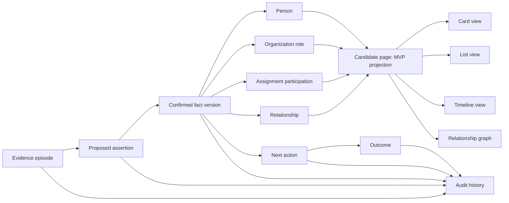

# Talent Signal design system

> Quiet relational intelligence for evidence-first recruiting.

## 1. Design thesis

Talent Signal is a living knowledge layer for candidate momentum. It should feel
like a well-edited professional notebook with the precision of an evidence
instrument.

The product is not:

- an ATS dashboard;
- a sales CRM with candidates substituted for deals;
- an AI command center;
- a social-capital ranking game;
- a collection of floating cards without a canonical information model.

The central design idea is:

> A person has one canonical identity. A candidate is that person participating
> in a specific assignment, and the candidate living page is the MVP's
> canonical working projection. Cards, lists, timelines, and graphs are views
> of the same person, role, assignment, and relationship objects. Every
> important claim can be traced back to evidence and through its change history.

### Reference interpretation

| Reference | Adopt | Do not copy |
| --- | --- | --- |
| Notion | One canonical page per entity, multiple views over the same data, side peek, generous whitespace | Generic document chrome or an infinitely configurable schema in V1 |
| Granola | Human authorship, visible provenance, calm note-like materiality | Meeting-summary output as the final product |
| Attio | Clear product hierarchy, dense information without visual noise | A broad CRM feature model |
| Harvey | Professional restraint and trust | A cold legal-services tone |
| Loanza CRM concept | Large contextual type, restrained charts, soft elevation | Decorative dashboard metrics or untested workflow assumptions |
| WOLB | Navigable people-company graph, interaction history, group and recency lenses | Opaque relationship scores or treating people as resources to rank |

Loanza is a design case study rather than evidence of a production workflow.
Use it as a surface-language reference only. WOLB is useful as a relationship
navigation reference, but Talent Signal must make every edge and interaction
meaning explicit.

## 2. Product design axioms

### 2.1 Page before card

The person is the canonical identity. The candidate page is the canonical
assignment-scoped working projection for the MVP. A card is a compact
projection for scanning and selection, never the only place where identity,
role, or candidate state lives.

### 2.2 Evidence before interpretation

Verified facts, proposed facts, and inferences must look different. A source is
one click away from every decision-relevant fact. Confidence is established by
provenance and editability, not by a decorative percentage.

### 2.3 Context changes the lens, not the person

Founder, product manager, candidate, client stakeholder, recruiter, and
referrer are contextual roles or participations, not mutually exclusive person
types. Card, list, timeline, and graph views use the same underlying person,
role, assignment, and relationship objects. Switching a view or role lens
preserves person identity, applicable history, search, filters, sorting, and
selection while changing only the context-relevant facts and actions.

### 2.4 Change must remain visible

New information appends to history. A later fact can supersede an earlier fact,
but the earlier state does not disappear. The interface should answer what
changed, when, why, from which source, and who confirmed it.

### 2.5 Visual weight represents work attention

Color, size, and emphasis may communicate urgency, unresolved dependency, or
the current next action. They must never imply a person's quality, worth, or
likelihood of success.

### 2.6 Color is scarce

Neutrals carry structure. Vermilion marks the single point of attention.
Semantic success and error colors appear only for real system states and always
include text or an icon.

### 2.7 Calm is functional

Whitespace, short line lengths, stable layouts, and quiet motion reduce the
cost of reviewing sensitive evidence. Calm does not mean sparse data. It means
that only decision-relevant information receives emphasis.

### 2.8 Human control is a visible material

Proposed, edited, confirmed, dismissed, and superseded states must be tangible
in the interface. Human review is part of the product surface, not a compliance
notice hidden in settings.

## 3. Canonical information model



The interface should reflect this model:

- `Evidence episode`: one intentional import or conversation event.
- `Assertion`: one atomic AI proposal with an exact source span.
- `Fact version`: a recruiter-confirmed state with valid time and system time.
- `Person`: one resolved human identity shared across authorized contexts.
- `Organization role`: a typed, time-bounded role held by a person at a
  company, such as founder or product manager.
- `Assignment participation`: a person's contextual role in one search or
  assignment, such as candidate, client stakeholder, recruiter, or referrer.
- `Relationship`: a typed, time-bounded connection with evidence and history.
- `Action`: a proposed or confirmed next move with owner and due time.
- `Outcome`: what actually happened after the action.
- `Audit event`: an append-only record of proposal, edit, confirmation,
  dismissal, execution, failure, supersession, or deletion.

Do not design a view that requires flattening these objects into one summary
string.

### 3.1 Identity, role lenses, and tags

Render a contextual card or page from:

`stable person identity + selected role or assignment + current user task +
authorized evidence`

Use a shared identity header for name, avatar, and resolved contact identity.
The contextual body answers the question for the selected lens:

- a founder lens emphasizes company, company stage, hiring needs, decision
  role, and current relationship;
- a candidate lens emphasizes assignment, preferences, constraints, process
  state, and the smallest next action;
- a product-manager lens emphasizes current organization, domain experience,
  work evidence, and relevant relationships;
- a client lens emphasizes active assignments, requirements, commitments,
  decision relationships, and follow-up work.

Do not show every role at once or create duplicate people to obtain different
cards. Free-form tags may filter and group people, but they must not silently
merge identities, assert a role, or determine what private facts are visible.
Role changes preserve before-and-after values, valid time, confirmation state,
and exact evidence. Ambiguous identity matches remain visibly unresolved.

## 4. Design dials by surface

| Surface | Variance | Motion | Density | Character |
| --- | ---: | ---: | ---: | --- |
| Marketing site | 8 | 7 | 4 | Editorial, asymmetric, demonstrative |
| Desktop knowledge workspace | 5 | 3 | 6 | Calm, information-rich, highly stable |
| Evidence review | 4 | 2 | 6 | Precise, comparative, consent-oriented |
| Relationship graph | 6 | 4 | 5 | Exploratory, legible, question-driven |
| iOS capture and Today | 4 | 2 | 5 | Focused, direct, one-handed |

Motion above level 3 is reserved for a state change, graph filtering, or a
marketing story. The product workspace has no perpetual decorative motion.

## 5. Spatial and material system

Notion-like borderlessness and Loanza-like elevation are not competing
directions. They form an elevation ladder.

### 5.1 Elevation ladder

| Level | Use | Treatment |
| --- | --- | --- |
| 0. Canvas | Candidate page, wiki content, default list rows | No card boundary, spacing and type create groups |
| 1. Interactive plane | Hover, selection, grouped filters | Muted surface fill or one hairline, no shadow |
| 2. Object card | Candidate gallery card, review proposal, draggable object | Soft surface, restrained 1px line, small warm shadow |
| 3. Focus layer | Side peek, dialog, command palette | Stronger separation and shadow, never used in the normal content flow |

Cards are justified only when the object can be selected, moved, compared, or
approved. Static information defaults to level 0 or level 1.

### 5.2 Shape

| Element | Radius |
| --- | ---: |
| Borderless page groups | 0 |
| Tags and compact metadata | 6px |
| Inputs and list selection | 10px |
| Candidate and review cards | 12-14px |
| Side peek and dialogs | 16px |
| Marketing feature cards | 20px |
| Primary action buttons | Full pill |

Avoid pill-shaped tags everywhere. Pills are reserved for actions, compact
filters, or a small number of semantic states.

### 5.3 Shadow

Use warm, low-opacity shadows that match the pearl canvas:

```css
--shadow-object:
  0 1px 2px rgba(54, 49, 42, 0.04),
  0 10px 28px rgba(54, 49, 42, 0.055);
--shadow-focus:
  0 2px 8px rgba(54, 49, 42, 0.06),
  0 24px 64px rgba(54, 49, 42, 0.11);
```

Do not apply a shadow to every section or row.

## 6. Color system

The current web palette is the canonical brand foundation.

| Token | Light value | Role |
| --- | --- | --- |
| `background` | `#F2F1ED` | Pearl canvas |
| `background-deep` | `#E7E5DF` | Recessed navigation or grouped region |
| `surface` | `#FAF9F5` | Focused object surface |
| `surface-muted` | `#EBE9E3` | Hover, selection, inactive control |
| `surface-strong` | `#DDD9D1` | Strong neutral separation |
| `ink` | `#181816` | Primary text |
| `ink-soft` | `#34332F` | Secondary text |
| `muted` | `#64615A` | Metadata |
| `line` | `rgba(24,24,22,0.14)` | Hairline |
| `accent` | `#D84A35` | Current attention, selection, primary action |
| `accent-strong` | `#B53727` | Accessible primary action |
| `accent-soft` | `#F0D4CD` | Proposed or highlighted region |
| `success` | `#356C51` | Confirmed execution or resolved state |
| `error` | `#A22F25` | Failed execution or destructive warning |

Rules:

- Use one brand accent per surface.
- Keep candidate tags neutral unless they express an actionable semantic state.
- Do not color-code every relationship type. Prefer labels, icons, and line
  patterns, with color as a supporting channel.
- Never use color alone to distinguish proposed, confirmed, inferred, or
  superseded information.
- Dark mode preserves the same hierarchy and accent identity. It is not a
  separate neon visual concept.

## 7. Typography

Use Manrope for display and interface text. Use IBM Plex Mono only for evidence
coordinates, timestamps, audit actors, field names, and compact system states.

No serif is needed in the product workspace. Editorial character comes from
composition, whitespace, and hierarchy rather than a decorative font switch.

| Role | Desktop size | Guidance |
| --- | ---: | --- |
| Marketing display | 48-72px | Short, maximum two lines |
| Candidate page title | 32-40px | Name is the strongest object on the page |
| View title or key decision | 26-32px | One large contextual statement per view |
| Section heading | 18-22px | Plain language, no repeated eyebrow |
| Card title | 16-18px | Candidate name or action |
| Body | 14-16px | 1.45-1.6 line height |
| Metadata | 11-12px | Mono only when metadata is operational |

Use tabular numerals for times, dates, and trend values. Large numbers require a
decision question. A number that does not change an action does not deserve
display scale.

## 8. Candidate library

### 8.1 View switching

Provide Card and List as the primary candidate-library views. Graph and Timeline
are secondary analytical views.

When switching Card and List:

- preserve query, filters, sort, selected candidate, and visible cohort;
- keep the same information order in both views;
- animate only opacity and a small positional transition;
- update the URL or saved view state when the view is shareable;
- keep keyboard focus on the equivalent candidate.

### 8.2 Candidate card

Each candidate card combines the stable person identity with the selected
assignment lens. It contains:

1. Avatar or initials, name, current role and company.
2. At most three high-signal tags.
3. One current change, unresolved dependency, or smallest next move.
4. Last meaningful interaction and next due time when one exists.

The card must not contain:

- a candidate quality score;
- a momentum progress bar;
- more than three colored tags;
- a miniature full profile;
- facts from another role or assignment merely because they belong to the same
  person;
- decorative charts without a time series;
- generic AI summaries.

Default gallery cards use level 2 materiality. Dense card views may use a
borderless level 1 treatment with a selected outline.

### 8.3 Candidate list

Use 64-72px rows. Keep the avatar, name, role, current signal, last interaction,
and due time aligned in a stable grid. Optional fields belong in configurable
columns or the side peek, not in a wrapping metadata sentence.

Opening a candidate defaults to side peek so the cohort remains visible.
Promote to a full page for deep review, editing, or history.

## 9. Candidate page as a living wiki

The candidate page is the product center. Its default order is:

1. Identity and current assignment context.
2. Current decision state: verified facts, open questions, and constraints.
3. Why now: one evidence-backed reason for attention.
4. Smallest next action: owner, due time, and completion condition.
5. Timeline of evidence, changes, actions, and outcomes.
6. Relationships to people, companies, roles, and referrers.
7. Source episodes and retention state.

### 9.1 Fact presentation

Every decision-relevant fact exposes:

- current value;
- fact type: explicit fact, preference, constraint, commitment, or inference;
- valid time;
- confirmation state;
- source link;
- change history.

Clicking the source opens the exact quote or anchored screenshot region. It must
not merely open a generic import record.

### 9.2 Provenance states

| State | Visual treatment |
| --- | --- |
| Proposed | Accent-soft region, proposal label, exact source visible |
| Confirmed | Normal ink, confirmation actor and source link |
| Edited | Final value in ink, original proposal retained in history |
| Ambiguous | Neutral warning icon and required clarification |
| Inference | Explicit `Inference` label and rationale, never styled as a fact |
| Superseded | Muted previous value in history with replacement link |
| Dismissed | Removed from current state, retained in audit history |

## 10. Timeline and audit history

Auditability is a daily interaction, not an administrator page.

The timeline uses append-only event language:

- Evidence imported.
- Fact proposed.
- Fact confirmed, edited, dismissed, or superseded.
- Action proposed, approved, executed, failed, or expired.
- Outcome resolved, still blocked, or unknown.

Each event shows:

- what changed, including before and after when applicable;
- the actor: recruiter, system, or connector;
- valid time and recorded time;
- source evidence;
- related action or outcome.

Group events by day, then by episode. Keep the current state concise while
allowing the user to expand the full chain in place. Do not hide provenance in
a separate modal that breaks reading context.

## 11. Relationship graph

The graph is a question-answering view over confirmed relationships. It is not
the home screen and not a decorative hero background.

### 11.1 Default graph

- Start with an ego network centered on the selected candidate or recruiter.
- Show one hop by default and allow a deliberate expansion to two hops.
- Include people, companies, roles, assignments, and referrers.
- Offer filters for relationship type, tag, assignment, interaction window,
  and evidence state.
- Click a node to open side peek.
- Click an edge to open its relationship history and evidence.
- Provide a list equivalent for accessibility and small screens.

### 11.2 Visual semantics

| Visual property | Meaning |
| --- | --- |
| Node shape or icon | Entity type |
| Accent ring | Requires attention now |
| Fixed size family | Entity type or selected state, never human worth |
| Edge label | Relationship type |
| Edge width | Confirmed interaction count in the selected window |
| Edge opacity | Recency |
| Dashed edge | Proposed or unverified relationship |
| Accent edge | Current unresolved action travels through this relationship |

Do not collapse relationship energy into one unexplained score. If the product
needs an energy concept, expose recency and interaction cadence separately and
show the selected time window. Relationship activity is not relationship
quality.

### 11.3 Graph restraint

- Avoid full-workspace hairballs.
- Avoid force motion after the layout has settled.
- Do not use neon edges, outer glows, or animated particles.
- Re-layout only after a filter, expansion, or recenter action.
- Always show a legend.
- Treat `no confirmed relationship` as a valid state.

## 12. Trends and analytics

Use trend lines only when a meaningful historical series exists. Appropriate
examples include interaction cadence, outstanding commitments over time, or
time-to-resolution for recruiter actions.

Do not chart:

- candidate quality;
- predicted acceptance without a validated model and a clear decision use;
- invented momentum percentages;
- single values padded into a dashboard.

A trend card contains one question, one series, one current value, and one
plain-language interpretation. It should lead to a candidate cohort or evidence
set when clicked.

## 13. Motion and feedback

- Use 160-220ms transitions for hover, selection, view changes, and side peek.
- Animate transform and opacity only.
- Use shared layout transitions only when they preserve object identity.
- Confirmation feedback shows the state change, not a celebration.
- Graph movement communicates filtering or recentering and then stops.
- Respect reduced motion across all surfaces.
- Never use perpetual shimmer, pulsing nodes, parallax, or floating cards in
  the product workspace.

## 14. Platform adaptation

### Desktop web

Desktop is the knowledge workbench. It supports Card, List, Timeline, Graph,
side peek, comparative review, and deep candidate pages.

### iOS

iOS prioritizes intentional capture, evidence review, and at most three Today
briefs. Do not compress the full desktop graph onto a phone. Use a relationship
summary list or a small static ego preview that opens a focused relationship
screen.

Both platforms share information hierarchy, provenance states, color meaning,
and action language. Platform-native navigation and controls remain native.

## 15. Accessibility and privacy

- Meet WCAG AA contrast for text and controls.
- Preserve a complete keyboard path through view switching, cards, side peek,
  evidence review, and graph alternatives.
- Give every graph insight a textual equivalent.
- Do not expose sensitive facts on a card unless they are required for the
  current task and the viewer is authorized.
- Treat role and assignment scopes as privacy boundaries. A person's candidate
  status or job-search evidence must not appear in founder, client, or general
  relationship views without explicit authorization.
- Avoid identifiable screenshots in marketing and fixtures.
- Make deletion state and derivative deletion legible from the source episode.

## 16. Implementation contract

- Reuse the existing semantic CSS variables on web and centralize equivalent
  SwiftUI tokens. Do not maintain competing palettes.
- Keep Phosphor as the web icon family. Use SF Symbols on iOS.
- Build Card and List from one view model so their semantics cannot drift.
- Build contextual cards from a shared person identity model plus an explicit
  role or assignment projection; do not duplicate a person per lens.
- Keep provenance and audit fields in the domain model, not in display-only
  strings.
- Provide loading, empty, ambiguous, error, proposed, confirmed, edited,
  dismissed, failed, expired, and superseded states.
- Test light and dark themes, reduced motion, mobile collapse, keyboard
  navigation, long names, missing avatars, three tags, no tags, and stale
  evidence. Also test one person with multiple simultaneous roles, ambiguous
  identity resolution, expired roles, and cross-context permission boundaries.

## 17. Design review checklist

- Is there one canonical person identity and one assignment-scoped candidate
  projection rather than duplicate people?
- Does the selected role lens change contextual information without changing
  identity or leaking evidence from another assignment?
- Does each view answer a specific user question?
- Does switching views preserve context?
- Can every important fact return to exact evidence?
- Can the user see what changed and who confirmed it?
- Does visual weight represent attention rather than human value?
- Are tags, color, cards, and shadows used sparingly?
- Does the graph expose edge meaning and a textual alternative?
- Is every chart backed by a real time series and a decision question?
- Does motion communicate a state change and then stop?
- Are all mutation states reviewable and reversible where possible?
- Does the surface still feel calm with realistic long and messy data?

## References

- [Notion database views](https://www.notion.com/help/views-filters-and-sorts)
- [Notion database page model](https://www.notion.com/help/intro-to-databases)
- [Notion relations and rollups](https://www.notion.com/help/relations-and-rollups)
- [Granola product method](https://www.granola.ai/blog/announcement)
- [Loanza CRM design case](https://www.behance.net/gallery/222322353/Loanza-Mortgage-CRM-UX-UI-Design)
- [WOLB product overview](https://www.w-o-l-b.com/product/)
- [WOLB relationship graph review](https://sspai.com/item/445)
