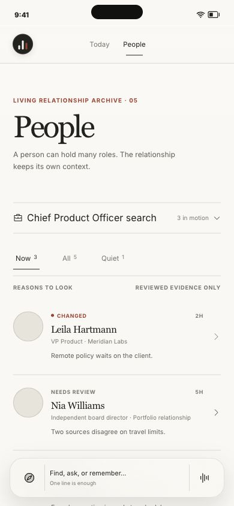
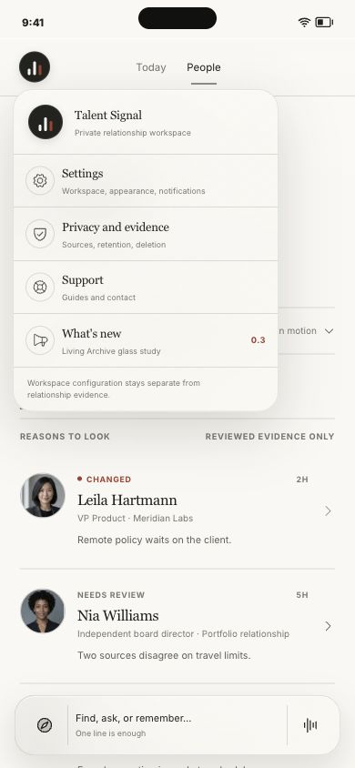
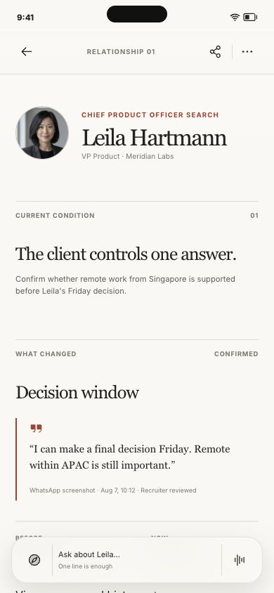
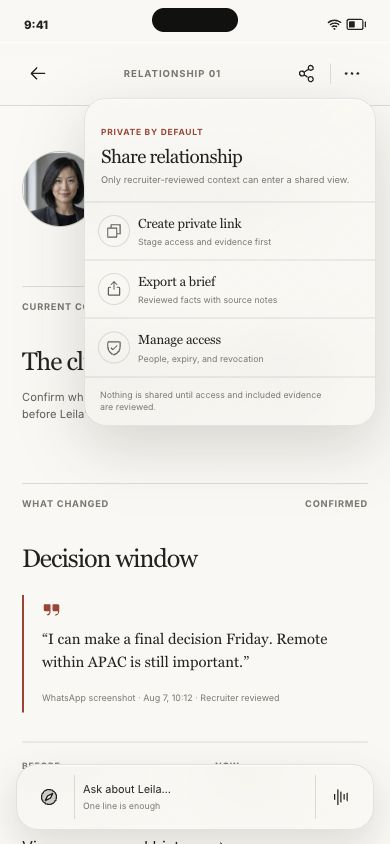
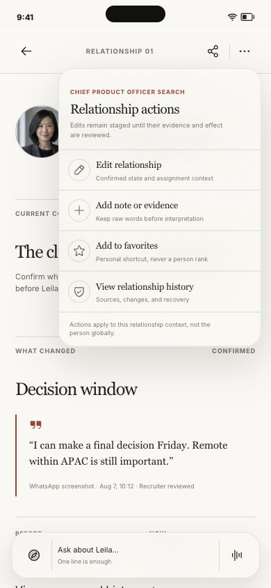
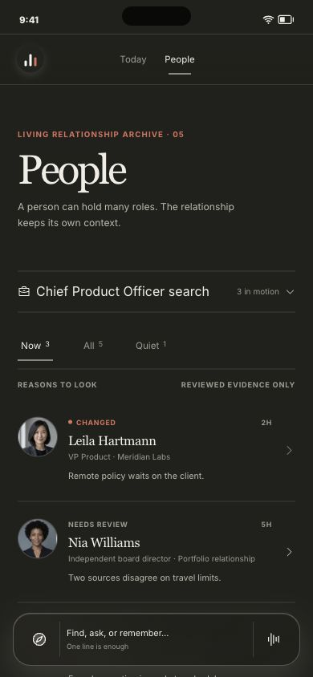

# iOS glass navigation and object actions

Date: 2026-08-07
Surface: `/concepts/relationships`
Decision: select **Museum Glass**; retain **Floating Objects** as a challenger.

## Outcome

The mobile archive now separates three layers of intent:

1. the circular Talent Signal mark owns workspace configuration, privacy,
   support, and updates;
2. the selected relationship owns Share and Actions in its top-right corner;
3. the persistent bottom Guide owns global find, ask, and remember intent.

This removes the duplicate global search affordance from a person's top bar.
It also keeps configuration and relationship edits from appearing to have the
same scope.

## Material comparison

Museum Glass treats the status bar and primary navigation as one translucent
threshold. The bottom Guide is one optical rail. Content remains on the quiet
archive surface instead of becoming a field of glass cards.

Floating Objects is closer to Notion's separate pill composition. It feels
more immediately tactile, but the extra islands fragment the relationship
hierarchy and make the chrome more visually important than the people.

## Mobile proof

## Safety and interaction review

- All visible people and evidence are synthetic.
- Share is private by default and stages access or export work; it does not
  claim that a link, file, or permission changed.
- Share is unavailable while identity evidence remains unresolved.
- Edit and add actions remain staged until reviewed.
- Favorite is named as a personal shortcut, never a person rank.
- All persistent icon targets are at least 44 by 44 CSS pixels.
- Menus expose expanded state, move focus to their first action, close with
  Escape, and include a scrim close target.
- Reduced-transparency mode removes backdrop filters and restores an opaque
  pearl navigation surface.
- Phone rendering was reviewed at 390 by 844, compact width at 320 by 720,
  deep scroll, light and dark material, and multiple person identities.
- Browser console review returned no errors.

## Verification

- `pnpm --filter @talent-signal/web exec eslint components/relationship-mobile-concept.tsx`
- `pnpm --filter @talent-signal/web typecheck`
- `pnpm docs:check`
- `git diff --check`
