# iOS Living Archive and Agent evaluation

Date: 2026-08-07

## Outcome

Living Archive is selected as the durable mobile home. Quiet Concierge survives
as the expanded Guide composition because its Agent-first threshold is elegant
for focused intent but weaker for direct browsing and stable spatial memory.

Capture is removed as navigation. Its useful behavior becomes Remember a
moment: one sentence or voice input, raw words preserved, possible relationship
context proposed, at most one meaningful clarification, and a draft receipt
that confirms no relationship state changed.

The implementation is an interactive web study at
`/concepts/relationships`. All people and evidence are synthetic.

## Selected direction

### Desktop decision study

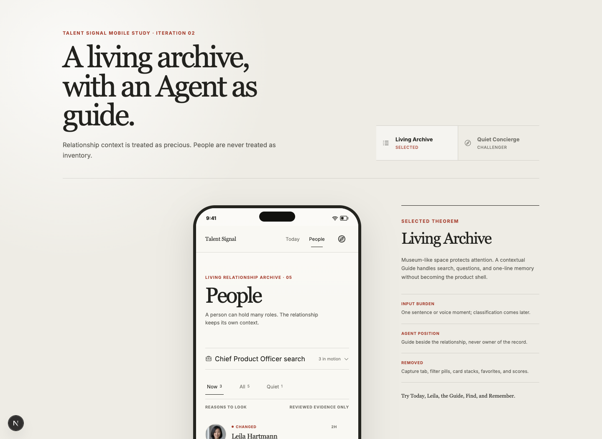

### People

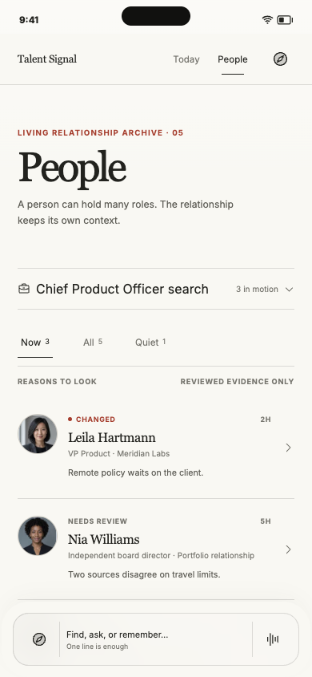

### Today

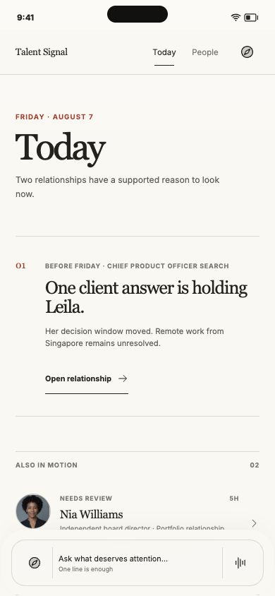

### Living relationship

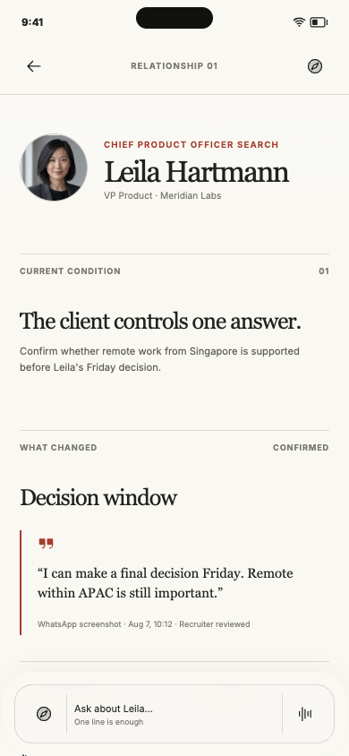

## Contextual Guide

### Evidence-grounded answer

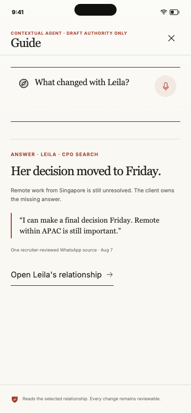

### Remember review

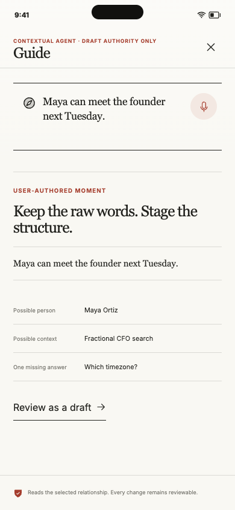

### Draft receipt

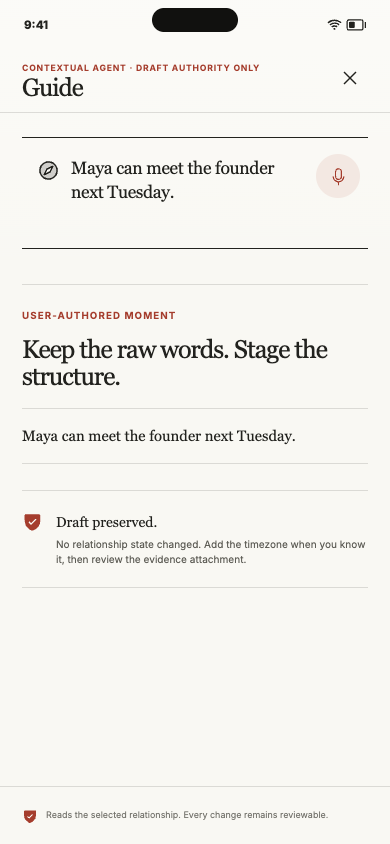

## Surviving challenger

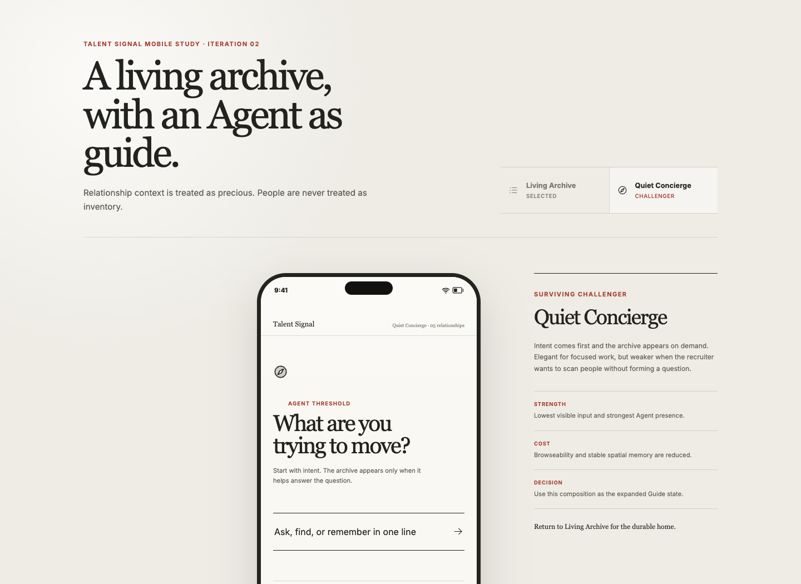

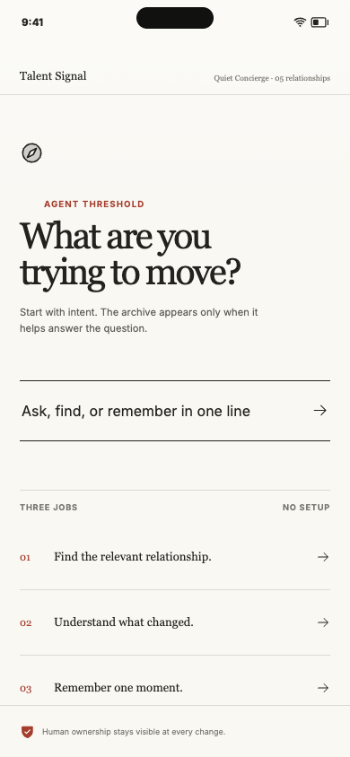

## Content and preference checks

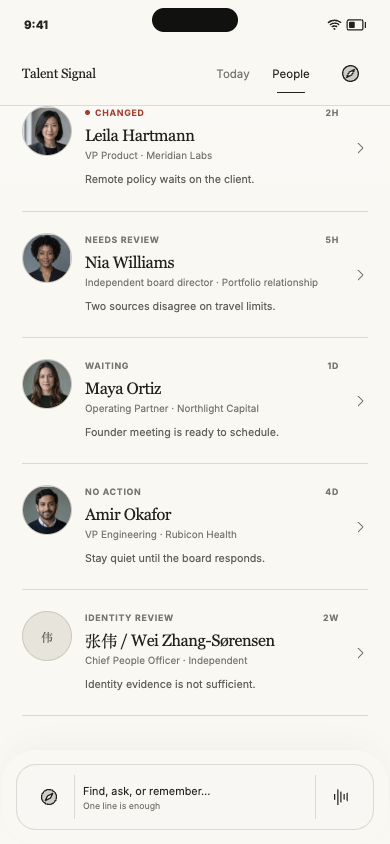

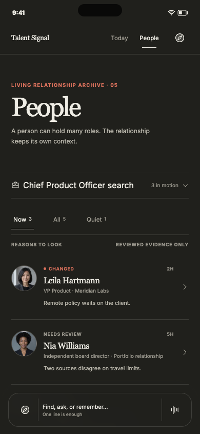

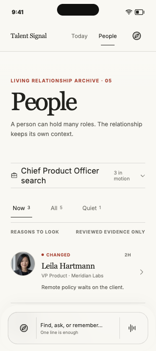

## Review against `REVIEW.md`

- **Product loop:** People gives direct retrieval; Today gives one supported
  reason to look; relationship detail puts current condition, exact change,
  evidence, and smallest safe next step in causal order.
- **Evidence and safety:** confirmed state, exact evidence, Agent answer,
  user-authored note, staged interpretation, and draft receipt remain visually
  distinct. No path shown writes externally or ranks a person.
- **Control and recovery:** the Guide declares draft authority, answers from a
  selected relationship, preserves raw words, and confirms when no canonical
  state changed.
- **System integrity:** the Agent is a reader and proposal layer beside the
  governed relationship object, never its canonical owner.
- **Visual result:** card stacks, filter pills, favorites, numbered workflow
  exposition, and the Capture destination are absent. Museum influence appears
  through thresholds, intervals, hairlines, and restrained vermilion rather
  than literal gallery decoration.

## Direct verification

- Browser-rendered at 1440 × 1050, 390 × 844, and 320 × 720.
- Interactively exercised People, Today, person detail, Guide answer,
  Remember review, draft receipt, direction switching, and deep-list scroll.
- Checked dark color scheme and reduced-motion preference.
- Checked a missing avatar and a multilingual long name.
- Browser console reported zero errors in the final interaction pass.

Native VoiceOver, physical-device ergonomics, live permissions, real evidence,
and external writes remain outside this web-study proof.
