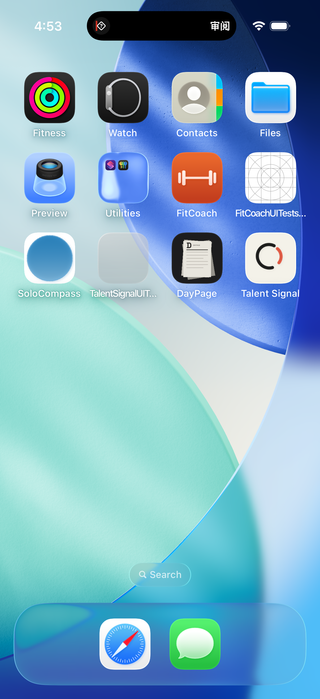

# Agent-work Live Activity implementation evidence

## Result

The Debug-only ActivityKit implementation is materially stronger and the
four-state boundary atlas is now reproducible on real Simulator system
surfaces. The linked implementation package is not yet globally complete:
Gate 1 recruiter research, eight participant receipts, the full TS-LA-01…10
system-screenshot set, two uncut videos, and signed-device Always-On evidence
remain `WAITING`.

Direction 73 is an explicitly authorized implementation baseline. It is not a
substitute for a recruiter-selected Gate 1 result.

The machine-readable status and screenshot hashes are in
[`evidence.json`](evidence.json). Xcode's original attachment metadata remains
in the `atlas/manifest.json` and `system/manifest.json` exports.

## Repository verification boundary

The iOS Release build and all 228 unit tests passed. The focused Agent-work
suite passed 16/16 tests, and both real ActivityKit UI journeys passed with six
retained system attachments.

A full UI run attempted 87 isolated journeys but is not a valid repository-wide
PASS receipt. The shared working tree changed while it was running: unrelated
capture-entry, Ask/contact, onboarding, and language-dependent journeys failed,
and `scripts/ios/check.sh` was transiently syntactically invalid while the
already-running shell was still reading it. The current script passes
`bash -n`; no unrelated concurrent file was changed as part of this artifact.

## What is directly proved

- Cold restoration reconstructs the exact task instance, domain phase, and
  accepted revision.
- An actions deep link is accepted only for the exact active
  `completed + review + readyForReview` state; a status link is accepted only
  for supported processing states.
- Missing ActivityKit state degrades to the App-owned lifecycle instead of
  blocking review; unsafe, conflicting, old, or regressive updates do not
  advance local state.
- Repeated start reuses one valid nonterminal task instance and removes
  duplicates; sign-out, explicit end, fixture reset, expiry, and exact handoff
  clean up their authorized Activity scope.
- The extension owns localized English and Simplified Chinese strings, keeps
  its action independently focusable for VoiceOver, and allows the expanded
  title to reflow.
- Partial, failed, unknown, and stale states each run through a deterministic
  Debug fixture and produce a real ActivityKit compact surface.

## System receipts

Running compact state:


Completed review compact state:


## Boundary atlas

Partial:


Failed:


Unknown:



Stale:


## Reproduction

Run the focused state and lifecycle tests:

```sh
xcodebuild -project apps/ios/TalentSignal.xcodeproj \
  -scheme TalentSignal \
  -destination 'platform=iOS Simulator,name=iPhone 17 Pro' \
  -only-testing:TalentSignalTests/AgentWorkActivityTests \
  -only-testing:TalentSignalTests/AgentWorkShowcaseStoreTests \
  CODE_SIGNING_ALLOWED=NO test
```

Run the real system-surface tests:

```sh
xcodebuild -project apps/ios/TalentSignal.xcodeproj \
  -scheme TalentSignal \
  -destination 'platform=iOS Simulator,name=iPhone 17 Pro' \
  -only-testing:TalentSignalUITests/AgentWorkShowcaseUITests/testBoundaryAtlasUsesRealSystemSurfaces \
  -only-testing:TalentSignalUITests/AgentWorkShowcaseUITests/testRealDynamicIslandMovesFromAwayToReview \
  CODE_SIGNING_ALLOWED=NO test
```

The atlas can also be opened one state at a time with Debug launch arguments:

```text
--agent-work-showcase --agent-work-atlas partial
--agent-work-showcase --agent-work-atlas failed
--agent-work-showcase --agent-work-atlas unknown
--agent-work-showcase --agent-work-atlas stale
```

These receipts establish Simulator system-surface behavior only. They do not
establish background push delivery, physical Action Button mapping, or
signed-device Always-On behavior.
