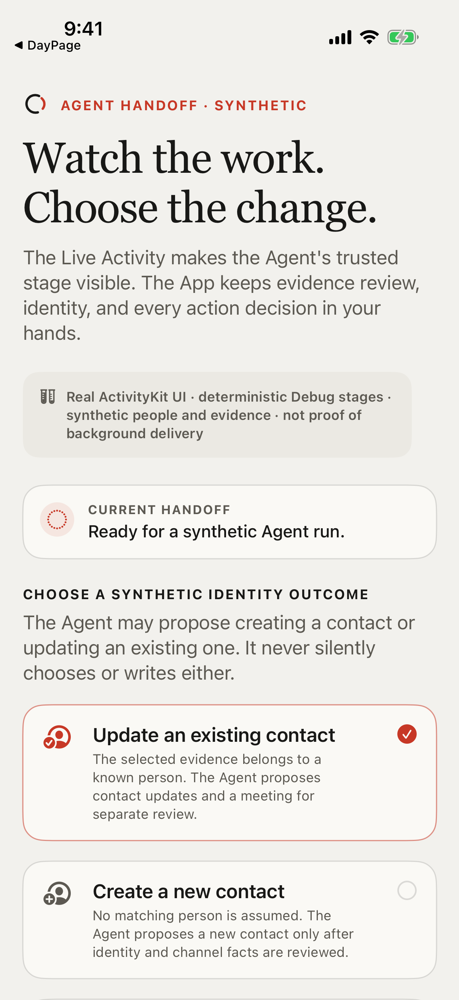
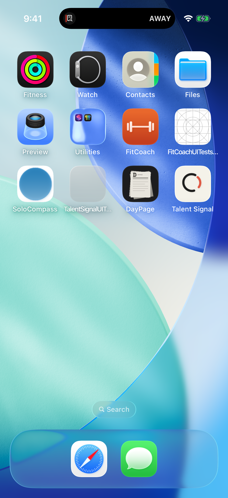
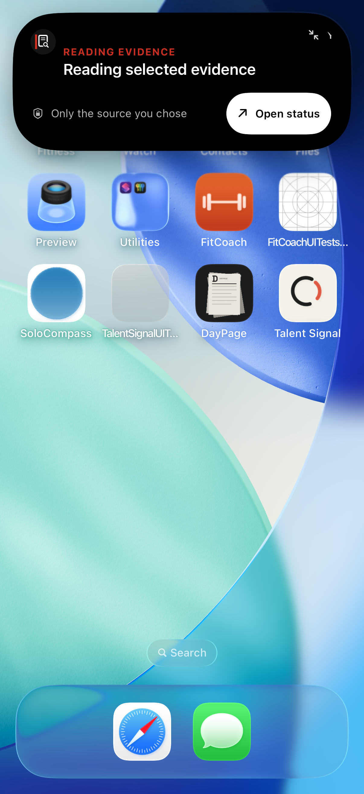
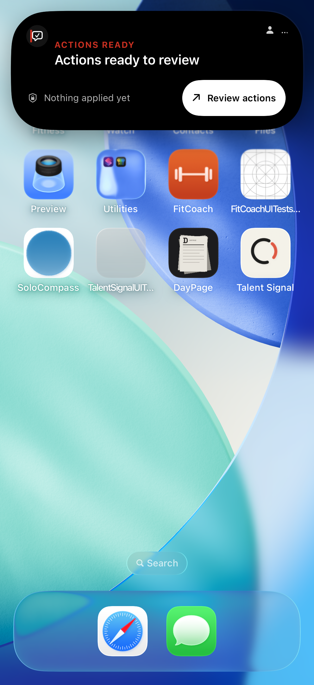
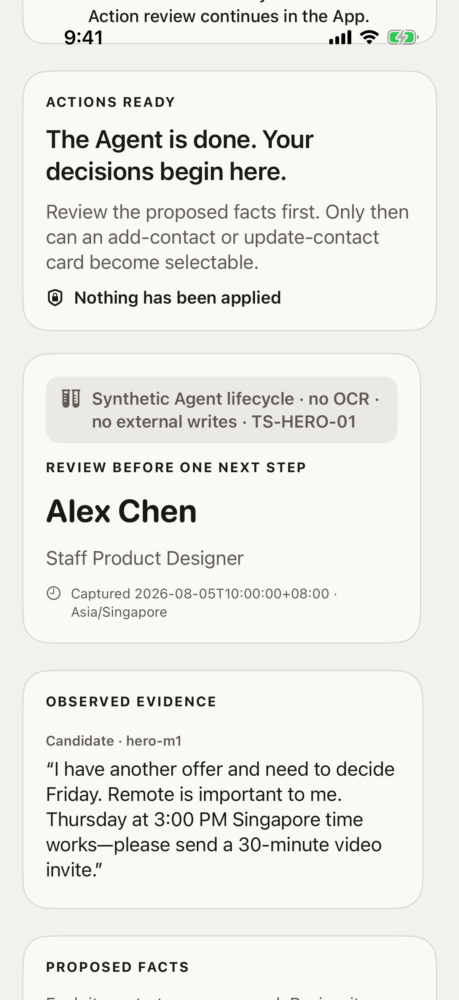

# Agent-work Live Activity implementation evidence

## Result

The Debug-only ActivityKit implementation is materially stronger. The
four-state boundary atlas is reproducible on real Simulator system surfaces,
and one uninterrupted Agent-work journey now retains six full-screen receipts:
showcase, running compact/expanded, review compact/expanded, and exact
deep-link/end. These are not promoted to Notion TS-LA `PASS` entries because
the executable scenario is an Agent-work handoff rather than the specified
Synthetic Research Showcase. Gate 1 recruiter research, eight participant
receipts, the exact ten-image research contract, two uncut videos, and
signed-device Always-On evidence remain `WAITING`.

Direction 73 is an explicitly authorized implementation baseline. It is not a
substitute for a recruiter-selected Gate 1 result.

The machine-readable status and screenshot hashes are in
[`evidence.json`](evidence.json). Xcode's original attachment metadata remains
in the `atlas/manifest.json` and `system/manifest.json` exports.

## Repository verification boundary

The current iOS Release build and all 236 unit tests passed. The focused
Agent-work suite passed 16/16 tests. The real ActivityKit boundary journey
retains four screenshots, and the running-to-review journey passes with six
retained screenshots plus direct SpringBoard assertions for both English
expanded titles.

The latest aggregate UI run attempted 89 isolated journeys: 83 passed, four
were skipped, and two were interrupted only after the unrelated
`com.daypage.app` took the shared Simulator foreground. Both affected journeys
then passed together, 2/2, after Simulator isolation. This covers the journeys
without mislabeling the interrupted aggregate command as one clean exit-zero
receipt. The current script passes `bash -n`; unrelated concurrent files were
not changed as part of this artifact.

## What is directly proved

- Cold restoration reconstructs the exact task instance, domain phase, and
  accepted revision.
- An actions deep link is accepted only for the exact active
  `completed + review + readyForReview` state; a status link is accepted only
  for supported processing states.
- Missing ActivityKit state degrades to the App-owned lifecycle instead of
  blocking review; unsafe, conflicting, old, or regressive updates do not
  advance local state.
- Repeated start reuses one valid nonterminal task instance and removes
  duplicates; sign-out, explicit end, fixture reset, expiry, and exact handoff
  clean up their authorized Activity scope.
- The extension owns localized English and Simplified Chinese strings, declares
  `CFBundleDevelopmentRegion = en`, keeps its action independently focusable
  for VoiceOver, and allows the expanded title to reflow. The declaration is
  regression-protected by direct English-title queries on SpringBoard; without
  it, an English App could render the system Live Activity in Chinese.
- Partial, failed, unknown, and stale states each run through a deterministic
  Debug fixture and produce a real ActivityKit compact surface.

## System receipts

Showcase before start:



Running compact state:



Running expanded state:



Completed review compact state:


Completed review expanded state:



Exact review route and Activity end:



All six entries are `PARTIAL` against the linked research screenshot contract.
Missing system receipts are running/review Lock Screen, true minimal with its
trigger condition, and a no-Dynamic-Island fallback. The machine-readable
ledger records the semantic mismatch for every retained image.

## Boundary atlas

Partial:


Failed:


Unknown:


Stale:


## Reproduction

Run the focused state and lifecycle tests:

```sh
xcodebuild -project apps/ios/TalentSignal.xcodeproj \
  -scheme TalentSignal \
  -destination 'platform=iOS Simulator,name=iPhone 17 Pro' \
  -only-testing:TalentSignalTests/AgentWorkActivityTests \
  -only-testing:TalentSignalTests/AgentWorkShowcaseStoreTests \
  CODE_SIGNING_ALLOWED=NO test
```

Run the real system-surface tests:

```sh
xcodebuild -project apps/ios/TalentSignal.xcodeproj \
  -scheme TalentSignal \
  -destination 'platform=iOS Simulator,name=iPhone 17 Pro' \
  -only-testing:TalentSignalUITests/AgentWorkShowcaseUITests/testBoundaryAtlasUsesRealSystemSurfaces \
  -only-testing:TalentSignalUITests/AgentWorkShowcaseUITests/testRealDynamicIslandMovesFromAwayToReview \
  CODE_SIGNING_ALLOWED=NO test
```

The atlas can also be opened one state at a time with Debug launch arguments:

```text
--agent-work-showcase --agent-work-atlas partial
--agent-work-showcase --agent-work-atlas failed
--agent-work-showcase --agent-work-atlas unknown
--agent-work-showcase --agent-work-atlas stale
```

These receipts establish Simulator system-surface behavior only. They do not
establish background push delivery, physical Action Button mapping, or
signed-device Always-On behavior.
