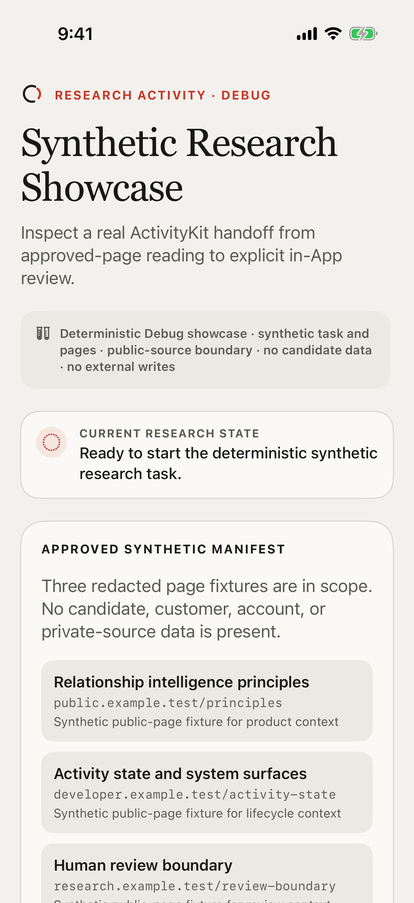
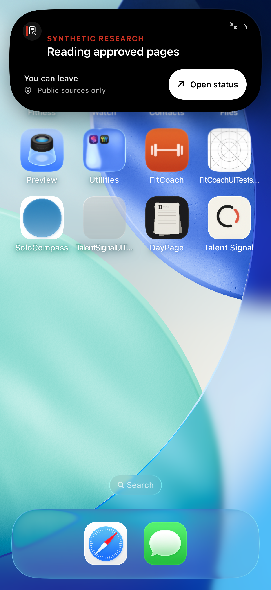
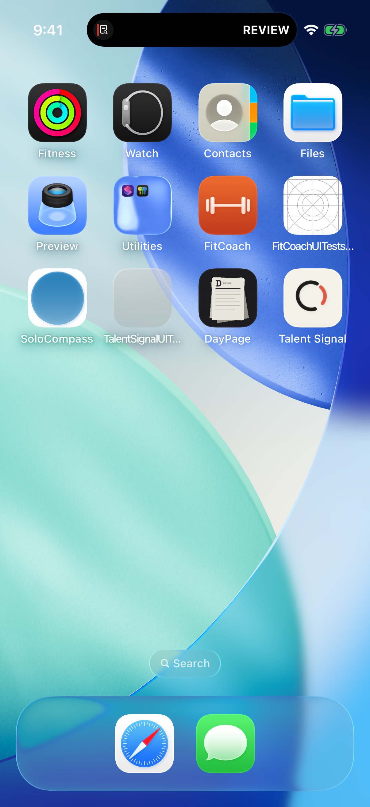
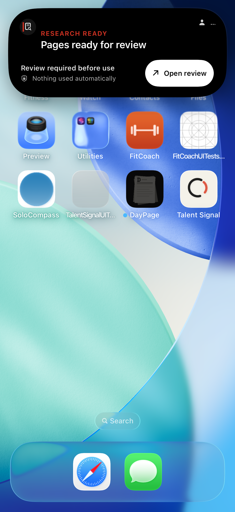
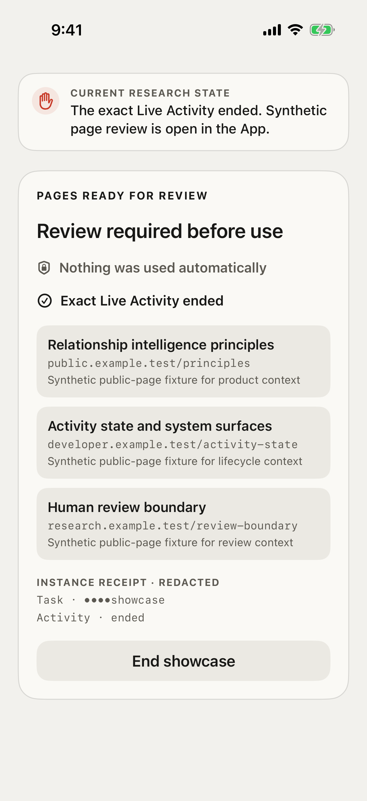
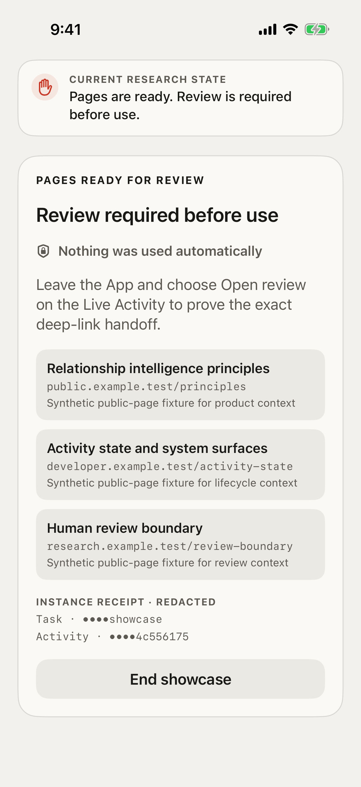

# Synthetic Research Live Activity implementation evidence

## Result

The requested Synthetic Research path now exists as an independent Debug-only
ActivityKit implementation rather than a relabeled Agent-work flow. One exact
task and Activity instance moves from approved-page reading to review-ready,
opens the matching in-App review destination, and ends only that Activity.
The retained Simulator journey directly asserts the required expanded-system
copy, taps the real SpringBoard `Open status` and `Open review` actions, proves
that the App returns to the exact review destination, and passes in 56.609
seconds. A continuous 52-second main recording retains the same journey.

This is a strong local implementation receipt, not a complete validation gate.
Six of the ten TS-LA system receipts pass their exact Simulator contract. The
App-owned part of TS-LA-10 is retained as partial proof. Running and review Lock
Screen receipts, a system-triggered minimal presentation, a no-Dynamic-Island
system banner, the required minimal recording and derived edit, signed-device
Always-On evidence, and Gate 1 research with eight recruiters are still
missing. Direction 73 is a user-authorized implementation baseline, not a
recruiter-selected Gate 1 result.

The machine-readable status and hashes are in
[`evidence.json`](evidence.json). Xcode attachment provenance is preserved in
[`system/manifest.json`](system/manifest.json).

## What is directly proved

- The showcase clearly labels its task and page manifest as deterministic,
  synthetic, public-source-only, candidate-free, and incapable of external
  writes.
- Activity identity contains opaque scope, task, and instance identifiers;
  payloads fail closed for unsupported state combinations, invalid identifiers,
  invalid revisions, or encoded payloads above 4 KB.
- Older updates, same-revision conflicts, identity mismatches, and terminal
  regressions cannot promote Activity state.
- Running compact and expanded presentations retain `AWAY`, `Reading approved
  pages`, `You can leave`, and `Public sources only`.
- Review compact and expanded presentations retain `REVIEW`, `Pages ready for
  review`, `Review required before use`, `Nothing used automatically`, and one
  `Open review` action.
- The review deep link is accepted only for the exact active task, Activity
  instance, and review-ready state. It ends that instance before showing the
  synthetic review page and redacted receipt.
- The Debug launch route and settings entry are inert in Release builds.
- The extension declares English as its development region so an English App
  does not inherit a mismatched extension locale.

## System receipts

Showcase before start:



Running compact:


Running expanded:



Review compact:



Review expanded:



Exact review route and Activity end:



Continuous main journey (52 seconds):

[Open the uncut Synthetic Research journey](system/TS-LA-main-uncut.mp4)

Derived review edit (22.5 seconds):

[Open the concise Synthetic Research edit](system/TS-LA-main-edit.mp4)

App-owned fallback:



## Explicitly missing proof

- TS-LA-04 and TS-LA-07: running and review Lock Screen on the same instance;
- TS-LA-08: true system minimal presentation. The widget implements `minimal`,
  but Apple selects it only under a system context such as Live Activities from
  multiple apps or StandBy; no compliant second-app/StandBy receipt was
  available in this Simulator run;
- TS-LA-10: no-Dynamic-Island Lock Screen or alert banner; the retained image
  proves only the exact App fallback;
- one uncut 15–25 second minimal video; the required 45–60 second main video
  and its 20–25 second derived edit are retained and pass their duration
  contracts;
- signed physical-device Always-On behavior;
- eight authorized recruiter participant receipts and a PASS Gate 1 decision.

These gaps remain `WAITING`; the video contract is `PARTIAL` because one of the
two required uncut recordings is present. The 22.5-second edit is derived from
that real main run. None is inferred from a widget preview, source code, a
passing build, or a Simulator screenshot from another surface.

## Reproduction

Run the full iOS unit suite:

```sh
xcodebuild test-without-building \
  -project apps/ios/TalentSignal.xcodeproj \
  -scheme TalentSignal \
  -destination 'platform=iOS Simulator,name=iPhone 17 Pro' \
  -only-testing:TalentSignalTests
```

Run the two retained system journeys:

```sh
xcodebuild test-without-building \
  -project apps/ios/TalentSignal.xcodeproj \
  -scheme TalentSignal \
  -destination 'platform=iOS Simulator,name=iPhone 17 Pro' \
  -only-testing:TalentSignalUITests/ResearchShowcaseUITests/testExactResearchActivityMovesFromAwayToReviewAndEndsOnDeepLink \
  -only-testing:TalentSignalUITests/ResearchShowcaseUITests/testAppFallbackKeepsExactBoundaryWithoutDynamicIsland
```

The Debug showcase can also be opened with:

```text
--synthetic-research-showcase --synthetic-research-reset
```
