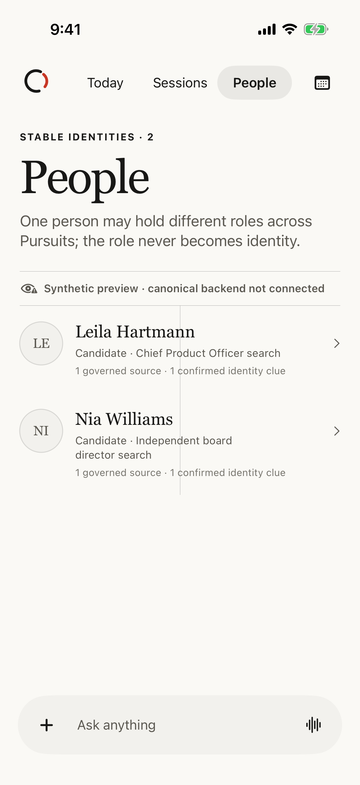

# iOS row gesture baseline

Date: 2026-09-01

## Scope

This is synthetic Simulator evidence for the Session-row versus primary-pager
gesture conflict. It contains no account or candidate data.

## Environment

- Xcode 26.6 (build 17F113)
- iOS 26.5 Simulator
- iPhone 17 Pro
- Talent Signal Debug synthetic preview workspace

## Observed probes

Three horizontal drags began on the first Session row:

| Probe | Expected | Observed |
| --- | --- | --- |
| Standard full left swipe | Reveal the trailing `Remove` action and remain in Sessions | Opened People |
| Short, fast left drag | Reveal the trailing row action and remain in Sessions | Opened People |
| Slower medium left drag | Reveal the trailing row action and remain in Sessions | Remained in Sessions but revealed no action |

The first two probes failed before dismissal could be tested. The third did not
enter the revealed state. The focused temporary XCUITest probes were removed
after capture so failing exploratory assertions do not become repository
behavior tests. The result bundles remain temporary local artifacts at
`/tmp/talent-signal-gesture-research.xcresult` and
`/tmp/talent-signal-gesture-short-fast-r2.xcresult`.

## Evidence

The screenshot checksum is
`8de95c37eca0f4b036aefd5586981d54e9e01e69cb5d7c36cfd728b8ebb7c927`.

## Interpretation boundary

This proves the conflict on one current Simulator, not every physical device or
gesture velocity. It does not prove tap-outside, VoiceOver, Switch Control,
reduced-motion, or post-fix behavior.
