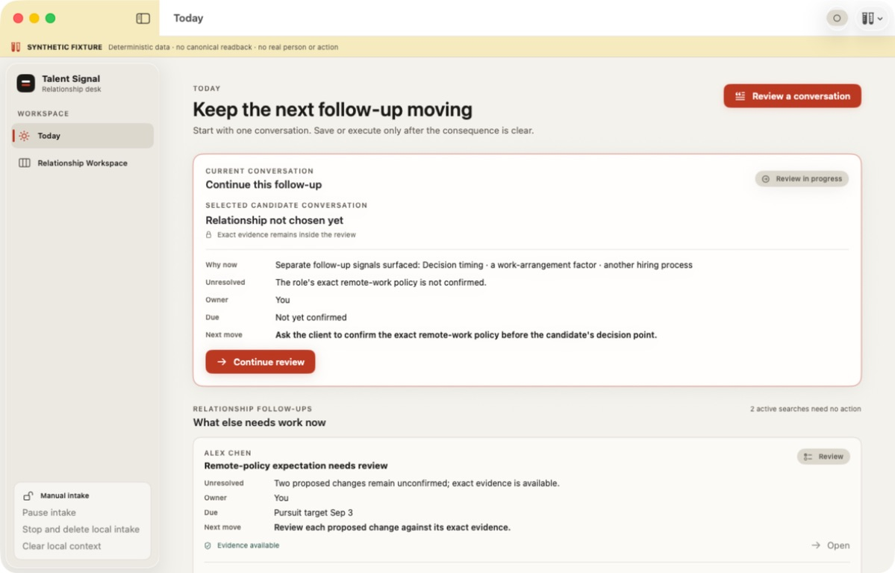
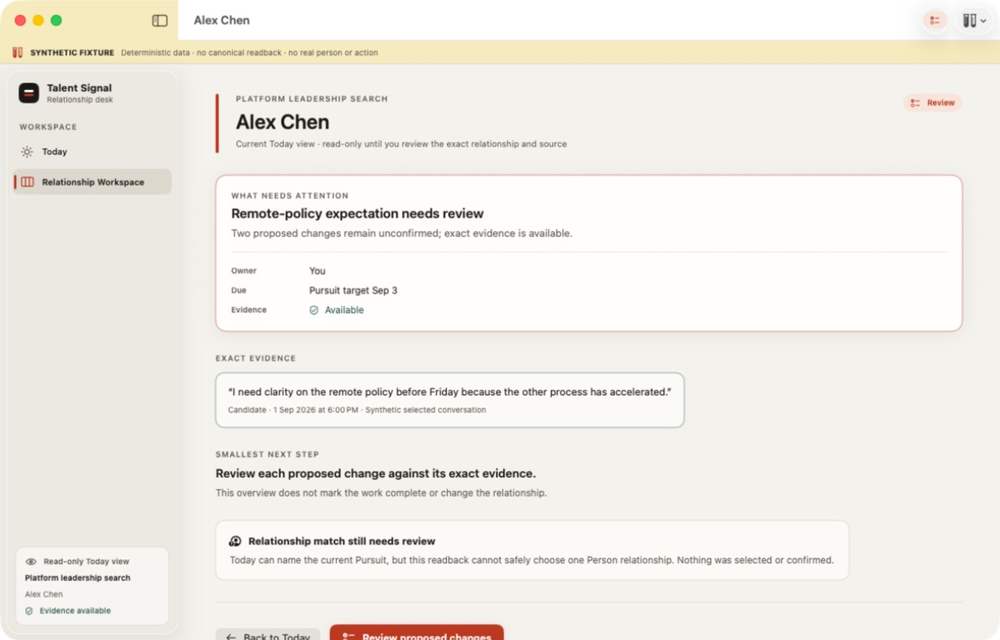
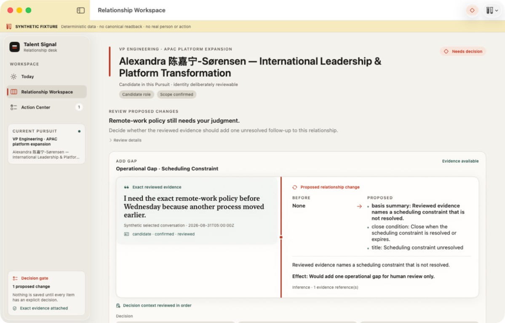
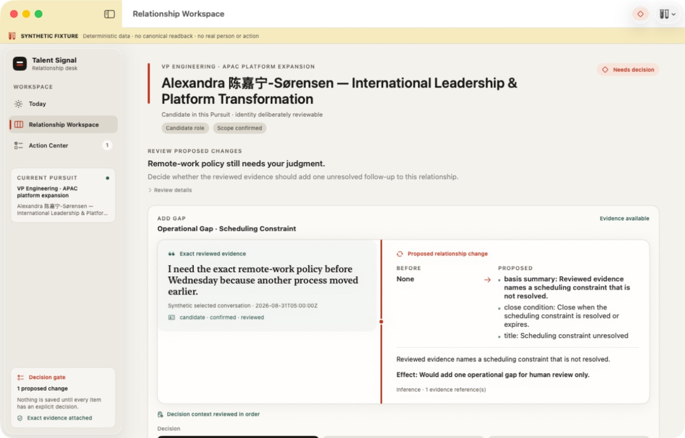
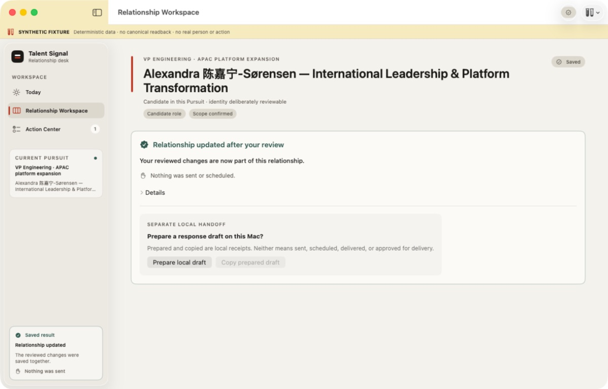
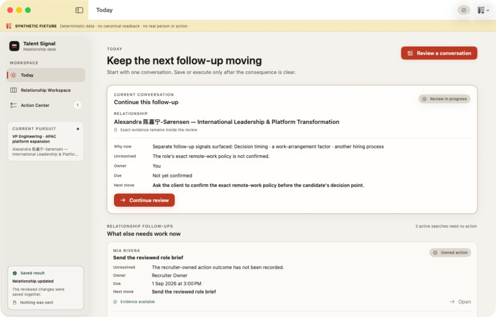
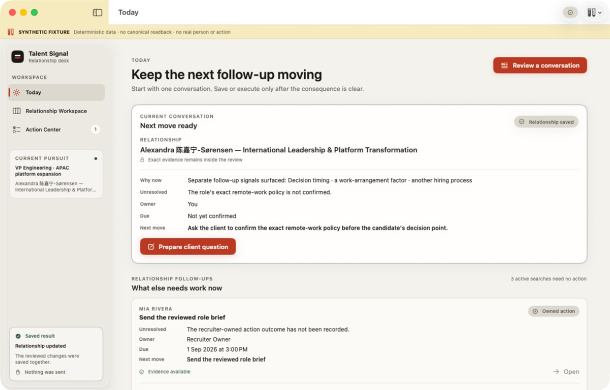
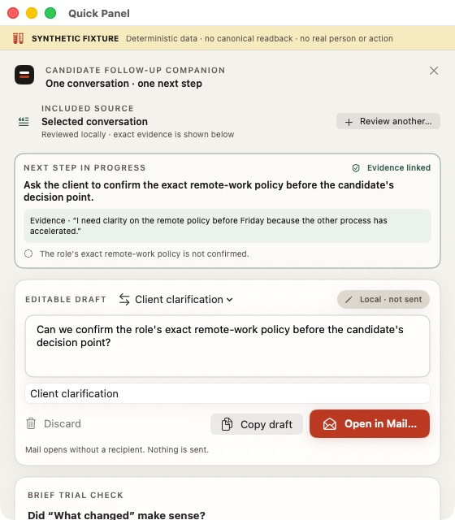

# Native Keyboard and Accessibility Audit R1

Date: 2026-09-01

Mode: native macOS app-owned keyboard flow plus accessibility-tree readback

Surface: Today → exact Proposal → decision → saved result → Today continuity

All candidate and Pursuit content in this audit is an explicitly labeled
synthetic fixture. This is interaction and presentation evidence, not recruiter
usefulness evidence or an authorized external write.

## Verdict

The core Today follow-up can now be completed in one native window without a
mouse and without depending on the user's macOS Full Keyboard Access setting.
The app-owned command path opens the first current Today item, resolves its
exact review gate, requires an explicit choice, saves only after that choice,
and returns to Today.

The pass found and fixed two continuity defects. A completed Proposal no longer
remains in the pending Today queue: the resolved Pursuit moves into the
no-action count while its reversible result remains in Needs your review. The
workspace status accessibility element is recreated with the current semantic
state, so the saved screen exposes `Saved` rather than retaining a stale
`Needs decision` description.

A follow-up comparison then found that the saved conversation still read
`Review in progress` and reopened its receipt, while a newly prepared draft
appeared below the Quick Panel fold. The final state now says `Next move ready`
and `Relationship saved`, prepares the evidence-bound next move through
`⌘⌥N`, and replaces the completed review with a focused editing surface whose
Copy and Open in Mail controls are visible at 560 × 640.

## Keyboard flow evidence

### 1. Today starts with current work

`⌘⌥↓` opens the first current relationship follow-up. The command resolves the
item from the live Today projection instead of retaining an identifier from a
previous render.

### 2. Exact Proposal detail

The read-only detail keeps the Alex Chen Pursuit, unresolved dependency, exact
candidate evidence, and smallest next step together. `⌘⌥R` opens only the
Proposal review named by this item.

### 3. Decision gate starts unselected

The accessibility tree reported all three choices as `Not selected` and the
save control as disabled. Exact evidence, before/proposed state, uncertainty,
effect, and relationship context precede the choices.

### 4. Keyboard choice is explicit

`⌘⌥⇧1` selects Confirm for the next unreviewed item. The accessibility tree
reported Confirm as `Selected`, the other choices as `Not selected`, and the
save control as enabled. Reject and Keep unresolved remain available through
`⌘⌥⇧2` and `⌘⌥⇧3`.

### 5. Human-language saved result

`⌘⌥Return` saves the reviewed changes. The result leads with `Relationship
updated after your review` and `Nothing was sent or scheduled`; technical proof
stays under collapsed Details. The status accessibility element reports only
`Saved`.

### 6. Completed work leaves the pending queue

`⌘⇧1` returns to Today in the same window. Alex's resolved Proposal is absent,
the remaining Mia and Daniel work stays visible, the honest no-action count
changes from two to three, and the reversible completion remains available in
Needs your review.

### 7. Saved review becomes a real next move

The current conversation no longer claims that its completed relationship
review is still in progress. It keeps the unresolved remote-policy dependency
and next move visible, marks the relationship review saved, and offers
`Prepare client question`. A no-action review instead offers only its result;
it cannot create duplicate work from Today.

### 8. The chosen draft action takes over

`⌘⌥N` prepares the suggested local next step and opens the Quick Panel directly
in its focused editing state. The exact evidence and unresolved dependency stay
visible above the editor, while purpose, editable body, subject, Discard, Copy,
and Open in Mail remain in the first 560 × 640 viewport. Nothing is sent.

## Native observations

- Exactly one `workspace` window remained throughout the route.
- App-owned commands made the key flow usable with macOS Full Keyboard Access
  off; the audit did not change that system preference.
- `⌘⌥N` continues the current conversation into its evidence-bound draft or
  reminder review instead of replaying a completed relationship receipt.
- The accessibility tree exposed exact evidence, ordered decision context,
  explicit selected/not-selected values, disabled/enabled save state,
  human-language success, conditional Action Center, and the current workspace
  status.
- Same-size screenshot comparison showed stable alignment and hierarchy across
  the six states. Long mixed-script identity text wrapped without clipping.
- Focused unit coverage proves the synthetic Today transition removes only the
  resolved Proposal, preserves five total Pursuits, increments no-action work,
  and retains one reversible result.

## Verification

- Focused AppModel and Today projection coverage includes the saved-review
  continuation and no-action duplicate guard; the full macOS unit suite passed.
- `scripts/macos/check.sh`: passed build, all macOS unit tests, and UI-test
  compilation.
- `pnpm docs:check`: passed 352 Markdown files plus wiki and architecture
  checks.
- `git diff --check`: passed.

## Remaining limits

- This host's XCTest UI runner compiled the test bundle but never materialized
  workers, so no XCTest UI assertion executed. Exact evidence is recorded in
  [`ui-runner-host-limitation.json`](ui-runner-host-limitation.json); the native
  keyboard and accessibility pass above is independent evidence, not a renamed
  XCTest pass.
- Accessibility-tree readback is not a VoiceOver announcement-quality study.
- The selected-text Service remains disabled in macOS settings; the audit did
  not change that preference.
- An authorized real EventKit write/readback/recovery/removal loop, an
  authorized multi-Pursuit Today readback, and 5–8 recruiter trials remain
  external completion gates.
