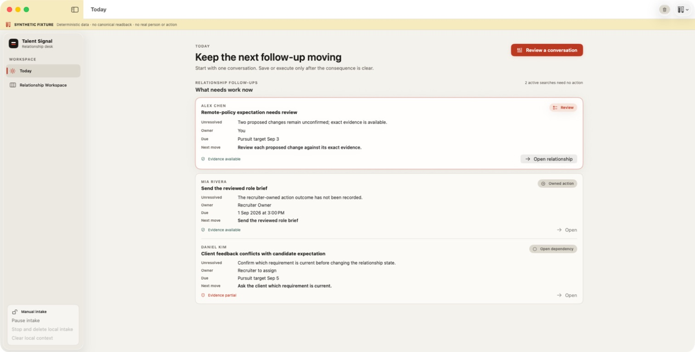
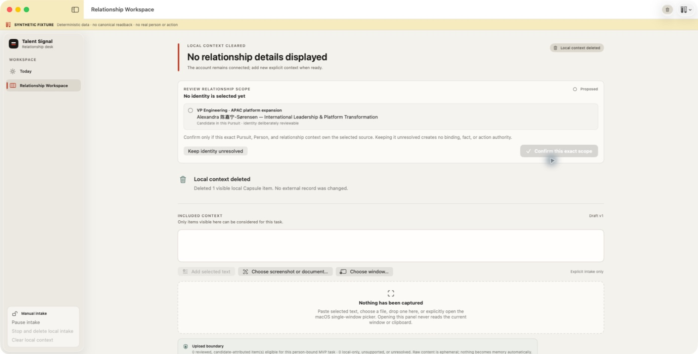
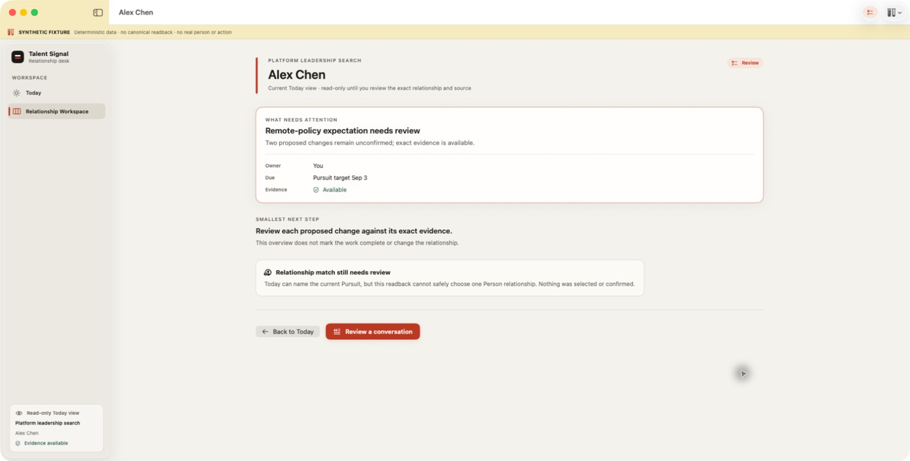
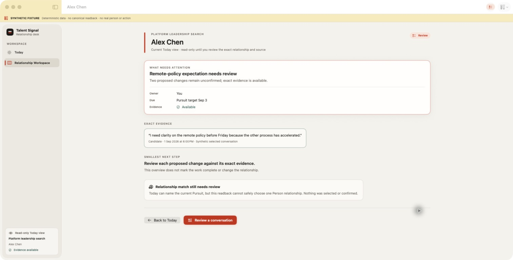
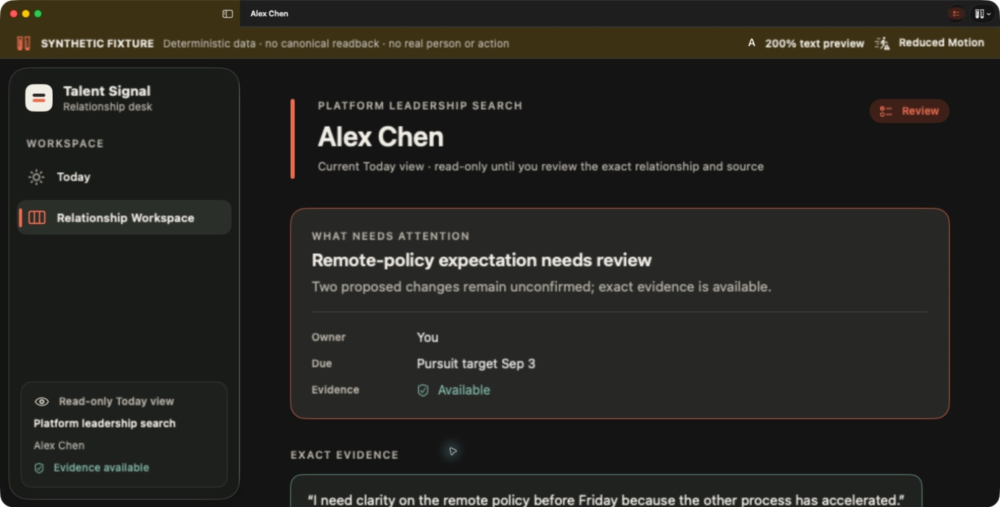
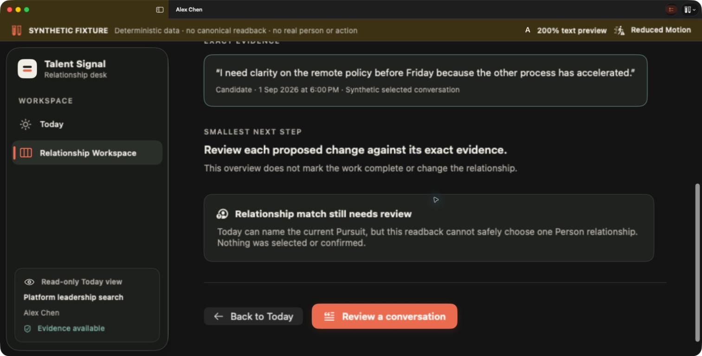

# Native Product Audit R3: Today to Relationship Detail

Date: 2026-09-01

Mode: combined UX and screenshot-based accessibility audit

Surface: native macOS Today → relationship detail

User goal: open one item that needs attention and immediately understand the
current dependency and smallest next step without granting relationship or
action authority.

All screenshots use an explicitly labeled synthetic fixture. They demonstrate
native behavior and visual hierarchy, not canonical readback or recruiter
usefulness.

## Verdict

The original transition was structurally broken: selecting Alex Chen on Today
opened a generic local-deletion and intake workspace that neither named Alex
nor preserved the selected dependency. The revised transition opens the exact
current Today projection as a read-only relationship explanation. It does not
select or confirm a Person/Pursuit scope, and it removes consequence controls
and empty intake UI from this read path.

Proposal-led Today items now carry only exact fragments that the Proposal
actually cites and that the current readback marks reviewed with confirmed
attribution. The relationship detail exposes those quotes without granting
decision authority. The remaining high-impact gap is a route to the exact
canonical Proposal review gate; the read-only detail must not substitute for
that decision surface.

## Flow steps

### 1. Today entry — healthy

One raised relationship item leads the broader continuation list. Every item
retains why now, unresolved dependency, owner, due, next move, and evidence
availability. The selected item is a projection of canonical work, not a person
score.

### 2. Previous relationship transition — broken

The selected Today item disappeared. The destination instead showed `Local
context cleared`, an unrelated scope-confirmation card, an empty intake editor,
and Capsule boundary copy. This failed task continuity and placed governance
before any relationship explanation.

### 3. Revised relationship transition — healthy intermediate state

The exact selected projection now owns the page title and attention hierarchy.
One focused surface contains the dependency plus owner, due, and evidence
availability. The smallest next step is separate and prominent. The sidebar and
toolbar describe a read-only Today view instead of leaking the prior local
Capsule state.

The unresolved relationship match is explicit. No Person, Pursuit, fact, or
action is silently selected or confirmed. This capture exposed the remaining
gap at that point: evidence availability was visible, but the supporting words
were not.

### 4. Exact cited evidence — healthy

The final revision keeps the same quiet hierarchy while adding the candidate's
exact cited words, actor, observed time, and source. The quote appears only on
the deliberate detail view, not in the Today queue. At the normal window size,
what needs attention, evidence, unresolved state, smallest next step, and both
navigation actions remain visible without scrolling.

The live projection filters out uncited fragments, unreviewed fragments,
unconfirmed attribution, and empty or revoked text. When a Proposal reports
evidence availability but the exact source is absent from the readback, the UI
says so instead of inventing a quote. Owned-action and open-gap items continue
to show availability only because their current list DTOs do not carry exact
fragments.

### 5. Dark, Reduced Motion, and 200% text — healthy at the first viewport

The identity, dependency, owner, due, evidence state, and start of the exact
quote remain legible. The layout uses vertical reflow and a scroll continuation
rather than shrinking metadata or introducing horizontal scroll. State remains
text-and-icon based.

### 6. Dark, Reduced Motion, and 200% text — healthy at the action viewport

The unresolved match and both navigation actions remain reachable after one
vertical scroll. The primary action still opens deliberate Quick Panel intake;
it does not read another app or clipboard automatically.

## Strengths

- Navigation preserves the exact current Today item instead of opening a
  generic workbench.
- Exact evidence is bound to Proposal citations and current source authority;
  availability alone cannot manufacture a quote.
- Read-only navigation remains separate from relationship selection,
  confirmation, fact mutation, and external action.
- The page has one visual focus and uses whitespace before additional cards.
- Long text wraps, dark appearance retains semantic distinction, and 200%
  text reaches every action by vertical scrolling.

## UX risks

1. Proposal-led Today items still need an exact canonical route that opens the
   relevant decision gate without asking the recruiter to rediscover it. The
   quote shown here is evidence access, not authority to accept or reject a
   proposed change.
2. A Today item without a unique Person relationship can explain the Pursuit
   dependency but cannot safely render a living candidate page. The current
   copy is truthful; future canonical routing must preserve that ambiguity.
3. `Review a conversation` starts a deliberate new-source review. It is not a
   substitute for opening the existing exact source.

## Accessibility risks and limits

- The native accessibility tree exposes the page, focused attention, exact
  evidence, next step, unresolved relationship, and both actions in reading
  order.
- Dark appearance and 200% text were visually inspected; contrast ratios were
  not instrumented.
- Reduced Motion was active, but transition timing was not measured.
- Keyboard-only focus order, VoiceOver announcement quality, and XCTest UI
  execution remain separate host-level verification work.

## Implemented corrections

- Today now resolves the clicked identifier against the current projection
  before navigating; stale identifiers fail closed.
- The selected Today item is retained as a read-only projection and cleared
  when canonical readback or explicit consequence-scope selection replaces it.
- Relationship scope remains unselected and unconfirmed during this read path.
- The relationship page, sidebar, window title, and status badge now describe
  the selected item rather than stale local-intake state.
- Proposal-led details now carry up to two exact, cited, reviewed fragments with
  confirmed attribution. Missing or ineligible source text remains explicit
  instead of being reconstructed from the Proposal summary.
- The incorrect startup call to `NSUpdateDynamicServices()` was removed. The
  service is plist-declared; system discovery and user enablement are separate
  from the in-process services provider.
