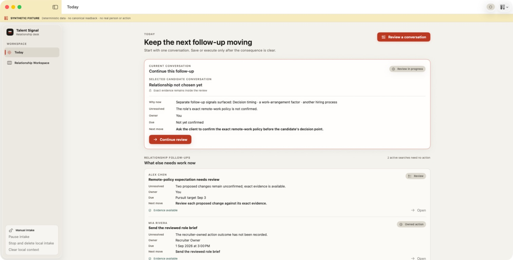
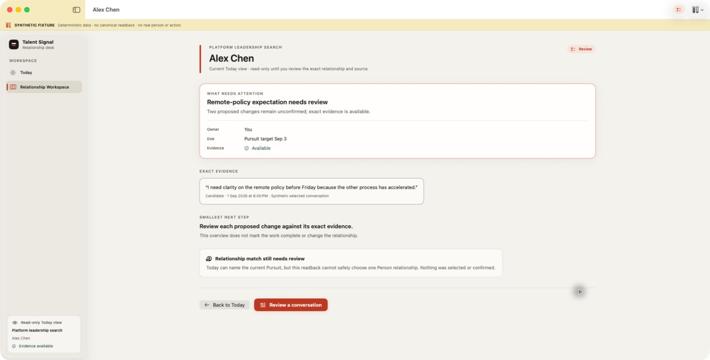
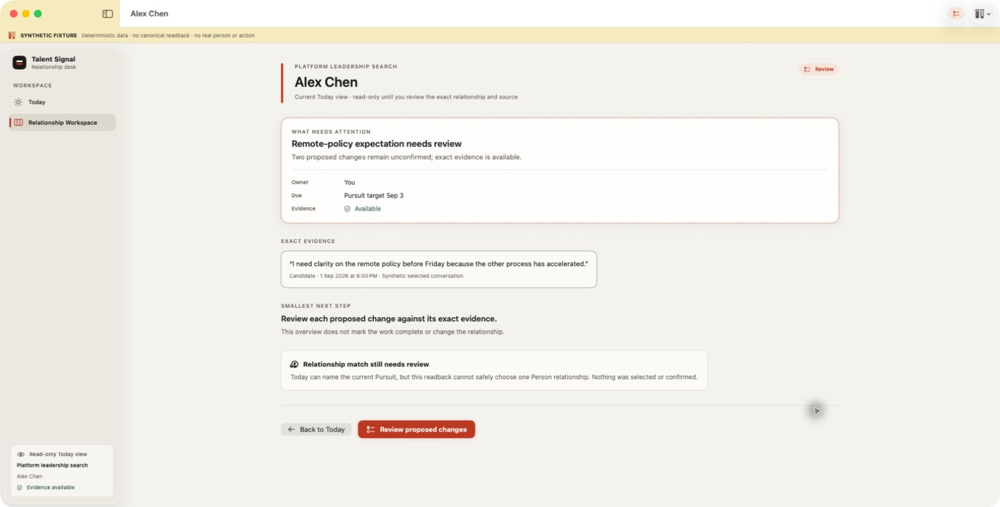
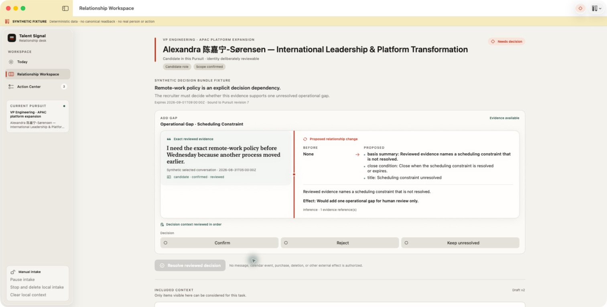
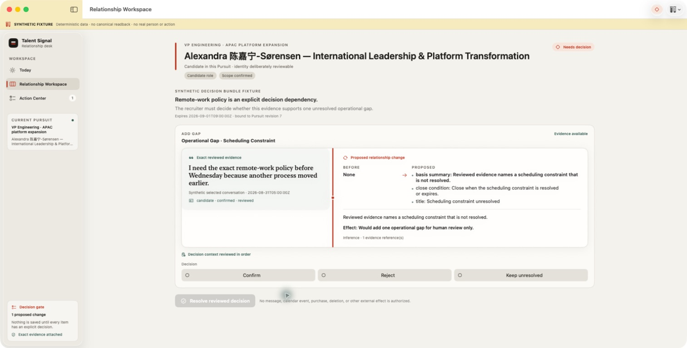
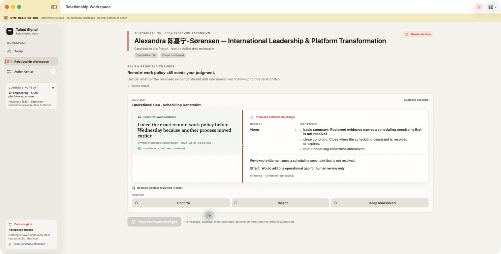
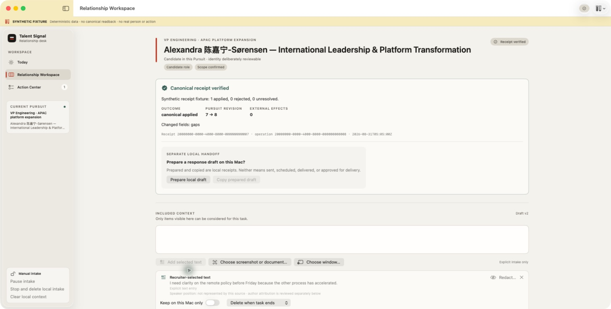
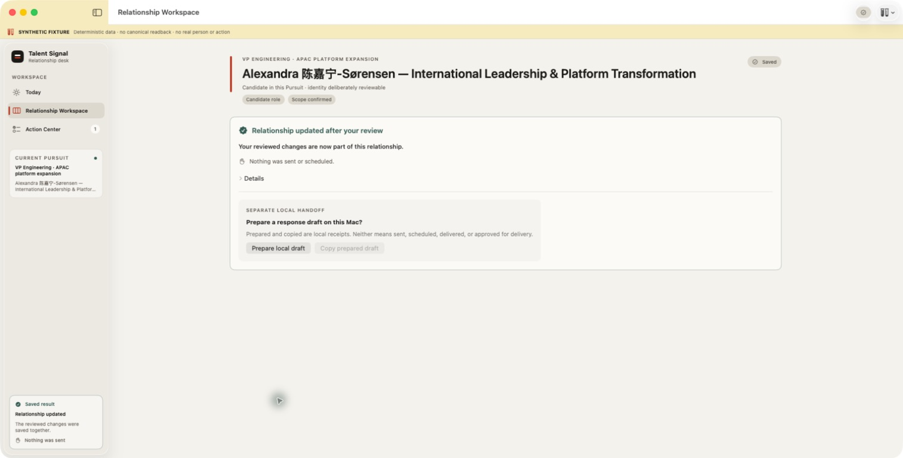

# Native Product Audit R4: Today Proposal to Human Decision

Date: 2026-09-01

Mode: native screenshot-first flow audit plus accessibility-tree verification

Surface: macOS Today → Proposal detail → exact decision gate → saved result

User goal: finish the relationship review already waiting in Today without
starting another conversation, rediscovering evidence, or learning internal
Agent and receipt terminology.

All screenshots use an explicitly labeled synthetic fixture. The exact route
was also exercised against the isolated loopback backend; neither source is
field evidence from an authorized recruiter workspace.

## Verdict

The original detail page explained the right dependency and exact evidence but
ended with `Review a conversation`. That control started a new intake rather
than opening the proposal already waiting for a decision. The revised flow
opens the one active decision bundle that matches the Today Proposal, Pursuit,
Person, relationship context, Capture, Resource, cited evidence fragments, and
Pursuit revision.

The native decision surface now keeps one causal thread: exact evidence,
before/proposed change, one explicit choice per change, and a disabled save
control until every choice is made. It no longer displays a second Capsule
intake or unrelated Action Center rows beside the decision. Technical expiry,
revision, receipt, operation, and effect fields remain available under
`Details`, while the ordinary result reads `Relationship updated after your
review` and `Nothing was sent or scheduled.`

## Flow evidence

### 1. Today entry

The pending Proposal remains one work item, not a candidate score. Why now,
unresolved dependency, owner, due, next move, and evidence availability are
visible before navigation.

### 2. Previous detail dead end

The detail correctly showed exact evidence, but its forward action opened a new
conversation review. The recruiter could not reach the already pending
decision from the object that named it.

### 3. Exact review route

The forward action is now `Review proposed changes`. Its accessibility hint
states that the exact current decision gate will open, no choice is
preselected, and nothing is saved until every proposed change is reviewed.

### 4. Decision gate before focus cleanup

This pass proved the correct evidence and change reached the gate, but it also
exposed three distractions: unrelated Action Center fixtures, Manual intake in
the sidebar, and another Capsule editor below the decision.

### 5. Focused decision gate

The second input path is removed while a decision is pending. Action Center
contains only the real pending proposal, and the sidebar states the save
boundary and evidence availability.

### 6. Human-language decision gate

Internal bundle, expiry, and Pursuit-revision language moved under `Review
details`. The primary action is `Save reviewed changes`; each choice says that
nothing is saved until that action is used. The accessibility tree confirmed
all choices began `Not selected` and the save control began disabled.

### 7. Previous receipt hierarchy

The first completed route exposed `Canonical receipt verified`, revision,
external-effect count, identifiers, a second intake editor, and Manual intake
as primary UI. The state was correct but the product language was not.

### 8. Focused human result

The completed state now leads with the recruiter outcome, explicitly says that
nothing was sent or scheduled, hides the unrelated Capsule intake, and keeps a
separate local draft handoff. The full receipt, operation identifier,
relationship version, changed fields, and zero-effect readback remain
inspectable under `Details`.

## Exact routing and safety proof

- The Today row carries the exact Proposal identifier; other attention kinds
  cannot enter this route.
- Opening review requires exactly one active `waiting_for_domain_decision`
  Task whose open Decision Bundle names that Proposal and has zero external
  effects.
- The adapter searches only authorized scopes for the Proposal's Person, then
  requires exactly one relationship Resource whose Capture ID matches the
  Proposal. This prevents a same-person/different-context match.
- Every Proposal evidence reference must resolve to current, available,
  authorized, reviewed, candidate-attributed, non-empty source text on that
  exact Resource.
- The Task's semantic Pursuit revision must equal the Proposal base revision.
  Stale or ambiguous correlation fails closed before a choice can be made.
- The existing atomic decision, idempotent receipt readback, unknown-outcome
  recovery, and no-external-effect boundary are reused rather than duplicated.
- The isolated native live suite passed 5/5, including Proposal review,
  response-loss reconciliation without duplicate write, evidence revocation,
  and Capsule-version isolation. Evidence is in
  [`canonical-today-review-route-r2`](../canonical-today-review-route-r2/).

## Accessibility and layout verification

- The accessibility tree exposes the Today Proposal, exact evidence, route
  control, ordered decision context, three explicit choices, disabled/enabled
  save state, saved-result sidebar, human result, and collapsed details.
- A manual native pass selected `Confirm`, verified the save control became
  enabled, saved the synthetic decision, and observed the final result without
  a Capsule editor.
- The long mixed-script candidate identity wraps without cropping at the
  1,280 × 820 audit size.

## Remaining limits

- These screenshots use deterministic synthetic content and do not establish
  recruiter usefulness.
- The exact route still needs observation against an authorized workspace with
  multiple current Pursuits.
- XCTest UI execution, keyboard-only focus order, and VoiceOver announcement
  quality remain host-authorized verification work.
- The broader product still requires an enabled selected-text Service, one
  authorized EventKit write/recovery/removal loop, and 5–8 recruiter trials.
