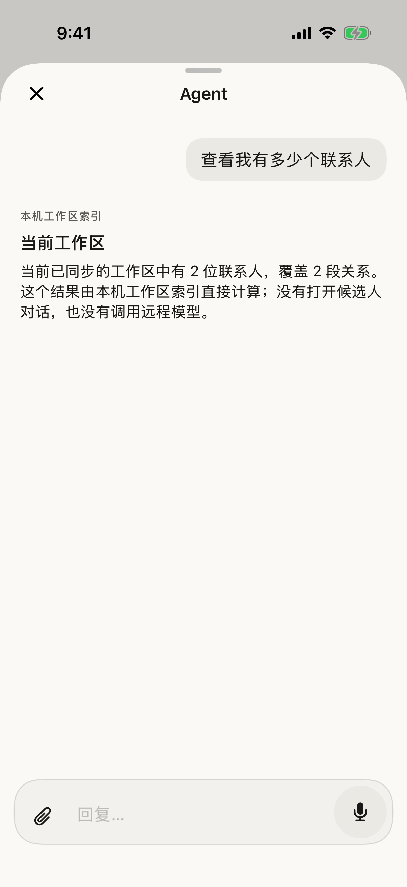

# iOS Agent local recovery and chat craft

Date: 2026-09-02

## Verified outcome

- Chinese prompt: `查看我有多少个联系人`
- Answer source: synchronized on-device workspace index
- Fixture result: 2 people across 2 relationship contexts
- Remote Agent requests: 0
- Unresolved relationship recall: absent
- Focused iPhone UI test: passed

## Visual evidence

The screenshot is an XCTest attachment captured after the local answer rendered
on an iPhone 17 Pro Simulator. The conversation uses a provider-neutral Agent
header, a quiet user bubble, and explicit local provenance.

## Automated evidence

- Backend typecheck and focused tests: 9 passed
- iOS focused unit tests: 79 passed
- Focused iOS UI test: 1 passed
- Documentation check: passed

The source-review path remains deliberately gated: a citation without a current
recruiter review is not silently promoted. The UI now preserves the exact cited
fragment and offers an explicit review or dispute path before the user retries.
