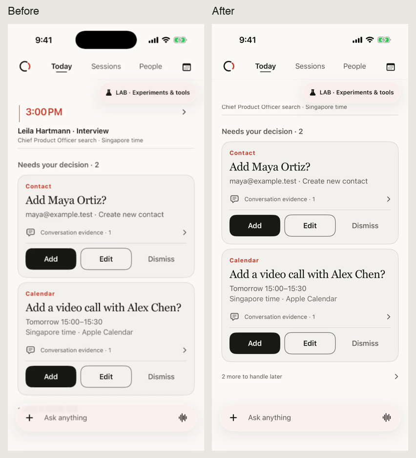
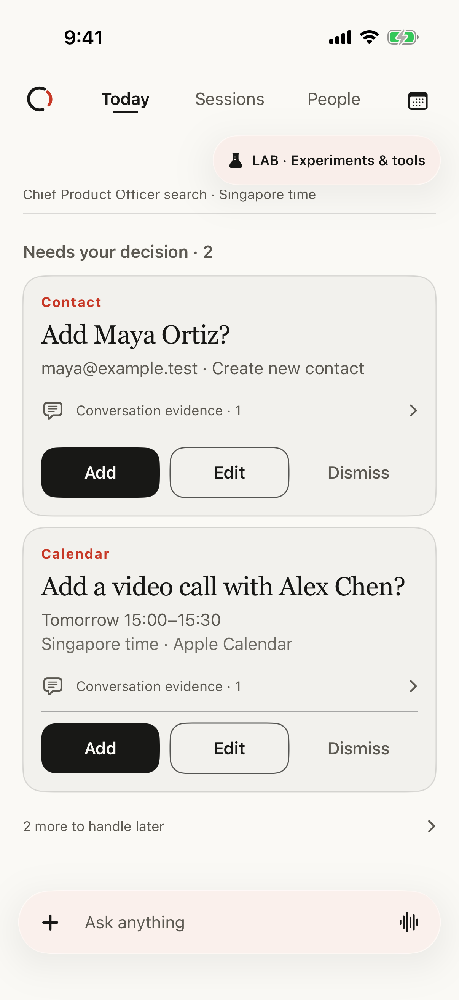
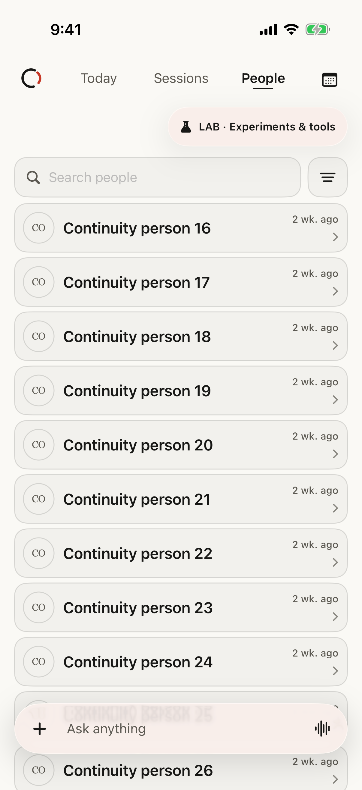
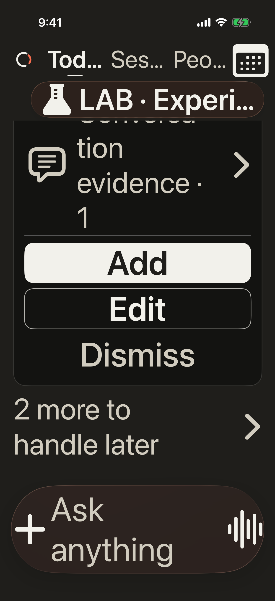
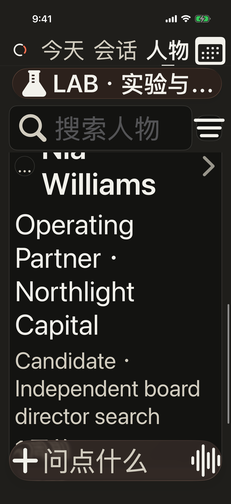

# iOS scroll continuity implementation

Reviewer: `mobile-ux-reviewer`
Lens: direct manipulation, reading continuity, content clearance, and recovery
Surface: Today, People, and Sessions for a time-constrained relationship owner

## Design decision

Keep the existing warm-neutral editorial workspace and restrained vermilion
attention. Refinement should make reading feel stable: controls have real
layout space, touch feedback does not resize cards, and the native list owns
scrolling and horizontal row actions.

The references are Apple's [scroll-view guidance](https://developer.apple.com/design/human-interface-guidelines/scroll-views)
and [motion guidance](https://developer.apple.com/design/human-interface-guidelines/motion):
retain familiar gesture behavior, make boundaries understandable, and keep
frequent feedback brief and purposeful. The existing design is the visual
reference; this change introduces no competing palette, icons, or ranking.

## Implementation

- The top header and bottom guide now apply their safe-area insets to the same
  content inside `NavigationStack`. Space follows the guide's actual layout,
  including larger text, rather than a hard-coded bottom padding.
- Today, People, and Sessions use content-sized vertical bounce on iOS 16.4+.
  Scrollable content retains native elastic behavior; short lists need not
  bounce just because a vertical gesture occurred. iOS 16.0–16.3 retain the
  platform fallback.
- Row position dictionaries are replaced by semantic visibility candidates.
  `onGeometryChange` transforms each row into hidden/partial/full visibility
  relative to the actual named viewport before updating state. The first
  visible candidate is saved only when its identity changes. There is no
  global 120-point threshold or pixel-offset propagation into shell state.
- Retrieval cards use a brief opacity change without scaling. Reduced motion
  removes the animation. Native swipe actions and context menus remain intact.
- People metadata reuses its two immutable ISO date parsers instead of
  allocating them during each row's metadata calculation.

Apple's [geometry-observation API](https://developer.apple.com/documentation/swiftui/view/ongeometrychange(for:of:action:))
supports the single-value action on iOS 16 and recommends transforming frequent
geometry changes into meaningful values before updating a broad UI subtree.

Implementation owners:
[archive view](../../../apps/ios/Sources/Features/RelationshipArchiveView.swift),
[retrieval metadata](../../../apps/ios/Sources/Features/RelationshipArchiveModels.swift),
[continuity UI tests](../../../apps/ios/UITests/RelationshipScrollContinuityUITests.swift).

## Verification

The isolated current-iOS snapshot built successfully on the iPhone 17 Pro
simulator running iOS 26.5. The production changes were then applied to the
shared working checkout as a task-only patch; the two modified production files match
the tested isolated sources byte-for-byte at integration. This working snapshot also contained concurrent
unpublished Lab changes; its results are implementation evidence, separate
from the isolated publication validation.

First targeted run passed six UI tests and one metadata/search unit test:

- People and Sessions preserved a deep anchor across tab changes, detail or
  composer dismissal, and background/foreground.
- The People test reached person 33 instead of remaining on the first row.
- A separate test verified that actual upward and downward gestures change
  the visible anchor, then checked restoration and settled row position.
- People swipe and long-press actions retained their existing scoped Ask path.
- The Today final row and calendar action cleared the guide in both directions
  at standard text size, in light and dark rendering.

The initial test named AX5 did not actually enlarge text. Screenshot review and
an explicit layout assertion caught duplicate arguments and a noncanonical
UIKit category string. The corrected tests use
`UIContentSizeCategory.accessibilityExtraExtraExtraLarge.rawValue`; the new
test also asserts enlarged evidence text before checking footer clearance.
The initial passing result is not counted as AX5 evidence. This prevention
lives in executable tests rather than new always-on guidance.

The corrected run passed actual AX5 Today footer clearance, Chinese dark AX5
People/Sessions reachability, and Session trailing-swipe ownership. In total,
eight distinct UI cases and one metadata/search unit case have valid passing
evidence. The current shared working checkout then compiled successfully and passed both
Today cases again: standard-size clearance and actual dark AX5 clearance. The
Today screenshots below are exported from this final integration result.

After the shared build finished, the simulator was restarted with the final
app. The installed executable and debug library match the integrated build
byte-for-byte. A read-only runtime inspection confirmed the corrected layout:

| Today geometry, standard text | Before | After |
| --- | --- | --- |
| Scroll view frame | 402 × 874 pt | 402 × 874 pt |
| Content size | 402 × 784 pt | 402 × 784 pt |
| Adjusted top inset | 166 pt | 166 pt |
| Adjusted bottom inset | 34 pt | 102 pt |
| Available scroll travel | 110 pt | 178 pt |

The additional 68 points match the guide's layout space. The UI tests' frame
comparisons and final screenshots independently verify that the footer clears
the guide. Documentation validation and the scoped whitespace check passed.

### Test reliability correction

The previous People restoration test targeted the `relationship-people`
accessibility marker, implemented as a 1-point background. The real List now
has `workspace-people-list`; the regression asserts a substantial gesture
target and an anchor change before testing recovery. This prevents a no-op
swipe from passing on the initial row.

### Rendered evidence

## Boundaries

All interaction evidence uses synthetic preview data. No contact/calendar
proposal was approved, no external message was sent, and no authority or
candidate-data boundary changed. Person identity, evidence, proposal status,
and action approval keep their existing meaning and attention order.

The tests and recordings establish layout clearance, real scroll movement,
restoration, and gesture behavior. They do not establish real-device FPS or
prove that every possible simulator frame stall has been eliminated.
At AX5, the existing English header abbreviates navigation labels; their full
accessibility labels and actions remain available. This is not a complete
header typography redesign or a full accessibility certification.

Raw local evidence: `/tmp/talent-signal-scroll-proof/` contains the build logs,
result bundles, synthetic UI recording, isolated baseline, and task-only patch.
The [prior diagnosis](../2026-09-04-ios-scroll-jitter.md) preserves the measured
baseline and its original reproduction limitations.
