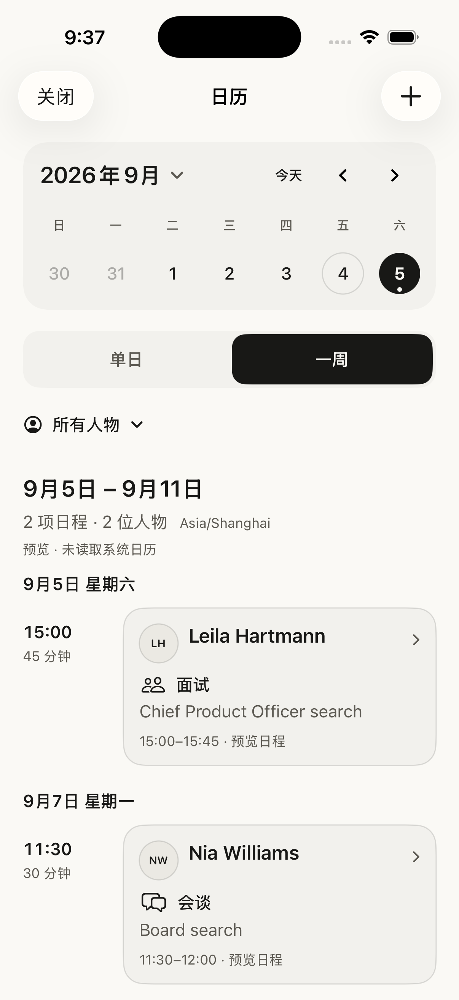
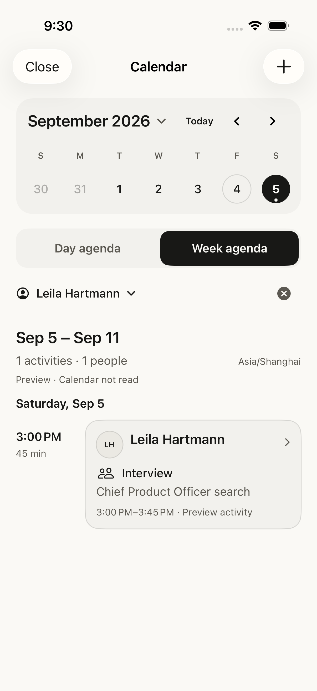
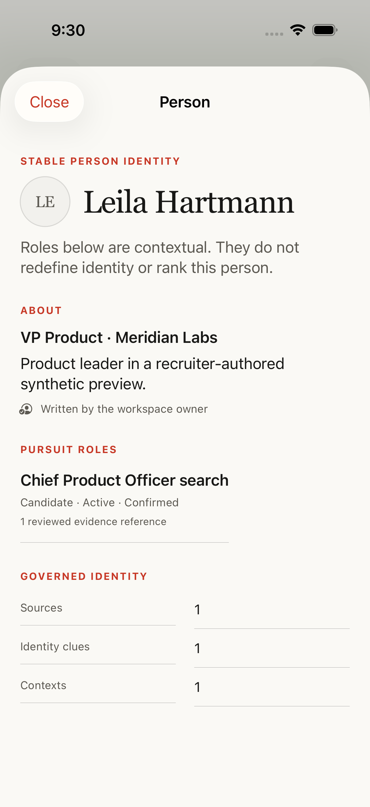
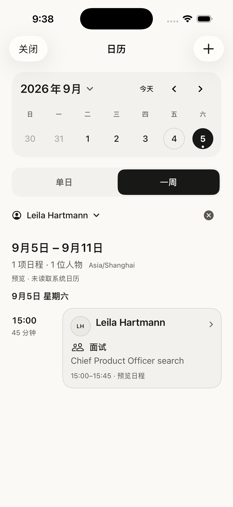
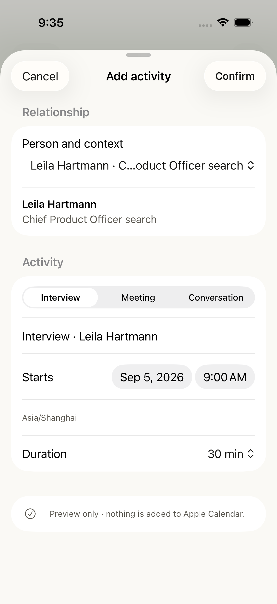
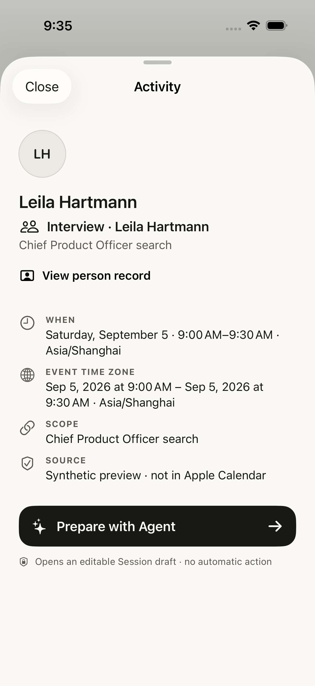
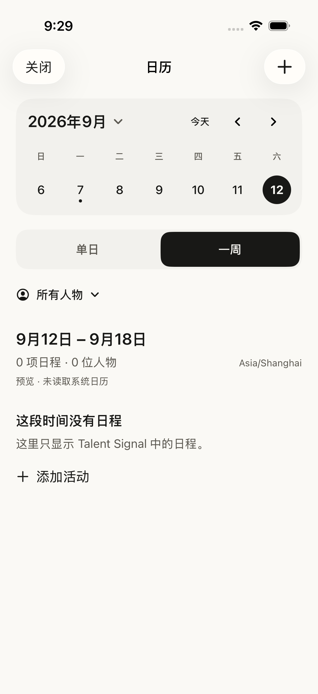
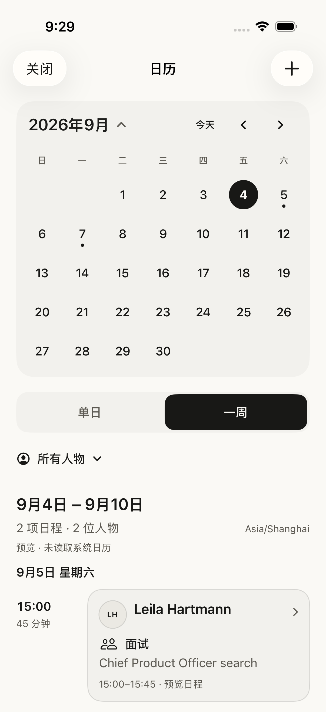
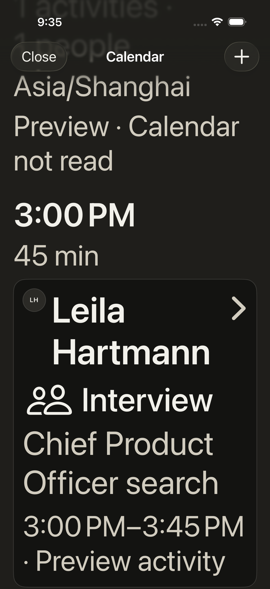
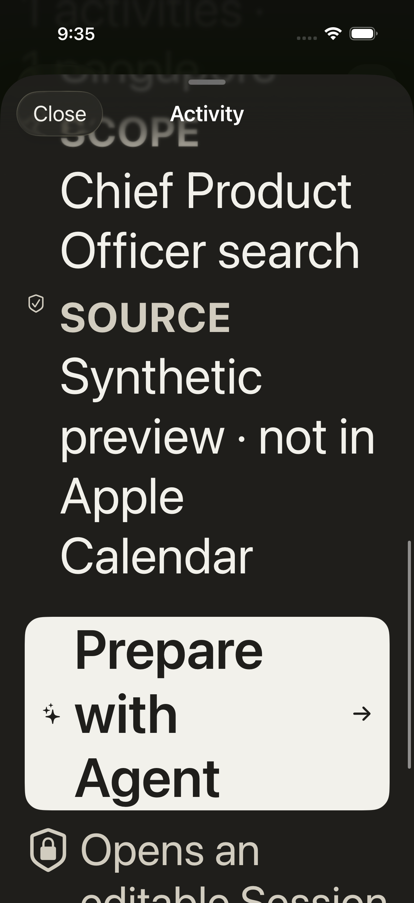

# Relationship calendar review

## Scope

Native iOS Calendar, synthetic preview only. User references supplied two mobile
calendar layouts. Those images are visual references, not instructions or
candidate evidence. No calendar read, invitation, message, or production write
was performed.

## Before

1. [Day agenda](01-before-day.png): time, avatar, person, and context compete in a
   narrow horizontal row; one selected date is the only retrieval mode.
2. [Activity detail](02-before-detail.png): identity and scope are readable, but
   person-record navigation and event timezone are missing. The editable Agent
   draft is an existing strength.

Both baseline images were captured from the isolated Simulator during this
review, inspected, and matched against the CUA-visible window and state.

## Design decision

Direction A retains the current compact row. Direction B uses a compact date
selector, day/week control, person filter, and wider person-led activity card.
The before/after comparison evaluates retrieval clarity, quiet visual identity,
and typography at operational scale. No candidate score, importance color, or
invented meeting acceptance is shown.

The implementation preserves stable Person/context IDs and separates preview,
in-app confirmation, and Calendar write receipts. Dates and filters project the
same activities. The week is explicitly seven calendar days from the selected
date; the heading shows its range. Cross-midnight events use half-open intervals,
and overlap warnings cover only known Talent Signal activities.

## Verified flow

| Step | Surface | Result |
| --- | --- | --- |
| 1 | Day/week and month navigation | Passed; selected dates, range, time zone and known people remain visible. |
| 2 | Person filter | Passed; the selected stable Person restricts the same agenda and day markers; clearing restores both preview people. |
| 3 | Activity → person record → calendar | Passed; the existing person page opens inside Calendar. Final CUA readback preserved September 5, week mode and the Leila filter on return. |
| 4 | Contextual creation | Passed; current person/date seed the editable form, the full selected scope is visible, and preview confirmation has no device write. |
| 5 | Preparation and accessibility | Passed; the existing scoped Agent draft remains unsent; actual maximum accessibility type remains scrollable and the preparation button reachable. |

### Final native week

### Person retrieval and return

### Creation and honest preview result

### Empty, month and maximum text size

## Validation and limits

- Thirteen unique focused XCTest cases passed: five date/identity/overlap tests
  and eight native UI workflows. Affected workflows were rechecked after
  layout and navigation refinements. See [verification ledger](verification.json).
- Final Debug build, localization boundary, `git diff --check`, and
  `pnpm docs:check` passed.
- The old Calendar accessibility test used an invalid content-size raw value.
  It now uses `UICTContentSizeCategoryAccessibilityXXXL`, asserts the enlarged
  person-name height, and scrolls until the actual control is reachable.
  Icon bounds and button wrapping were corrected from those screenshots.
- Final source was installed into an isolated iPhone 17 Pro / iOS 26.5
  Simulator. CUA confirmed the final Chinese week and person-return flow.
  Other images are inspected XCTest attachments from this same review.
  Earlier English attachment counts preceded the final grammar-only wording
  correction; the final summary uses “Activities: n · People: n”.
- This is not a physical-device, TestFlight, VoiceOver, keyboard, or recruiter
  usability certification. Long arbitrary customer content and live failed
  Calendar writes were not exercised. No external side effects were performed.

## Related

- [Design rationale](../../../_index/inbox/2026-09-04-relationship-calendar-design.md)
- [Plan](../../../plans/2026-09-04-relationship-calendar.md)
