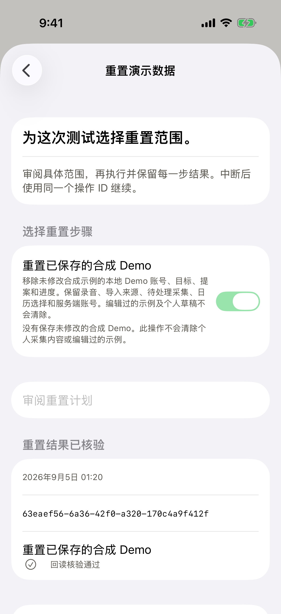
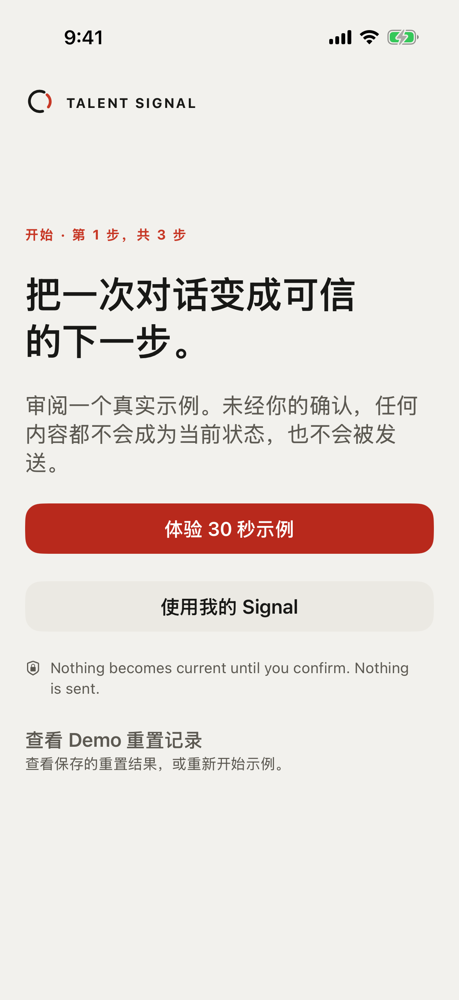
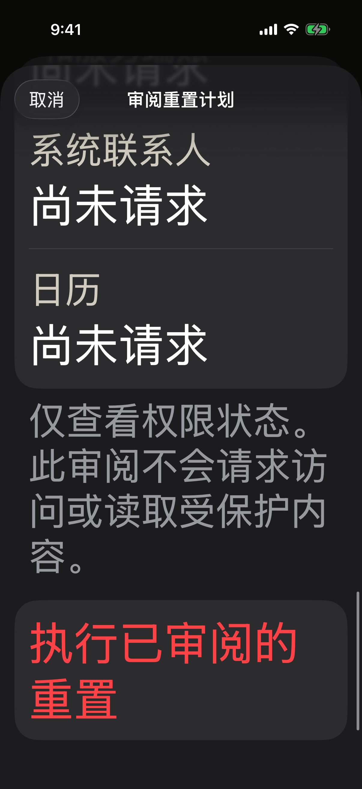

# Scoped synthetic Demo reset

Scope: local iOS implementation and synthetic Simulator verification.
This is an independent reset capability in the [full Lab plan](../../../plans/2026-09-04-lab-complete-runtime.md),
not a server-created empty workspace or a release deployment.

## Behavior and ownership

Lab maintenance and standalone Settings share a reviewed reset action. Within the existing Debug-only
standalone route, this entry is independent of server sign-in and the
internal device-Lab build flag. Its Welcome screen can reopen saved results.

The previous Demo command called a broad session reset that also removed the
co-located Recordings directory and global Live Activity stop requests. Neither
directory placement nor a Demo account label proves ownership of user capture.
The replacement admits an unchanged catalog example, rejects mixed/private or
edited state, and binds review to a canonical hash of the saved revision.
Set-valued fields are sorted before hashing so relaunch preserves identity.

Reset replaces only the synthetic local account, goal, draft, proposal and
progress. Imported-source IDs, unassigned capture identity, calendar selection,
permission observation and calendar window survive. All recording files, shared
capture payloads, shortcuts, global activity requests and server accounts remain
outside this action. Edited examples use their ordinary source-specific controls.

Intent precedes effects. The atomic replacement carries the operation UUID, so a
lost journal receipt can be reconciled without resetting work created afterward.
A changed source or a different session blocks an old intent. State-save failure
preserves the original. Active recording or writes block maintenance. Combined
Demo/onboarding reset clears the Demo first, then resets the introduction route.
No unknown or ineligible state is silently turned into a successful fresh test.

## Verification

Artifacts are under `/tmp/talent-signal-lab-v2/`.

| Proof | Result |
| --- | --- |
| Scoped Demo reset, composite maintenance and existing onboarding | 69 signed checks passed in `demo-reset-final-1.xcresult` |
| Chinese reset → Welcome after relaunch → same operation receipt | Passed in `demo-reset-native-final.xcresult` |
| Chinese AX5/dark review and reachable confirmation | Passed in `demo-reset-native-2.xcresult` |
| Localization | Passed: 2,074 catalog keys |
| Documentation | Passed: 427 Markdown files |
| Immutable 201-file Release snapshot | `demo-reset-source-delivery`; passed in `demo-reset-release.log`; public device-Lab flag NO |

The [source proof](source-proof.json) records all 12 owned file hashes. They
match the Release snapshot. Six unrelated Live Activity source/test files
changed afterward and were preserved; this is a snapshot build, not a claim
that those later changes were compiled. No owned proof service remains, and no
TestFlight, production deployment or publication occurred.

Signed checks cover actual file/media preservation, private and edited content
rejection, canonical Set hashing, stale reviews, new sessions, failed intent and
state writes, lost receipts, later-work preservation, recording blockers and
ordered composite reset. Existing onboarding source deletion/recovery checks
continue to pass.

Native test corrections were harness corrections: SwiftUI List items outside the
viewport require scrolling before their existence is asserted; relaunch must
retain the independent standalone-entry flag while removing only the clean-reset
flag. No product failure was inferred from those initial assertions. All named
passing paths use the final scoped reset implementation.

## Limits

- Reset recognizes the two existing synthetic text fixtures and their unedited
  derived values; it does not infer ownership of arbitrary content under a Demo
  account.
- Readback verifies the local replacement. It does not delete original media,
  reset iOS permissions or create a server workspace.
- The existing standalone Welcome retains a redundant English trust footer in
  Chinese mode; its preceding Chinese text carries the same meaning. This
  milestone does not claim a complete app-localization audit.
- Simulator proof does not establish physical-device protection behavior or
  assistive-technology user comprehension.
- Native tests use separate UUID namespaces for onboarding and reset journals;
  they do not clear a user's saved onboarding or unfinished reset.
