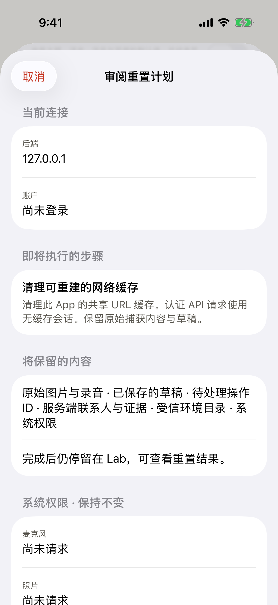
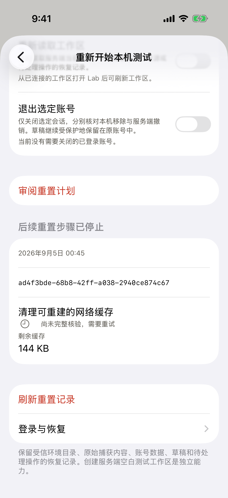
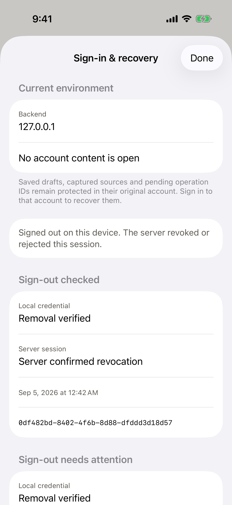

# Reviewed device reset and session-ending recovery

Scope: internal working-tree iOS implementation and synthetic Simulator proof.
This milestone implements local maintenance and the shared sign-out primitive;
it does not complete every requirement in the [full Lab plan](../../../plans/2026-09-04-lab-complete-runtime.md).

## Product behavior

Data & restart offers one reviewed plan with selectable cache, display,
diagnostic-history, saved-onboarding, workspace-read and sign-out steps. Review
fixes the selected actions and original context, names preserved data and the
destination, and reads current permission statuses without requesting access.
Each operation and step has durable intent and readback. Relaunch requires an
explicit same-operation resume. Stopping remaining steps preserves completed
and uncertain outcomes rather than claiming rollback or success.

Shared URL cache is rebuildable; the authenticated API session is uncached.
Display reset preserves saved Lab presets. Diagnostic clearing stops capture,
clears local reports and uses MetricKit's deletion watermark. Onboarding changes
only its Welcome route and intro flag; tests compare all other fields and the
actual retained recording file. Workspace refresh requires a successful fresh
read rather than treating a retained stale snapshot as proof.

## Session boundary

Sign-out first saves an endpoint-bound protected intent. It invalidates the old
root, closes capture recovery and activity surfaces, then separately verifies
local credential removal and remote revocation. Late validation cannot reopen
the account. Pending intent receipts appear at sign-in before closure finishes.
Normal settings preserve account-scoped drafts and pending operation IDs.

Failed revocation retains a credential only in its Keychain ending journal,
never normal restoration or diagnostic exports. Resolution or reported expiry
removes that copy on journal access. Expiry is labeled as saved expiry, not a
fresh server verification. A non-secret identity-slot hash supports later local
removal after the raw credential is discarded. Retry targets the original
fingerprint, preserves a newer login and leaves an already signed-out recovery
screen mounted. The journal bounds unresolved records rather than silently
discarding them. Unreadable storage preserves prior bytes and blocks effects.

Maintenance uses the runtime work registry: active writes or recording block a
reset step, and only the maintenance owner's exact logout route receives its
write permit. Recording holds a lease through asynchronous finalization and
cancellation. No business write, original source deletion or permission reset
is part of local maintenance.

## Verification

Artifacts are under `/tmp/talent-signal-lab-v2/`. Final focused results:

| Proof | Result |
| --- | --- |
| Session ending, signed Keychain and runtime isolation | 27 checks passed in `reset-final-1.xcresult` |
| Reset lifecycle, real-file preservation and combined cache/logout recovery | 8 checks passed in `reset-local-final.xcresult` |
| English partial sign-out → relaunch → same-ID server-confirmed retry | Passed in `reset-native-2.xcresult` |
| Chinese AX5/dark reviewed-scope controls | Passed in `reset-native-2.xcresult` |
| Chinese cache observation → exact-ID relaunch → explicit stop retaining uncertainty | Passed in `reset-local-ui-final.xcresult` |
| Backend fixture typecheck | Passed in `reset-backend-typecheck.log` |
| iOS localization and documentation | Passed: 2,065 keys; 422 Markdown files |
| Immutable 198-file Release snapshot | `reset-source-final`; Release passed; all current hashes matched; public device-Lab flag NO |

A controlled URLCache reached zero and the composite operation recovered its
original logout receipt. The native shared-cache run observed 144,016 bytes
remaining; its result stayed unverified after relaunch and after stopping
further steps. The test did not substitute a fake zero value.

The native proof service is
[`startLabResetProofServer.ts`](../../../apps/backend/src/evaluation/startLabResetProofServer.ts).
It binds only loopback 4341, creates synthetic sessions, deliberately rejects
the first logout and accepts the next one. It has no database, Apple login,
provider calls or business writes. Its metadata records counts without tokens.
The passing native journey showed local removal plus unverified remote
revocation, relaunch without account content, and same-ID retry with server
readback. It made exactly two logout attempts and one successful revocation.
Across initial attempts and the passing journey, metadata recorded three
synthetic validations, four logout attempts and one revoked session, with zero
provider calls and zero business writes. The owned service was closed after
proof; no database or proof process remains.

Native verification exposed an invalid zero-cache assumption: shared system
cache occupancy remained nonzero after removal. The product correctly retained
that observed size and an unverified result; the journey now checks either
measured outcome, same-ID relaunch and explicit stopping without a success
claim. A supplied real in-memory URLCache separately proves zero-size readback.

The rendered sign-in recovery control also needed an explicit accessibility
container so child identifiers remain reachable. Source review removed an
optional-context no-op path by making the confirmation own an immutable plan.
Intent receipts publish before closure, and signed-out retries preserve root
generation; the latter has a focused executable regression. Final native
verification covers these corrections. Result rows expose one combined
accessibility element, and completing or stopping work scrolls to its receipt.

## Remaining boundaries

- No TestFlight or production release, hosted CI execution or real account
  sign-out is claimed.
- Server-created empty test workspaces and separately scoped Demo reset remain
  pending in the full plan. Memory fixtures do not fulfill either capability.
- Physical-device Keychain and speech-engine lifecycle proof remain outside
  this Simulator milestone; registry and cancellation code do not substitute
  for that proof.
- Corrupt protected journals are preserved and effects blocked. This milestone
  provides retry after storage becomes readable; it does not invent a safe
  automatic repair or discard unknown ending intent.
- Historical privacy-safe receipts remain bounded local records. Previously
  exported reports and iOS-owned permission/system metrics remain separate.

See [Lab ADR](../../decisions/0012-useful-device-lab-and-real-experiments.md) and
the [iOS implementation guide](../../../apps/ios/README.md).
