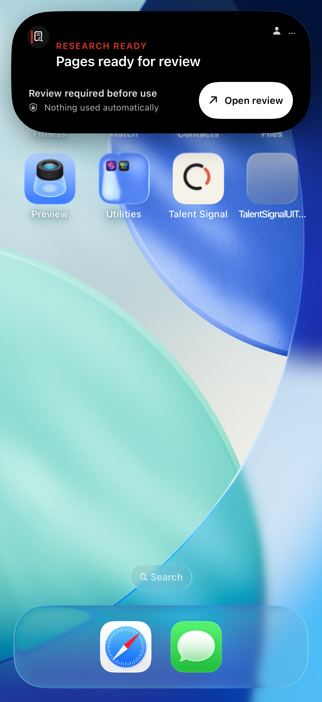
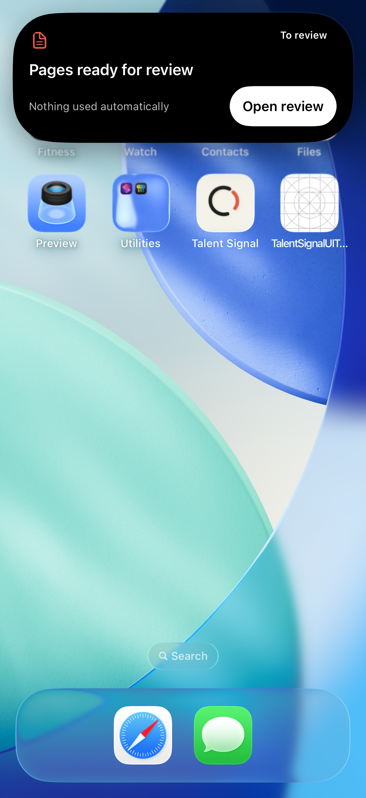
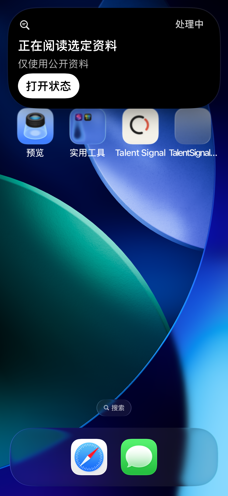
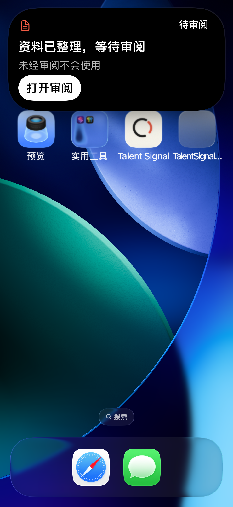

# Live Activity refinement

The existing ActivityKit presentation now leads with the task, a distinct work
or review state, one boundary statement, and one in-App destination. Compact
labels describe work instead of telling the user to leave. Expanded labels stay
inside the rounded corner, and accessibility sizes use a vertical action layout.

## Observed result

1. **Working — passed:** Research compact and expanded show the working symbol,
   current task, public-source boundary, and an exact status destination.
2. **Review — passed:** the symbol and label change together; review opens the
   matching task and ends only that Activity instance.
3. **Partial, failed, unknown, delayed — passed:** four real Agent system
   presentations and their exact issue/status destinations were exercised.
   Partial evidence never becomes a complete review session.
4. **System card — passed with a native first-use prompt:** Notification Center
   renders the Lock Screen presentation and its working/review actions. This is
   not proof of a physically locked device. The screenshots retain Apple's
   unaccepted Live Activity permission prompt below the app-owned card.
5. **Chinese, dark, AX5 — passed:** the Simulator system language was `zh-Hans`,
   appearance `dark`, and text size `accessibility-extra-extra-extra-large`.
   Compact, expanded, and system-card titles, boundaries, and actions remained
   visible. Both destinations returned to the exact task. Apple's separate
   first-use permission text truncates at AX5; no claim is made that this
   OS-owned prompt passed a full accessibility audit.

The new accent has a calculated 6.39:1 contrast against black. State also has
text and distinct symbols; color alone never carries the meaning. Full
VoiceOver/Switch Control testing remains outside this receipt.

## Before and after

The baseline repeated phase and reassurance text and clipped the expanded
trailing label. The refinement removes that duplication, preserves one useful
boundary, and moves the title into the full-width bottom region.

| Baseline Research review | Refined Research review |
| --- | --- |
|  |  |

| Chinese working at AX5 | Chinese review at AX5 |
| --- | --- |
|  |  |

Additional original screenshots and their test, device, timestamp, and hashes
are indexed in [the screenshot manifest](screenshots.json). Images are unedited
Xcode system attachments captured during this run. This is a synthetic,
candidate-free fixture, not production research or a background delivery test.

## Implementation and verification

- Shared display policy handles invalid payload combinations, system staleness,
  explicit domain staleness, review, partial results, no-action, and end states.
  Invalid projections offer no unsupported route. System expiry changes the
  presentation without changing business state or exact-instance identity.
- The recording widget shares typography and colors, uses review rather than
  completion symbolism, hides stale live timers, localizes its copy, and has
  explicit 44-point controls. Three existing stop/freshness regressions passed;
  the recording surface itself was not captured in this run.
- [34 focused tests](unit-summary.json), [4 English system journeys](ui-en-summary.json),
  and [1 Chinese AX5 system journey](ui-zh-summary.json) passed on iPhone 17 Pro,
  iOS 26.5, device `432CF099-1379-47F5-93EB-8E87F7B2782C`.
- The current shared-workspace App build passed (`/tmp/talent-signal-island-app-build.log`).
  Integrated build-for-testing encountered unrelated in-progress
  `RelationshipCaptureServiceStub` protocol conformance. No integrated full-suite
  pass is claimed. Focused tests ran on a detached clean-base worktree carrying
  the same Activity source and tests. The unrelated custom Reduce Motion
  environment property retained its base value there.
- [Source hashes](source-manifest.json) identify the final shared-workspace
  implementation. Temporary build/test worktrees and original xcresults remain
  under `/tmp/talent-signal-island-*` as local verification artifacts.

The deterministic corrections belong in projection and lifecycle tests. No
additional global policy or duplicate design specification was introduced.

## Limits

Agent and Research remain Debug-only synthetic showcases. This slice adds no
production APNs transport, autonomous task execution, or external-write authority.
Minimal symbols are implemented and covered by display-policy tests, but a true
system-selected minimal presentation was not captured. Signed-device Always-On,
physical locking, recording visuals, and background delivery still require their
own evidence. Apple determines the system presentation and its size; see
[ActivityKit guidance](https://developer.apple.com/documentation/ActivityKit/displaying-live-data-with-live-activities).
