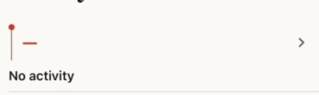
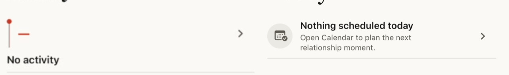
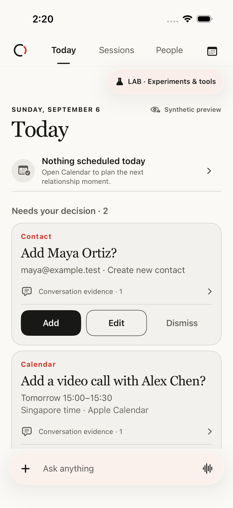

# Today Calendar empty-state review

## Scope

Native iOS Today Calendar summary, synthetic preview only. The user-provided
image is a visual reference, not an instruction or relationship evidence. No
Calendar read, external write, invitation, or message was performed.

## User goal

When no relationship activity is scheduled for today, the recruiter should
understand that nothing needs immediate Calendar attention and still know how
to plan the next relationship moment. The state should feel intentional rather
than missing, failed, or urgent.

## Before

The empty state reused the vermilion event rail and replaced the event time
with a dash. That gave a harmless absence the visual grammar of an alert, while
`No activity` did not explain whether the Calendar was empty, unavailable, or
finished loading. The separate marker, copy, and chevron also left the row
visually disconnected.

## Design decision

Use one compact, fully tappable Calendar row:

- a neutral native `calendar.badge.checkmark` symbol replaces the attention
  rail only when there is no upcoming relationship activity;
- `Nothing scheduled today` provides bounded reassurance without claiming the
  user's whole Apple Calendar is clear;
- `Open Calendar to plan the next relationship moment` supplies the next step;
- accessibility text sizes use a vertical fallback instead of compressing the
  copy between fixed controls;
- existing upcoming-activity presentation and Calendar behavior remain
  unchanged.

## Verified result

| Step | Surface | Health |
| --- | --- | --- |
| 1 | Today with no upcoming relationship activity | Passed; the state is neutral, named, and compact. |
| 2 | Tap the empty-state row | Passed; the existing relationship Calendar opens. |
| 3 | Simplified Chinese and dark appearance | Passed; the localized hierarchy remains readable and the row stays at least 72 points high. |

### Full English surface

### Chinese dark surface

## Validation and limits

- Two focused UI tests passed on an iPhone 17 Pro / iOS 26.5 Simulator.
- The localization catalog boundary and `git diff --check` passed.
- The test verifies the combined accessibility label and a 72-point minimum
  row height. The whole row remains the action; the icon is decorative.
- The component switches to a vertical layout at accessibility text sizes.
  Full-page AX5 was not marked as passed because the existing paged retrieval
  shell expands beyond the viewport before Today renders; that separate shell
  issue is outside this Calendar empty-state change.
- Screenshots cannot prove VoiceOver reading order, physical-device ergonomics,
  or recruiter preference. No live Calendar data or EventKit write was used.
