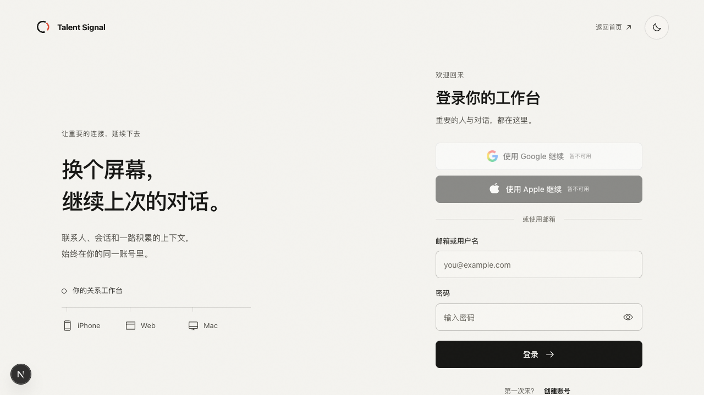
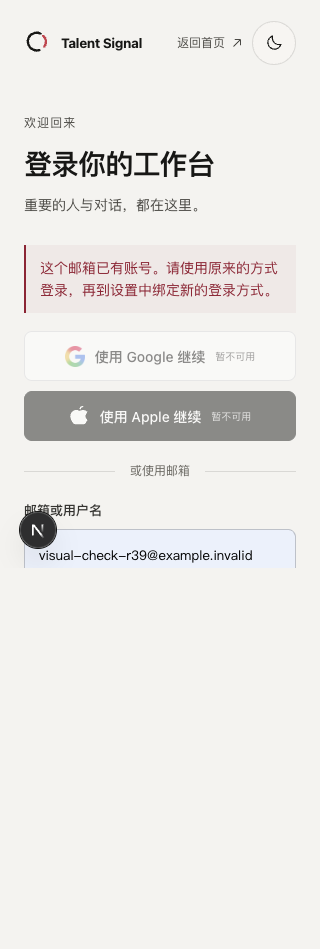

# Login continuity design and bounded acceptance

The parent selected A (desktop continuity explanation beside a focused form)
over B (generic centered form), following the independent rendered review.
Mobile keeps one form column. Production uses the existing brand/theme tokens,
50px primary controls, 16px inputs, 44px utility targets and 14px recovery text.
The repeated continuity caption is shown only on mobile; study controls and
the redundant left footer line are absent from production.

The canonical object is the signed-in account. Device labels explain access
to the same People and Session history; they are not fake contact previews,
provider status or identity proof. Email conflicts direct the user to an
existing method and Settings binding.

`receipt.json` binds the four production source files, the rendered A/B review,
actual runtime screenshots and 320px DOM geometry. A real keyboard password
login entered the existing disposable account; a failed password attempt
returned a generic error and usable controls; actual logout returned home.
Registration was switched visually only. The conflict screenshot used the
existing query-selected error presentation and does not prove backend collision
handling. Apple/Google were correctly unavailable on the loopback HTTP test
configuration. No live OAuth, phase-two native entry boundary, physical device,
or 200-percent text-zoom acceptance is claimed.

Prototype capture anomalies are documented in the independent review and
receipt. The valid raw-CDP phone screenshot and measured layout replace the
invalid capture as evidence; no product layout correction or exact tooling
root cause is inferred.

