# Import-to-action technical design

> Status: proposed implementation contract
> Last reviewed: 2026-08-04
> Scope: iOS-first evidence capture, candidate-state compilation, capability
> routing, approved execution, and outcome feedback

## 1. Purpose

Talent Signal turns one recruiter-controlled conversation artifact into an
inspectable change in candidate state and one smallest useful next action.

It is not a general-purpose autonomous agent. The product is an
evidence compiler and governed action broker:

```text
intentional import
→ inspectable evidence
→ proposed assertions
→ recruiter-confirmed state
→ one action proposal
→ capability and policy resolution
→ user-approved execution
→ verified outcome
```

This document complements:

- [`architecture.md`](architecture.md), which defines the shared domain,
  backend, agent, memory, and execution boundaries;
- [`product.md`](product.md), which defines the user, job, and MVP scope;
- [`design-system.md`](design-system.md), which defines the canonical
  information model and product surfaces;
- [`deep-research-candidate-momentum-loop.md`](deep-research-candidate-momentum-loop.md),
  which contains the broader product, market, safety, and evaluation research;
- [`integrations.md`](integrations.md), which defines the first model and
  credential boundary.

## 2. Decision summary

The implementation follows these decisions:

1. Normalize every capture path into one `ImportEnvelope`.
2. Aggregate sources as versioned evidence and fact state, not as a long
   generated summary.
3. Use a deterministic workflow for the one-screenshot loop.
4. Let models resolve semantic ambiguity and propose typed output.
5. Let code own identity, time, permissions, state, policy, and side effects.
6. Route actions through a versioned capability registry.
7. Keep fact confirmation separate from action approval.
8. Execute local Apple-system effects on the device and external SaaS effects
   through the authorized backend connector.
9. Verify the destination result before showing success.
10. Treat no action, ambiguity, failure, expiry, and deletion as normal product
    states.

The core technical taste is:

> Use the smallest useful model boundary and the strongest deterministic
> boundary around identity, permission, time, and mutation.

## 3. Current implementation baseline

The shipping iOS source currently:

- accepts one image through `PhotosPicker`;
- displays the selected image;
- continues to render `CandidateSignal.sample`;
- derives a demo verdict from deadline and unresolved-constraint flags;
- changes only local UI state when an action is confirmed.

The repository does not yet implement:

- Share Extension ingestion;
- OCR or conversation-layout reconstruction;
- candidate identity binding;
- structured extraction against real imported evidence;
- fact confirmation and temporal state;
- capability resolution or connector execution;
- execution verification, audit reconciliation, or outcome feedback.

Before implementing the vertical slice, select one canonical iOS project and
source tree. CI and Fastlane currently build
`apps/ios/TalentSignal.xcodeproj`; the repository also contains a root Xcode
project with a separate source tree and deployment target. New platform
capabilities must not be integrated into a project that is outside the release
path.

## 4. End-to-end runtime

```mermaid
flowchart LR
    I["Import surfaces"] --> N["Import normalizer"]
    N --> P["Local privacy preprocessing"]
    P --> O["OCR and layout reconstruction"]
    O --> E["Evidence episode and spans"]
    E --> B["Person and assignment binding"]
    B --> X["Structured assertion extractor"]
    X --> V["Identity, time, conflict, and sensitivity validators"]
    V --> R["What changed review"]
    R -->|"Confirm or edit"| F["Temporal fact state"]
    R -->|"Dismiss or clarify"| A["Audit and correction corpus"]
    F --> M["Momentum policy"]
    M --> Q["One action proposal"]
    Q --> C["Capability broker"]
    C --> H["Approval checkpoint"]
    H --> D["Device executor"]
    H --> S["Server connector executor"]
    H --> U["User handoff"]
    D --> Z["Verified result"]
    S --> Z
    U --> Z
    Z --> T["Outcome and audit"]
    T --> M
    T --> A
```



This is a workflow graph, not a multi-agent deployment requirement. Multiple
read-only stages may use the same model behind separate strict schemas.

## 5. Import surfaces

### 5.1 Priority

| Priority | Surface | Purpose | Default behavior |
| --- | --- | --- | --- |
| P0 | iOS Share Extension | Import a screenshot directly from Photos or a conversation app | Copy into the App Group, create a pending envelope, and finish quickly |
| P0 | In-app `PhotosPicker` | Privacy-preserving fallback and demo path | Load only explicitly selected assets |
| P1 | App Intent | Import evidence from Siri, Spotlight, Shortcuts, the Action button, or another intent | Accept a typed file or transferable entity and return a pending import |
| P1 | Shortcuts screenshot automation | Power-user path after a screenshot is saved | User-configured automation invokes the App Intent |
| P2 | Web drag and drop | Desktop evidence review and multi-file work | Upload through the shared backend |
| P2 | File, email, ATS, or CRM connector | Broader context after the core loop is proven | Read through an authorized adapter with source metadata |

Do not make passive photo-library scanning, clipboard monitoring, or continuous
private-message surveillance a capture path.

### 5.2 Import contract

All surfaces produce the same envelope:

```json
{
  "import_id": "imp_123",
  "source_type": "ios_share_extension",
  "source_application": "photos",
  "initiated_by": "user_42",
  "initiated_at": "2026-08-04T08:15:00Z",
  "conversation_time": null,
  "timezone": "Asia/Singapore",
  "locale_hints": ["zh-Hans", "en"],
  "candidate_hint": null,
  "assignment_hint": null,
  "assets": [
    {
      "asset_id": "asset_123",
      "media_type": "image/png",
      "content_hash": "...",
      "byte_size": 412381
    }
  ],
  "retention_policy": "ephemeral",
  "processing_status": "pending"
}
```

Required properties:

- `initiated_by` and `initiated_at` prove intentional capture;
- asset identifiers and hashes support replay, deduplication, and deletion;
- time, timezone, and locale hints anchor relative dates and OCR;
- candidate and assignment hints remain suggestions, not identity authority;
- retention is selected before remote processing;
- source application is metadata, not a trusted statement about speaker or
  identity.

### 5.3 Extension handoff

The Share Extension should:

1. validate the attachment type and size;
2. copy the selected asset into an App Group container;
3. create a minimal pending `ImportEnvelope`;
4. optionally collect a candidate or assignment hint;
5. enqueue a background upload only when the user has chosen remote analysis;
6. finish without performing a long model workflow inside the extension.

The containing app or backend resumes the durable workflow. The extension must
not claim that analysis or execution completed merely because the handoff
succeeded.

### 5.4 Multi-image and duplicate handling

Multiple screenshots may contain overlapping messages. Normalization should:

- calculate exact and perceptual image hashes;
- compare OCR-line fingerprints and timestamps;
- preserve the user-selected image order;
- identify overlapping message spans;
- merge only when message order and speaker assignment are sufficiently clear;
- keep ambiguous ordering visible for review;
- link every merged message back to each source image and bounding box.

Deduplication must never silently delete an independently imported episode. It
may mark an episode as a duplicate and reference the canonical asset while
preserving the audit event and deletion state.

## 6. Evidence compilation

### 6.1 Local perception

Apple Vision is the default OCR adapter because it can run on-device and
returns recognized text, confidence, and bounding boxes.

The perception layer stores:

- raw OCR observations;
- normalized coordinates;
- recognition language and revision;
- candidate alternatives when confidence is low;
- line and message grouping;
- speaker-side hypothesis;
- time separators, quoted blocks, forwarded content, and system messages;
- the mapping from merged messages back to raw observations.

OCR confidence describes recognition quality only. It does not establish the
truth of a statement, the speaker, the candidate identity, or whether an action
is authorized.

### 6.2 Context binding

Identity binding runs before write-capable planning:

```text
deterministic candidate retrieval
→ ranked person and assignment candidates
→ optional model comparison
→ explicit matched, ambiguous, or unknown state
→ recruiter confirmation before mutation
```

Retrieval may use authorized contact identifiers, names, assignment membership,
recent activity, and prior manual selections. It must not silently merge people
based on a display name or model confidence.

### 6.3 Assertion extraction

The extractor proposes only atomic, decision-relevant assertions such as:

- identity;
- availability;
- decision deadline;
- preference;
- constraint;
- commitment;
- stage;
- next meeting.

Each assertion carries exact evidence and uncertainty:

```json
{
  "assertion_id": "asrt_123",
  "subject_ref": "person_42",
  "assignment_ref": "assignment_7",
  "field": "decision_deadline",
  "raw_value": "Wednesday",
  "normalized_candidates": [
    "2026-08-05T23:59:59+08:00"
  ],
  "modality": "explicit_fact",
  "speaker": "candidate",
  "evidence_refs": ["span_42"],
  "valid_from": "2026-08-04T14:20:00+08:00",
  "ambiguities": [],
  "state": "proposed",
  "extractor_version": "..."
}
```

The model must abstain when evidence cannot support the subject, field, value,
speaker, or time. A preference must not become a constraint, availability must
not become meeting consent, and a recruiter annotation must not become
candidate speech.

### 6.4 Aggregation is state compilation

Talent Signal does not aggregate evidence by concatenating summaries. It
compiles three separate projections:

1. `EpisodeDigest`: a disposable aid for reviewing one import;
2. `CurrentFactProjection`: active confirmed facts after valid-time,
   system-time, conflict, expiry, and permission rules;
3. `TodayProjection`: at most one actionable brief per person and assignment.

The authoritative store remains the append-only evidence, assertion,
fact-version, action, result, and audit history. Generated prose is always a
rebuildable projection.

## 7. Model and code responsibilities

| Capability | Primary owner |
| --- | --- |
| OCR and bounding boxes | Apple Vision |
| Bubble grouping and speaker ambiguity | Deterministic layout code, with an optional vision-model fallback |
| Assertion candidates | Structured-output language model |
| Date and timezone normalization | Deterministic parser plus explicit review |
| Person and assignment retrieval | Authorized database queries and rules |
| Final identity selection | Recruiter |
| Sensitive-inference prohibition | Policy code, schema, tests, and monitoring |
| Evidence entailment | Deterministic span checks plus optional model grader |
| Current fact projection | Versioned domain code |
| Momentum verdict | Versioned deterministic policy |
| Rationale wording | Language model constrained to confirmed inputs |
| Action selection | Allowlisted playbook and policy |
| Tool execution | Deterministic executor |
| High-risk write authorization | Recruiter |

The extractor should be provider-independent:

```swift
protocol AssertionExtractor {
    func extract(from episode: EvidenceEpisode) async throws
        -> [AssertionCandidate]
}
```

Expected adapters:

- `CloudStructuredExtractor` for the baseline production path;
- `AppleFoundationExtractor` when the on-device model, language, context size,
  and required OS capabilities are available;
- `MockExtractor` for deterministic UI and state-machine tests.

On-device Foundation Models remain an optimization, not a universal
dependency. Availability depends on device eligibility, Apple Intelligence
settings, supported language, context size, and operating-system model version.
Each model and OS version requires regression evaluation.

## 8. Capability broker

### 8.1 Why a broker

An extracted point does not map directly to an unrestricted agent. It maps to a
typed action family, and the capability broker resolves:

- whether the capability is enabled for this product phase;
- whether it is local, server-side, or a user handoff;
- current OS, device, connector, and permission availability;
- risk level and approval policy;
- exact input and output schemas;
- idempotency, verification, reconciliation, and reversal behavior.

### 8.2 Capability descriptor

```json
{
  "capability_id": "calendar.create_meeting",
  "version": "1",
  "status": "enabled",
  "executor": "device",
  "risk": "system_write",
  "input_schema": "CreateMeetingInputV1",
  "output_schema": "ExternalEventResultV1",
  "approval_policy": "exact_effect",
  "required_permissions": ["calendar_write"],
  "idempotency_scope": "assignment_and_time_window",
  "verification": "external_identifier",
  "reversal": "supported",
  "availability_gate": "eventkit_write_access"
}
```

Tool access and approval are separate decisions. Enabling a capability does not
pre-authorize any invocation.

### 8.3 Risk levels

| Level | Description | Default policy |
| --- | --- | --- |
| L0 | Read-only perception, retrieval, extraction, or projection | May run automatically within authorized scope |
| L1 | Reversible Talent Signal state or internal attention schedule | One explicit confirmation; preserve undo or cancel |
| L2 | Device system record such as Contacts or Calendar | Show exact target and effect; confirm every write |
| L3 | External SaaS write or communication | Draft-first or exact-effect approval; verify destination |
| L4 | Candidate scoring, automated rejection, protected-trait inference, or unbounded delegation | Prohibited |

### 8.4 Current MVP allowlist

The candidate-signal analysis contract currently permits:

- `create_contact`;
- `update_contact`;
- `create_meeting`;
- `no_action`.

Each action is a proposal with evidence and requires confirmation. The MVP does
not automatically send messages, change an ATS stage, create a system reminder,
or schedule an alarm from model output.

### 8.5 Follow-on capability map

| Confirmed state | Smallest useful action | Execution surface | Product phase |
| --- | --- | --- | --- |
| Unknown person with sufficient explicit identity data | Propose `create_contact` | Device Contacts adapter | MVP |
| Existing person with new explicit contact detail | Propose `update_contact` | Device Contacts adapter | MVP |
| Explicit next meeting with sufficient date, time, timezone, and attendees | Propose `create_meeting` | EventKit or EventKitUI | MVP |
| Decision deadline or recruiter commitment | Create internal `AttentionSchedule` after a separate user decision | Talent Signal state plus local notification | Follow-on |
| Exceptional hard deadline requiring prominent interruption | Escalate an approved `AttentionSchedule` to an app-owned alarm | AlarmKit | Follow-on, opt-in only |
| Unresolved candidate constraint | Prepare one clarification question | Draft and user handoff | Follow-on |
| Explicit ATS field change | Propose a typed ATS patch | Server connector | Follow-on design-partner integration |
| Missing company, role, or market context | Run read-only cited research | Cloud research workflow | Desktop follow-on |
| No actionable change | Save timeline evidence only | No executor | Always available |

AlarmKit is not a generic way to control the Clock app. It schedules alarms
owned by Talent Signal and requires app-specific authorization. A model must
never escalate a notification into an alarm without a separate user choice and
a product-defined urgency rule.

## 9. Device, server, and user-handoff boundaries

### 9.1 Device executor

Use the device for:

- local OCR and redaction;
- local cached retrieval;
- PhotosPicker and Share Extension ingestion;
- Contacts, Calendar, notifications, and app-owned alarms;
- App Intents, interactive snippets, widgets, and controls;
- final permission checks for Apple-system writes.

The backend may propose a local action, but it cannot execute device-only
framework calls. The device receives a signed, versioned proposal, revalidates
it, asks for approval when required, and records the verified result.

### 9.2 Server connector executor

Use the backend for:

- multi-episode and long-context analysis;
- shared person, assignment, fact, and audit state;
- ATS, CRM, email, calendar-provider, and research APIs;
- OAuth credential storage and refresh;
- durable jobs, outbox delivery, retry, and reconciliation;
- cross-device Today state and APNs.

External connectors expose typed business operations rather than generic shell,
browser, or filesystem access. MCP may later provide interoperability, but it
does not replace tenant authorization, approval, idempotency, or audit.

### 9.3 User handoff

Use a redirect, compose sheet, or deep link when:

- the destination does not provide a reliable write API;
- the user should inspect richer destination context;
- the operation represents communication or commitment;
- execution cannot be verified safely;
- current permissions are insufficient.

A user handoff is a first-class successful plan when it is the safest way to
complete the work. The product records `handed_off`, not `executed`, until a
verifiable result returns.

## 10. iOS system integration

### 10.1 App Intents surface

The first system-facing layer should expose only:

1. `ImportEvidenceIntent`;
2. `ShowTodaySignalIntent`;
3. `CompleteOrSnoozeActionIntent`.

Recommended entities:

- `CandidateBriefEntity`: a narrow assignment-scoped projection;
- `PendingActionEntity`: identifier, person, why-now, due time, and state.

Keep the App Intents types thin. They resolve entities and call the same domain
services used by the app. Business rules and tool execution do not live inside
intent declarations.

Use an inline intent when a lightweight read or reversible action can complete
in the system surface. Open the app when identity, evidence, date, permission,
or mutation details need review. On supported OS versions, an interactive
snippet may show the exact action and provide confirm, snooze, or open-evidence
controls without exposing the full app.

### 10.2 Reminder hierarchy

Use this order:

1. in-app `AttentionSchedule`;
2. local notification for ordinary due-time attention;
3. EventKit Calendar for an actual meeting;
4. system Reminders only when users explicitly want that destination and accept
   its broader permission requirement;
5. AlarmKit only for exceptional, explicit, interruption-worthy deadlines.

Do not use an alarm as a more noticeable default notification.

### 10.3 Background work

iOS background execution is opportunistic and interruptible. Do not implement a
long-lived local agent that waits for deadlines or continuously watches private
content.

Use:

- an App Group handoff for extension-to-app durability;
- background URL sessions for user-initiated uploads;
- foreground or continued-processing tasks for visible long-running analysis
  where supported;
- system-scheduled notifications or alarms for exact local attention;
- backend jobs and APNs for dynamic server-derived attention.

Every background stage must be resumable from persisted workflow state.

### 10.4 Availability tiers

| Tier | Required baseline | Optional enhancement |
| --- | --- | --- |
| Existing deployment baseline | PhotosPicker, Vision OCR, App Intents, local notifications, Contacts, EventKit | Cloud structured extraction |
| iOS and iPadOS 26-capable device | AlarmKit and on-device Foundation Models | Local structured extraction and prominent alarms |
| 2026 platform cycle | New Shortcuts automation and richer model/system integrations | Screenshot-triggered power-user workflow |

All optional APIs require runtime availability checks, fallbacks, and
version-specific evals. Product correctness cannot depend on the newest device.

## 11. Product surfaces

### 11.1 Capture

User question:

> What am I choosing to analyze, who is it about, and what will happen to the
> source?

Show:

- selected asset preview;
- candidate and assignment binding;
- remote-processing and retention choice;
- redaction controls;
- processing stage;
- cancel and delete.

Capture is transient. It should not become a permanent upload dashboard.

### 11.2 What changed

User question:

> What explicit state change does this evidence support?

Each review object contains:

- one atomic before-and-after value;
- fact modality;
- exact source quote and anchored screenshot region;
- ambiguity, conflict, or expiry;
- Confirm, Edit, Dismiss, or Clarify;
- separate action approval when a mutation is proposed.

Do not title the surface `AI analysis`. Provenance, editability, and restraint
establish trust more effectively than a confidence percentage.

### 11.3 Today

User question:

> Who needs my attention now, why now, and what is the smallest useful move?

Show at most three assignment-scoped briefs. Each brief contains:

- person and role context;
- why now;
- unresolved dependency;
- one owner;
- one due time;
- one next action;
- expandable evidence;
- complete, snooze, dismiss, expired, failed, and outcome states.

Visual weight represents work attention, never candidate worth.

### 11.4 System surfaces

Siri, Spotlight, Shortcuts, widgets, controls, notifications, and snippets are
projections of the same `PendingActionEntity` and domain services. They do not
define separate action models.

## 12. Safety and failure contract

Release-blocking conditions include:

- evidence can bind to the wrong person, assignment, client, or speaker without
  mandatory review;
- an unsupported, contradicted, or expired assertion can appear confirmed;
- a preference can become a constraint or availability can become consent;
- a write can occur without an exact target-and-effect preview;
- a duplicate or unknown-result write cannot be reconciled;
- success can appear without a destination identifier or equivalent proof;
- one assignment's evidence can leak into another role or tenant;
- raw or derived evidence can outlive the selected retention and deletion
  contract;
- screenshot text can alter tool policy, permissions, or approval behavior;
- the product can infer candidate quality, personality, protected traits,
  culture fit, or acceptance probability.

Required operational states:

```text
pending
processing
needs_review
ambiguous
confirmed
edited
dismissed
approved
executing
succeeded
failed
unknown_result
reconciling
expired
superseded
reversed
deletion_pending
deleted
```

An optimistic success state must never hide a failed or unverified external
mutation.

## 13. Evaluation and observability

Trace every transition with:

- import, asset, person, assignment, assertion, proposal, and execution IDs;
- OCR, model, prompt, schema, validator, and policy versions;
- exact evidence references;
- workflow state transition and actor;
- permission and approval result;
- connector request idempotency key;
- external identifier or unknown-result state;
- latency, retry, reconciliation, and deletion events.

Do not place raw private conversation text in general analytics logs.

Minimum eval suites:

| Layer | Required cases |
| --- | --- |
| Import | ordered multi-image input, duplicate images, extension termination, cancelled upload |
| OCR/layout | Chinese and English, mixed language, speaker inversion, quotes, forwarding, cropped dates |
| Identity | unknown, exact match, same-name ambiguity, cross-assignment privacy |
| Assertion | preference versus constraint, negation, retraction, relative dates, no signal |
| Review | confirm, edit, dismiss, clarify, partial approval, rapid confirmation |
| Execution | changed permission, duplicate meeting, timeout, unknown result, safe retry, reversal |
| Memory | conflict, supersession, expiry, source deletion, derivative deletion |
| Safety | sensitive inference, prompt injection, unauthorized retrieval, false success |

Current release gates remain:

- every mutation has approval and audit evidence;
- every action traces to visible source evidence;
- ambiguous identity produces no automatic write;
- protected or sensitive inference is absent;
- duplicate external writes are prevented or reconciled;
- no-action samples create no operation.

## 14. Delivery sequence

### Phase 0: repository and contract convergence

- choose the canonical iOS project and remove release-path ambiguity;
- define shared JSON Schema or OpenAPI contracts;
- add `ImportEnvelope`, evidence, assertion, fact, proposal, execution, and
  outcome fixtures;
- establish deterministic state-machine tests.

### Phase 1: evidence to confirmed state

- Share Extension and PhotosPicker;
- App Group handoff;
- Vision OCR and bounding boxes;
- manual candidate and assignment binding;
- structured extraction of the first five signal types;
- exact evidence review;
- Confirm, Edit, Dismiss, Clarify;
- temporal fact persistence and deletion drill.

Exit when a real screenshot produces one correctly bound, evidence-backed,
reviewed state change without an external mutation.

### Phase 2: confirmed state to one executed action

- current MVP action planner;
- Contacts and Calendar proposal previews;
- execution-time permission and duplicate checks;
- idempotent executor, outbox, verified result, retry, and reconciliation;
- Today projection and outcome check-in.

Exit when one approved contact or meeting proposal reaches the correct
destination, returns verifiable evidence, and updates the timeline.

### Phase 3: system surfaces and attention

- the three App Intents;
- interactive snippets where supported;
- internal attention schedules and local notifications;
- optional AlarmKit escalation;
- Shortcuts screenshot automation guidance;
- APNs-backed dynamic Today refresh.

### Phase 4: external and research capabilities

- one design-partner ATS or CRM connector;
- read-only cited research;
- correction and outcome analysis;
- capability-specific evals and permission policies;
- MCP only when it improves interoperability without weakening governance.

## 15. Deep-research priorities

Prioritize research that changes an implementation decision:

1. Apple Vision OCR and chat-layout reconstruction for mixed Chinese and
   English screenshots.
2. Share Extension, App Group, and resumable-processing behavior under memory,
   time, and termination pressure.
3. Foundation Models structured generation across eligible devices, locales,
   OS model versions, and context limits.
4. App Intents entities, interactive snippets, Shortcuts screenshot automation,
   and inline-versus-open-app handoff.
5. Notification versus Reminders versus Calendar versus AlarmKit interruption
   semantics and user expectations.
6. Temporal state, append-only audit, outbox, idempotency, unknown-result
   reconciliation, and deletion propagation.
7. Permission-aware connector design and execution-versus-redirect patterns.
8. Field-level and end-to-end evals that measure real destination outcomes,
   not only model output quality.

Avoid deep investment in a graph database, multi-agent orchestration,
unrestricted computer use, or candidate scoring until the one-screenshot
vertical slice proves reliable user value.

## 16. Open decisions

The implementation still needs explicit decisions on:

- the canonical iOS project and minimum supported OS;
- App Group storage format and extension-to-app synchronization;
- default source retention mode;
- whether baseline extraction is cloud-first or device-first;
- shared schema ownership and Swift/TypeScript code generation;
- the first calendar execution mode: write-only EventKit or EventKitUI;
- whether contact creation uses direct Contacts access or system contact UI;
- the exact boundary between fact confirmation and combined action approval;
- Today scheduling ownership between device and backend;
- the first design-partner ATS or CRM connector;
- target latency and cost budgets for local and remote analysis.

Resolve these as narrow ADRs when they change data ownership, permission,
platform availability, or migration cost.

## 17. Primary references

### Apple platforms

- [Selecting photos and videos in iOS](https://developer.apple.com/documentation/PhotoKit/selecting-photos-and-videos-in-ios)
- [Recognizing text in images](https://developer.apple.com/documentation/vision/recognizing-text-in-images)
- [Locating and displaying recognized text](https://developer.apple.com/documentation/vision/locating-and-displaying-recognized-text)
- [App Intents](https://developer.apple.com/documentation/appintents)
- [Displaying static and interactive snippets](https://developer.apple.com/documentation/appintents/displaying-static-and-interactive-snippets)
- [Develop for Shortcuts and Spotlight with App Intents](https://developer.apple.com/videos/play/wwdc2025/260/)
- [What's new in Shortcuts](https://developer.apple.com/videos/play/wwdc2026/310/)
- [Foundation Models](https://developer.apple.com/documentation/foundationmodels)
- [Foundation Models updates](https://developer.apple.com/documentation/updates/foundationmodels)
- [Scheduling a notification locally](https://developer.apple.com/documentation/usernotifications/scheduling-a-notification-locally-from-your-app)
- [Accessing the EventKit event store](https://developer.apple.com/documentation/eventkit/accessing-the-event-store)
- [Wake up to the AlarmKit API](https://developer.apple.com/videos/play/wwdc2025/230/)
- [Background Tasks](https://developer.apple.com/documentation/backgroundtasks)
- [Contacts](https://developer.apple.com/documentation/contacts)

### Agent and action patterns

- [OpenAI: Using tools](https://developers.openai.com/api/docs/guides/tools)
- [OpenAI: Guardrails and human review](https://developers.openai.com/api/docs/guides/agents/guardrails-approvals)
- [Anthropic: Building effective agents](https://www.anthropic.com/engineering/building-effective-agents)
- [Glean Actions](https://docs.glean.com/agents/actions/introduction-to-actions)
- [How Linear uses Linear Agent](https://linear.app/now/how-we-use-linear-agent-at-linear)

### Product interaction references

- [Granola product method](https://www.granola.ai/blog/announcement)
- [Attio AI Attributes](https://attio.com/blog/introducing-ai-attributes)
