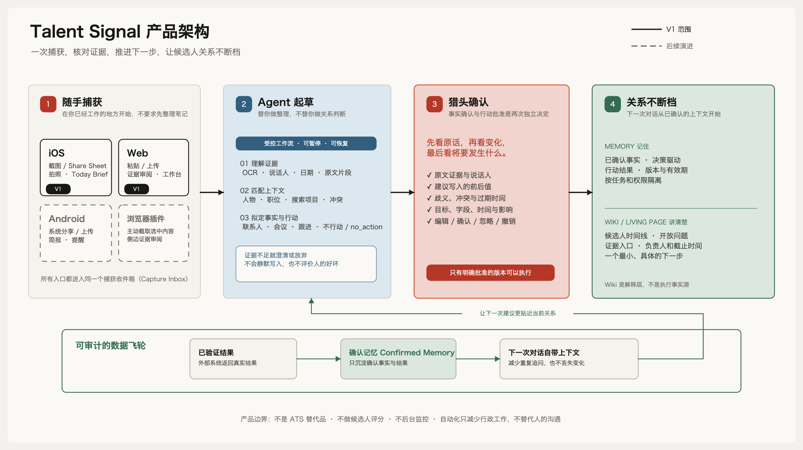

# Product

## Audience and job

Talent Signal serves independent recruiters and boutique search teams handling
high-value, relationship-led assignments.

The recruiter is the initial product user. Candidates do not need a Talent
Signal account or a reciprocal platform relationship for the recruiter to
preserve governed context. Their absence from the account model does not remove
their privacy rights or turn their conversations into unrestricted customer
property.

For each active search, and especially after a meaningful conversation, it
helps the recruiter answer:

> What outcome are we pursuing, what changed, what is blocking it now, and
> what is the smallest safe action that keeps the relationship moving?

## Promise

Never lose a strong candidate in the gaps between conversations.

The product reduces context reconstruction and missed timing. It does not
replace the recruiter's relationship judgment.

## Product loop

The loop is:

1. capture one meaningful source from the recruiter's current surface;
2. separate explicit evidence from ambiguity and interpretation;
3. let the recruiter correct and confirm what changed;
4. propose one smallest useful next step;
5. require a separate decision before consequential action;
6. observe the result and carry confirmed context forward.

The editable diagram is
[`talent-signal-product-architecture.excalidraw`](talent-signal-product-architecture.excalidraw).

## Canonical experience

The product is organized around a `Pursuit`: a concrete outcome with a time
horizon that requires people, organizations, evidence, criteria, and action.
The first complete Pursuit is a recruiting or executive-search mandate.

People remain stable identities across the product, while roles, criteria,
claims, gaps, and actions are scoped to a Pursuit. A person may be a candidate
in one search, a client stakeholder in another, and a referrer elsewhere
without becoming several unrelated identities. Cards, lists, timelines,
graphs, Today, Pursuit rooms, and living person pages are views of the same
governed state, not competing records.

Today, Sessions, and People are the primary mobile retrieval surfaces. A
Session groups recruiter-initiated Agent tasks around one explicit relationship
context so a recent conversation can be resumed without reconstructing intent.
It is a projection, not a second record: Pursuit, evidence, Proposal, reviewed
state, Action, and Receipt continue to own goals, provenance, decisions, and
effects. Evidence remains one step from a consequential claim but does not
become a top-level library that asks the recruiter to browse sources before
understanding the goal. Pursuits remain directly reachable from Today, a
Session, a person, and review context rather than consuming a higher-frequency
mobile retrieval position.

Today continues unread Sessions and gives one supported dependency or
reviewable Agent insight a clear visual lead. Remaining attention-bearing
Pursuits stay compact continuations without an arbitrary data cap. Target
outcome and date, current blocker, evidence freshness, owned action, owner, and
due date remain available from the item or its Pursuit rather than being
repeated as dashboard chrome. Today is a flexible retrieval composition, not a
generic feed: it shows only unread conversation work and current governed
attention. A pending Proposal may change the primary decision, but it cannot
hide an owned action or gap from the same Pursuit. Pursuits with no pending
review, owned action, or evidence-backed gap remain an explicit no-action count
rather than invented work.

Evidence-backed is a live authority statement, not permanent copy. When a
source is deleted or loses authorization, the affected role, gap, Proposal,
and Today item visibly become partial or unavailable. An explicitly
recruiter-authored note remains attributable to that recruiter and says that
evidence is not required; it is never relabeled as source-supported. A Proposal
whose source authority is gone stays available only as superseded history and
cannot be confirmed.

A reviewed milestone remains a versioned historical fact after its source is
deleted, but its current evidence authority becomes unavailable. The readback
keeps the confirmer, decision time, Proposal, and Receipt so history is not
silently rewritten or presented as currently source-supported.

Chat is the primary intent surface for ordinary desktop work, not another
record. It stays beside the selected Pursuit and affected person so the
recruiter can ask, navigate, compile, or stage a change while the governed
object remains visible. On mobile, the same tasks appear in manageable Sessions
because recent intent is retrieved more often than the full contact directory.
Structured review still happens on the affected object, and Chat or Session
returns an operation receipt rather than claiming that a page or external
system changed. An answer may cite only exact, currently available evidence
fragments from its account-, person-, relationship-, and snapshot-bound context.
The source name is visible in the conversation and opens an inspectable evidence
readback; a generic person page or an opaque evidence count is not a citation.
Successful mobile Sessions and unsent drafts resume within the same signed-in
account. Restored answers are visibly stale, hide their citations, and require a
new Ask before source authority is claimed again. A submitted question remains
recoverable until validated recording succeeds, and retry reuses the same task
intent instead of creating duplicate work.

An exact citation can enter a scoped source review from the Agent response. A
recruiter can dispute it with a reason; the source is rejected canonically, its
dependent knowledge is invalidated, and the current Agent turn becomes stale.
No message or other external effect is executed. A no-action result carries one
evidence-state condition for revisiting the decision without manufacturing
urgency.

Mobile capture is the complementary intent surface. A screenshot selected from
Photos or handed in through a system shortcut enters one recoverable review:
the recruiter corrects on-device text, supplies only the identity and
relationship clues they can support, compares temporal owners without a
default selection, and explicitly attaches the governed source. Completion
returns the actual compiled-Wiki quality and identifiers; it does not create a
second contact merely because another source arrived.

Local typed-signal recovery follows the authenticated workspace. The app does
not display a restored payload until workspace readback agrees, so switching
accounts on a shared device cannot expose another workspace's draft. Retry and
deletion continue to use the original workspace and stable Signal ID.

Typed Signal uses a searchable, untruncated scope list with a stable Person
record clue beside the Pursuit and relationship context. Name alone never
selects a Person; canonical readback must return the same workspace, Person,
role, and context identifiers.

An owned internal action closes only when its owner records an observed outcome.
Before submission, the client persists the draft and a client-owned operation
ID that the backend must use for the canonical operation. An ambiguous response
locks the draft until exact-ID readback reconciles it, including after relaunch;
retry cannot mint a second operation. Completion is revisioned and idempotent,
returns a matching canonical Receipt and readback, and has no external effects.
It never implies that an email, meeting, ATS, CRM, or notification write occurred.

The recruiter gets one contact entry without receiving one flattened context.
Every material item remains scoped to the relationship, assignment, purpose,
and time in which it is valid. Context-specific evidence must not leak merely
because identity is shared.

A contact identifier is not timeless identity. Current confirmed clues help
the recruiter find an existing person; expired clues are labeled historical
and can only suggest whom to review. When a fresh contact card, screenshot, or
shared source contains an expired clue, the product stages an identity review
instead of silently binding or creating another person. Choosing an existing
relationship changes the operation to attaching the fresh governed source.
Only that explicit decision can reconfirm the masked clue for a new interval.
Choosing a different person requires an equally explicit decision and preserves
the prior owner as history.

When one clue has both a current and a historical owner, the Agent resolves it
inline beside the living person page rather than opening a generic search
result or silently choosing the first card. The current owner appears first
because of visible source-linked authority, while the historical owner remains
available for comparison with its relationship controls disabled. No person is
preselected. The recruiter may choose the current relationship, remove the
clue, or preserve the source as an unresolved identity review; creating another
person stays unavailable while the conflict is active. The selected operation
then changes visibly from identity review to source attachment before any
state is committed.

Normal capture uses a plain-language default review date without asking the
recruiter to configure policy. An exceptional custom date requires a visible
reason, appears in durable Agent history, and remains attributable to the
policy version active when it was chosen. Later policy learning can change new
confirmation without silently extending an old clue.

When the recruiter discovers two entries for the same person, the product
repairs identity on the living person page rather than silently deduplicating a
directory. The review names the page that stays stable, shows every
relationship context and governed source that would move, exposes material
label, fact, and masked-identifier differences, and blocks on unresolved
identity or external effects. A current preview, recorded recruiter basis, and
explicit confirmation are required. The result retains old-link continuity,
recompiles affected knowledge, produces an audit receipt, and remains
reversible while no new dependent evidence makes an automatic split unsafe.
The immediate receipt is not the only recovery path: an applied merge remains
reviewable from durable Agent history. Reopening history creates a fresh
reversal review from current canonical ownership and dependency state; history
never acts as authority to replay an old undo. If the relationship gained new
evidence or state after the merge, the product removes the automatic reversal
action and explains what now requires human resolution.

## What the product remembers

The product remembers:

- explicit preferences, constraints, commitments, and deadlines;
- how current understanding changed over time;
- unresolved questions and dependencies;
- what action was proposed, approved, attempted, and observed;
- corrections, contradictions, and superseded state.

It distinguishes:

- source evidence;
- user-confirmed state;
- model interpretation;
- action intent;
- observed outcome.

## Attention model

The default unit of attention is not a score. It is a current dependency:

- what is blocking a decision;
- who controls it;
- when it matters;
- what evidence supports it;
- the smallest appropriate next step.

`no_action` is a valid and often valuable result.

## Initial wedge

Begin with an independent recruiter managing several high-value searches. The
first complete experience should take one recruiter-controlled post-call signal
through recoverable capture, Pursuit and identity review, evidence-backed
claims and an explicit gap, one safe action, and a verified internal result.

A thin sales fixture may prove that the Pursuit contract is not hard-coded to
recruiting, but it does not broaden V1 into a general CRM. Broader research,
desktop workflows, channels, and external agents reuse the same truth and
approval boundaries only after the recruiting loop is complete.

## Non-goals

- a general autonomous recruiter;
- a generic conversation summarizer;
- automatic candidate ranking or rejection;
- a full ATS or configurable CRM;
- ambient collection of private communication;
- message volume as a success metric;
- a generated wiki that becomes the system of record.

## Product success

Success means the recruiter can act with less reconstruction and greater
confidence while the candidate experiences more relevant, timely, and
human communication.

See [Principles](principles.md), [Capture to action](capture-to-action.md), and
[Design system](design-system.md).
