# Talent Signal 深度调研：从对话证据到下一步行动

> 研究日期：2026-08-04  
> 研究对象：面向独立猎头与精品寻访团队的 candidate-momentum assistant  
> 研究方法：仓库现状审阅、官方产品与技术文档对比、监管原文与人机协作研究交叉验证  
> 说明：厂商能力与效果数字若无特别说明，均来自厂商公开资料，适合判断产品方法，不应视为独立审计结论。

## 一、结论先行

### 1. 产品最重要的部分是什么

Talent Signal 最重要的不是 OCR、截图导入、会议摘要、CRM，也不是一个会聊天的 AI。

它最重要的部分是：

> **一个可审计的候选人状态转换闭环：把对话中的明确证据，变成经猎头确认的候选人状态变化，再在正确时间给出一个最小、具体、可执行的下一步，并持续知道行动有没有发生、有没有解决问题。**

可以把它压缩成：

```text
Evidence → Verified State Change → Momentum Decision → Approved Action → Outcome
```

这条闭环有三层价值：

1. **用户当下感知到的价值：下一步行动。** 用户不是为“被总结”付费，而是为“没有错过候选人的决定窗口”付费。
2. **下一步行动可信的必要条件：带来源、带时间的事实状态。** 没有可靠状态，所谓 next best action 只是更像建议的幻觉。
3. **长期产品壁垒：用户修正与行动结果构成的反馈数据。** 什么被确认、什么被修改、哪个行动解决了哪个阻塞，比原始聊天文本更有价值。

因此，Talent Signal 应被定义为：

> **位于私人对话与 ATS/CRM 之间的 candidate momentum layer（候选人动量层），而不是新的 system of record。**

更直接的产品承诺可以是：

> 每一次重要候选人对话，最终都留下一个可验证的变化和一个不会被遗漏的下一步。

### 2. 当前方向是对的，但原型还没有证明核心价值

仓库里的产品边界非常克制，而且方向正确：

- 用户被限定为独立猎头与精品寻访团队；
- 价值不是“管理更多候选人”，而是避免在对话间隙丢掉强候选人；
- 只提取显式事实，事实与推断分离；
- 联系人、日历变化必须经过确认；
- iOS 用于有意图的截图导入，桌面端用于更深的研究和比较；
- 不做完整 ATS，不做自动消息，不做人格或敏感属性评分。

但现有实现仍是一个 narrative prototype：

- Web demo 使用 4 组正则识别 `competing-offer`、`deadline`、`preference` 和 `availability`，返回的是预写文案，不是真实证据片段，也没有身份、时间和冲突处理；
- iOS 可以选取图片，但导入的图片没有进入分析链路，候选人 brief 仍来自 `CandidateSignal.sample`；
- “Confirm next step” 只改变界面状态，没有形成候选人事实版本、动作执行、审计与结果回流；
- 当前 verdict 是一次性函数，不是随新证据持续更新的时间状态。

这不是坏事：原型已经验证了产品语言和交互骨架。下一阶段不应该继续扩页面，而应该打通一条真实 vertical slice。

### 3. 最优先的真实 vertical slice

```text
从系统分享菜单导入一张真实截图
→ 本地 OCR 与版面定位
→ 用户确认候选人身份
→ 只提出 1–3 个带原文定位的事实变化
→ 用户确认/修改
→ 写入带时间和来源的候选人状态
→ 生成一个“为什么是现在”的下一步
→ 用户确认后创建提醒或日历事项
→ 到期后记录是否完成、阻塞是否解除
```

只有这条链路跑通，Talent Signal 才从“漂亮的 AI 招聘概念”变成产品。

---

## 二、为什么核心不是摘要，而是状态转换

### 1. 摘要正在快速商品化

Metaview 和 Ashby 已经把招聘会议录制、转写、结构化笔记、scorecard 草稿和 ATS 回写做成招聘基础设施。Metaview 的公开流程是自动加入访谈、生成说话人区分的文本、按岗位 rubric 填结构化结果，再回到 ATS；Ashby 则把 transcript、resume、email、feedback 和 interview context 直接放在候选人记录里，并明确限制 AI 自动填充为“事实性草稿”，由面试官插入、编辑和提交。

这说明：

- “为招聘场景生成一份更好的总结”很快会成为 ATS 的内置能力；
- 通用 notetaker 与招聘 notetaker 的差异主要来自领域 schema 和工作流嵌入；
- 独立产品若止步于截图总结，会同时被系统 OCR、通用模型和 ATS 三面压缩。

参考：

- [Metaview Notetaker 与招聘对话覆盖范围](https://support.metaview.ai/guides/overview-for-ta)
- [Metaview 与 Greenhouse 的结构化笔记和人工提交流程](https://support.metaview.ai/integrations/ats-integrations/greenhouse)
- [Ashby AI Notetaker](https://docs.ashbyhq.com/ai-notetaker)
- [Ashby 访谈后 AI 草稿的事实性限制与人工插入](https://docs.ashbyhq.com/ai-notetaker-post-interview)

### 2. “记住”也不是最终价值

关系型工作中的底层问题不是没有记录，而是记录没有变成注意力分配。

一个候选人说：

> “我手里还有一个 offer，周三要决定。周二下午可以聊，但 remote 很重要。”

摘要可以正确地重述四件事，但用户真正需要回答的是：

- 哪件事改变了候选人的当前状态？
- 哪个事实是硬约束，哪个只是偏好？
- 周三按候选人所在时区到底是哪一天？
- remote policy 是候选人依赖，还是 recruiter 已经知道答案？
- 在约下一轮面试前，最小的解除风险动作是什么？
- 谁负责，最迟什么时候做？
- 如果没有处理，什么时候重新浮到 Today？

所以核心数据单位不应是 `summary`，而应是 **带来源的、具有时间有效性的 assertion（断言）与 state transition（状态转换）**。

### 3. “下一步建议”本身也不够

没有证据和状态，建议不可信；没有执行和结果，建议不产生业务价值。

真正完整的 action card 至少应回答：

| 用户问题 | 产品必须展示的内容 |
|---|---|
| 这是关于谁？ | 已匹配候选人、岗位/assignment，身份不明确时必须先确认 |
| 什么变了？ | `旧值 → 新值` 或 `此前未知 → 新事实` |
| 根据什么？ | 精确原文、截图定位、说话人和对话时间 |
| 事实还是推断？ | 明确的类型标签，不把 preference 升格为 constraint |
| 为什么现在要处理？ | deadline、commitment、dependency 或 inactivity trigger |
| 建议做什么？ | 一个最小、可逆、具体动作 |
| 会改动哪里？ | Contacts、Calendar、ATS/CRM 的目标字段与 patch |
| 谁授权？ | Confirm / Edit / Dismiss；有歧义时要求澄清 |
| 之后发生了什么？ | executed / failed / expired / resolved / still blocked |

这张卡不是 AI 输出的展示组件，而是一份 **人机之间关于“什么是真的、允许改变什么”的契约**。

---

## 三、完整链路：各环节的产品问题、技术问题和最佳实践

### 0. 前置上下文：先知道这是谁、在哪个 search 中

#### 产品问题

截图往往不包含完整姓名、岗位或对话日期。对“周三”“下一轮”“他们”这样的内容，单张图片无法独立解释。

#### 推荐做法

- 导入后第一优先级不是跑洞察，而是完成低成本 context binding：
  - 候选人；
  - assignment / role；
  - 对话发生时间与时区；
  - 对话渠道；
  - 必要时是哪一方发言。
- 最近活跃候选人优先展示，但不静默匹配。
- 若身份候选只有一个，也展示“将更新 Alex Chen”，让用户有机会改。
- 身份不确定时允许只保存为 unbound episode，禁止写联系人或日历。

#### 技术做法

- 先用 deterministic candidate retrieval 缩小候选集合：
  - 昵称、手机号/邮箱、头像哈希（仅本地）、岗位、最近互动、用户手动选择历史；
- 再让模型做候选比较与“无法确定”判断；
- 任何 identity match 都记录候选集、匹配理由和最终人工选择。

Metaview 的 ATS 匹配失败文档公开列出的常见问题正是重复候选人、参会人信息缺失和数据不一致。这说明 entity resolution 不是边缘问题，而是写回链路的第一风险点。[Metaview Greenhouse troubleshooting](https://support.metaview.ai/integrations/ats-integrations/greenhouse)

### 1. Capture：有意图地导入，而不是静默监听

#### 产品问题

中国私人聊天场景里，微信、WhatsApp、LinkedIn DM 等关键上下文难以通过标准 API 完整同步。截图是一个现实 wedge，但每次去 App 内选图会形成明显摩擦。

#### 推荐做法

- 优先做 iOS Share Extension，从照片/截图完成后直接“分享至 Talent Signal”；
- 保留 PhotosPicker 作为 fallback；
- 一次只导入用户主动选择的内容；
- 导入页明确显示：
  - 将分析什么；
  - 原图是否上传；
  - 原图保留多久；
  - 哪些下游系统可能被更新；
- 默认对原图采用临时生命周期；需要保留完整来源时单独征得同意；
- 支持裁剪、打码无关参与者和删除前预览。

Apple 的 Photos Picker 在独立进程中运行，App 只能读取用户明确选择的资产；Vision 的文字识别可以完全在设备端执行。这两点非常适合 Talent Signal 的“recruiter-controlled import”定位。

- [Apple Photos Picker 的选择性访问与隐私机制](https://developer.apple.com/documentation/PhotoKit/selecting-photos-and-videos-in-ios)
- [Apple Vision 端侧文字识别](https://developer.apple.com/documentation/vision/recognizing-text-in-images)

#### 不建议

- V1 静默读取整个相册；
- 监控剪贴板；
- 伪装成无感监听的 meeting bot；
- 一开始投入大量成本逆向不同聊天 App 的 UI。

### 2. Perception：OCR 不只是文本识别，还要恢复对话结构

#### 产品问题

招聘截图的错误通常不来自单个字，而来自：

- 把左右气泡的说话人弄反；
- 丢失换行和消息顺序；
- 把系统时间、引用消息或转发内容当成新消息；
- 对中英混合、昵称、公司名和岗位名识别错误；
- 截图被裁掉日期，导致“明天”无法归一化。

#### 推荐技术链路

1. **端侧 OCR**：使用 Vision `VNRecognizeTextRequest` / `RecognizeTextRequest`，保存每个 observation 的文本、confidence 与 bounding box。
2. **版面重建**：
   - 按 y 坐标排序；
   - 通过 x 位置、气泡几何和颜色聚类识别说话人；
   - 单独识别时间分隔符、系统提示、引用块；
   - 保留原始行与合并消息之间的映射。
3. **视觉模型仅处理歧义**：
   - 谁说了哪句话；
   - 引用内容和新内容的边界；
   - OCR 低置信字符；
   - 不让视觉模型直接生成最终 action。
4. **证据定位**：
   - 每个抽取事实必须回指 `image_id + bounding_box + original_text`；
   - UI 点击证据可以回到对应截图区域。

Apple 的 OCR API 同时返回文本、识别置信度和位置框；对中文可显式指定简体/繁体识别语言。这使“点击事实回看原图位置”可以在不先上复杂视觉 agent 的情况下实现。[Apple OCR sample](https://developer.apple.com/documentation/Vision/locating-and-displaying-recognized-text)

### 3. Extraction：把对话编译成受限领域事件，而不是自由摘要

#### 推荐 ontology

只抽取对“候选人是否继续移动”和“下一步如何发生”有直接作用的类型：

- `identity`
- `availability`
- `decision_deadline`
- `competing_process`
- `preference`
- `constraint`
- `commitment`
- `next_meeting`
- `stage_change`
- `compensation_expectation`（敏感展示与更严格权限）
- `location_or_work_mode`
- `open_question`
- `client_dependency`

每一条 assertion 应包含：

```json
{
  "subject": "candidate",
  "field": "decision_deadline",
  "raw_value": "周三",
  "normalized_value": "2026-08-05T23:59:59+08:00",
  "modality": "explicit_fact",
  "polarity": "positive",
  "speaker": "candidate",
  "evidence_span_id": "span_42",
  "valid_from": "2026-08-04T14:20:00+08:00",
  "valid_to": null,
  "ambiguities": [],
  "sensitivity": "normal"
}
```

#### 模型使用原则

- 使用 strict structured output / JSON Schema，而不是解析散文；
- schema 中不允许未知字段；
- 模型负责候选 assertion，代码负责合法性校验；
- 日期归一化交给确定性时间解析器，模型只给 raw span 与解析候选；
- 模型不能用自报的 0–100% confidence 直接决定是否写入；
- 把 `explicit_fact`、`preference`、`constraint`、`commitment`、`inference` 分开；
- 如果证据不能逐字支持 assertion，直接拒绝；
- 对敏感属性做独立 guardrail，禁止从头像、语气或名字推断年龄、种族、性别、健康、宗教等。

OpenAI Structured Outputs 可以用 JSON Schema 约束模型输出；Anthropic 对生产 agent 的建议也强调先采用简单、可组合、可插入程序化 gate 的工作流，而不是为了“AI native”直接做自治 agent。

- [OpenAI Structured Outputs/API schema](https://platform.openai.com/docs/api-reference/responses-streaming/response/web_search_call)
- [Anthropic: Building effective agents](https://www.anthropic.com/engineering/building-effective-agents)

### 4. Verification：真正的人类监督不是“默认全选后点确认”

#### 产品问题

如果界面给出四张看起来很权威的卡，用户在忙碌状态下会直接全部确认。此时虽然形式上有 HITL，实际只是把错误责任转移给用户。

NIST 明确提醒：人类与 AI 组合可能放大原有偏见，应该定义清楚人类职责，并追踪用户推翻 AI 输出的频率和原因。EU AI Act 对高风险系统的人类监督也专门要求操作者意识到 automation bias，并能够忽略、覆盖、反转或停止系统输出。

- [NIST AI RMF：Human-AI Interaction](https://airc.nist.gov/airmf-resources/airmf/appendices/app-c-ai-risk-management-and-human-ai-interaction/)
- [EU AI Act Article 14：Human oversight](https://eur-lex.europa.eu/legal-content/EN/TXT/?uri=celex%3A32024R1689)

#### 推荐交互

- 卡片默认只展示一个 state diff，不把多种事实混成一段摘要；
- 精确证据默认可见，而不是藏在二级详情；
- 明确展示 `AI proposed` 与 `Recruiter confirmed`；
- 对旧值被覆盖的情况展示 `before → after`；
- 对日期、身份、硬约束的歧义使用强制澄清；
- 支持 Confirm / Edit / Dismiss，编辑时保留 AI 原值和用户最终值；
- 高置信、低风险字段可以批量确认；身份、deadline、calendar write 不批量静默处理；
- `Not enough evidence` 是成功状态，不是报错；
- 若用户连续快速确认所有卡片，可抽样要求展开证据，监测 rubber-stamping。

Granola 在产品上做得最好的一点，是将用户原始输入与 AI 补充以不同颜色呈现，并能通过 “Zoom In” 回到具体引文。它把 provenance 设计成日常交互，而不是合规附件。[Granola 产品发布说明](https://www.granola.ai/blog/announcement)

### 5. Temporal Memory：候选人事实会变化，旧事实不能被覆盖后消失

#### 产品问题

候选人昨天说 remote 是偏好，今天可能变成硬约束；原定周三决定，后来延期到周五；“可以聊”不等于已经承诺会议。普通 CRM 的最新字段无法解释：

- 什么时候开始成立；
- 何时被新信息替代；
- 当时系统为什么给出某条建议；
- 用户是否确认过；
- 原始来源是否仍存在。

#### 推荐数据模型

V1 不必立刻上图数据库，但必须采用 temporal semantics。

最少需要两类时间：

- `valid_time`：这个事实在现实世界何时成立；
- `system_time`：系统何时得知、何时修改了它。

推荐表：

| 表 | 作用 |
|---|---|
| `episodes` | 一次导入/对话事件，含渠道、对话时间、保留策略 |
| `evidence_spans` | 原文、图片坐标、说话人、OCR 版本 |
| `assertions` | 模型提出的原子事实，含 modality 与证据 |
| `fact_versions` | 人工确认后的有效事实版本，支持 supersede/invalidate |
| `action_proposals` | 建议动作、理由、due time、风险等级 |
| `action_executions` | 实际调用的 connector、参数、幂等键与结果 |
| `outcomes` | completed、resolved、still_blocked、expired 等 |
| `audit_events` | 谁在何时确认、修改、驳回、删除了什么 |

写入采用 append-only event log，再生成 current-state projection。不要直接 `UPDATE candidate SET remote_preference = ...` 后丢掉历史。

Graphiti/Zep 的公开实现值得借鉴的是概念而非立即照搬技术栈：它把原始 episode 作为 provenance，将事实建成有有效期的关系；新事实出现时让旧事实失效而不是删除，同时支持语义、关键词和图遍历混合检索。[Graphiti GitHub](https://github.com/getzep/graphiti)

#### 为什么先用 Postgres，而不是 Neo4j

- 当前实体和关系规模很小；
- 大部分查询是按 candidate、assignment、deadline、status 过滤；
- Postgres range、JSONB、event log 足够支持双时态事实；
- 图数据库的运维和查询复杂度在验证价值前没有回报；
- 当出现跨 candidate、client、role、colleague 的关系路径和复杂历史检索，再评估图存储。

这就是技术审美：**先采用正确的语义，不急于采用最重的技术名词。**

### 6. Momentum Reasoning：排序行动，不评价人

#### 产品边界

Talent Signal 不应回答：

- “这个候选人质量几分？”
- “他接受 offer 的概率是多少？”
- “这个人是否适合团队文化？”
- “从头像/语气看他是否稳定？”

它应该回答：

- 谁现在需要注意？
- 哪个已确认变化制造了时间压力？
- 什么依赖尚未解除？
- 当前最小、最可逆的推进动作是什么？

#### 推荐状态计算

用规则/策略引擎确定 verdict，用 LLM 生成简洁解释或把动作适配到上下文。

| 已确认状态 | Verdict | 推荐动作方向 |
|---|---|---|
| 近期限 + 未解决约束 | `at_risk` | 先解除约束，不要机械约下一轮 |
| 已承诺动作逾期 | `at_risk` | 立即补救并承认延迟 |
| 有 blocker、无近期限 | `resolve_blocker` | 明确 blocker 的 owner 与验证问题 |
| 双方有清晰 commitment、无 blocker | `advance` | 确认下一节点 |
| 没有决策相关变化 | `wait` | 保存上下文，不制造任务 |

优先级建议由以下因素构成：

```text
urgency × consequence × actionability × evidence_quality
```

但不要向用户展示一个神秘分数。界面应直接表达：

- `Why now`：周三前必须决定；
- `Unresolved`：remote policy 尚未确认；
- `Smallest next move`：今天向 client 确认 policy；
- `Due`：一个工作日内。

“候选人优先级”必须是 **工作优先级**，不是 **人的价值排序**。

### 7. Action Planning：一个最小动作胜过一组 AI 建议

#### 动作选择顺序

1. 先识别阻塞是 recruiter 可解决、client 可解决，还是 candidate 需要澄清；
2. 找能减少最大不确定性的最小动作；
3. 优先可逆动作；
4. 为动作设置 owner、due time 和 completion condition；
5. 把消息草稿和真正发送分开；
6. 若必要信息缺失，动作可以是“问一个澄清问题”，而不是猜。

#### 初期动作白名单

- `create_or_update_contact`
- `create_reminder`
- `create_or_update_meeting`
- `prepare_question`
- `prepare_message_draft`
- `update_ats_fact`

V1 不自动发送消息，不自动移动招聘 stage，不自动代表招聘方承诺条件。

Glean 把 action 建成可复用、带明确输入输出的操作原语，并把权限和 guardrail 集中在 action 层；Linear 则让 agent 的委派状态直接显示在 issue 中，任务仍归属人，PR 最终由人批准。这两个模式共同说明：AI 行动能力应该嵌入原有对象与权限，而不是藏在聊天框背后。

- [Glean Actions 的输入输出、权限与 guardrails](https://docs.glean.com/agents/actions/introduction-to-actions)
- [Linear 内部如何使用 Agent，并保留人类最终批准](https://linear.app/now/how-we-use-linear-agent-at-linear)

### 8. Approval & Execution：模型提议，代码校验，人授权，connector 执行

推荐执行合同：

```text
LLM proposes
→ policy validates
→ UI renders exact patch
→ human confirms/edits
→ deterministic tool executes
→ system verifies outcome
→ audit log records everything
```

关键实现：

- 每个 tool 都有 typed input；
- read 与 write 权限分开；
- write 默认需要 approval；
- action proposal 与 execution 分开存储；
- 每次执行有 idempotency key，避免重试创建两个会议；
- 执行前重新校验候选人、目标系统权限和事实是否过期；
- connector 返回外部对象 ID，不能只相信模型说“已创建”；
- 日历或 ATS 失败时保留 proposal，可以恢复，不重新跑整条推理；
- 删除和跨租户写入属于高风险动作，必须单独审批。

如果未来采用 LangGraph，其 interrupt/checkpoint 模式适合保存待审批状态并在用户确认后恢复；官方文档也特别要求 interrupt 之前的副作用必须幂等。[LangGraph interrupts](https://docs.langchain.com/oss/python/langgraph/interrupts)

V1 也可以不引入 LangGraph：数据库状态机 + job queue + outbox pattern 已足够，且更容易调试。

### 9. Today & Notification：价值在正确时间再次出现

导入后立即给洞察只是第一次价值。真正的 candidate momentum 产品必须在状态需要处理时重新出现。

Today 不应是全量 dashboard，而应是最多三条需要注意的 candidate brief：

```text
Alex Chen · At risk
Why now: 外部 offer 周三到期
Unresolved: remote policy
Next: 今天 15:00 前向 client 确认
Evidence: “remote 对我很重要”
```

排序原则：

- 先排明确 deadline / overdue commitment；
- 再排可解除的 blocker；
- 再排长时间 inactivity；
- 无可执行动作的不进入 Today；
- 同一候选人只展示一个最高价值动作；
- 用户 dismiss 时允许选择原因：不重要、已处理、事实错误、时机不对。

系统需要支持 action expiry：周三已经过去后，原建议不能继续显示成“当前事实”，而应进入 outcome review。

### 10. Outcome & Learning：真正的数据飞轮

不要把“用户点了 Confirm”当作成功。Confirm 可能只是自动化偏见。

每个 action 应追踪：

- 是否真的执行；
- 是否在 deadline 前执行；
- candidate/client 是否响应；
- blocker 是否解除；
- 是否进入下一 stage；
- 用户后来是否撤销或修正事实；
- 如果候选人退出，退出原因与建议是否相关。

长期飞轮：

```text
用户对事实的 Edit/Dismiss
→ 改进 ontology、抽取 prompt 和校验规则

用户选择哪个 next action
→ 学习不同 signal 下的 playbook

行动结果
→ 评估建议是否真正降低不确定性/解除阻塞
```

早期不要急于 fine-tune。先把 correction reason 与 outcome 结构化，形成高质量训练/评估数据。Clay 把 closed-lost CRM、通话数据、外部变化信号重新路由成 re-engagement 与产品洞察，就是“结果回到下一轮动作”的成熟 GTM 参照。[Clay closed-lost signal loop](https://www.clay.com/blog/how-clay-uses-clay-for-closed-lost-deals)

---

## 四、产品审美好的公司：值得借鉴什么

快速检索这些案例及后续新增参照时，使用
[Design reference catalog](design-reference-catalog.md)；本节保留详细证据与
取舍，不承担目录职责。

### 1. Granola：AI 不替代判断，而是放大用户已经指出的重要性

#### 方法

- 用户自己的速记是 steering signal；
- AI 结合完整 transcript 补充结构；
- 用户文本和 AI 文本视觉上不同；
- 可以从结论 zoom 到具体原话；
- 默认体验是一个安静的 note，而不是 AI 控制台；
- 原始音频转写后删除，降低敏感数据保留面。

#### 对 Talent Signal 的启发

- 用户可以在导入后点选“这一句重要”，作为优先抽取信号；
- 人写的 context、AI 抽取、最终确认事实必须有视觉层级；
- evidence drill-down 是核心交互，不是详情页；
- 不用“AI confidence 96%”营造权威，用来源与可修改性建立信任。

#### 不照搬

- Granola 的目标是形成一份好笔记；Talent Signal 的目标是形成状态变化与动作；
- “没有 meeting bot”不等于可以忽略录音/转写同意，尤其在招聘场景。

参考：[Granola 产品方法](https://www.granola.ai/blog/announcement)、[Granola 的音频删除与分享控制](https://www.granola.ai/blog/how-to-share-meeting-notes)

### 2. Metaview：领域 schema 比通用总结更有价值

#### 方法

- 围绕招聘会议而不是所有会议；
- 识别不同 call type；
- 笔记模板和岗位 scorecard 绑定；
- ATS 是 canonical record；
- AI 自动完成结构化部分，但评价字段留给人；
- 一键写回而不是让用户复制粘贴。

#### 对 Talent Signal 的启发

- 不要训练“更聪明的总结器”，要定义 candidate-momentum ontology；
- 输出应直接映射到 deadline、constraint、commitment、next meeting 等字段；
- 保持 ATS/CRM 为最终系统记录；
- identity matching 与 duplicate handling 要成为一等能力。

#### Talent Signal 的差异空间

Metaview 擅长计划内访谈和 ATS 内流程；Talent Signal 可以占据计划外、私域、移动端、关系型对话，以及“访谈之间发生了什么”的空白。

参考：[Metaview 概览](https://support.metaview.ai/get-started/what-is-metaview)、[Metaview Greenhouse integration](https://support.metaview.ai/integrations/ats-integrations/greenhouse)

### 3. Ashby：知道完整 candidate context，但克制地不替人评价

#### 方法

- 将 transcript 与 resume、email、note、feedback、availability、scheduled interview 放进同一个候选人上下文；
- 回答时遵守具体用户已有权限；
- AI 可以指出 pending action；
- feedback autofill 只生成事实摘要，不做 hiring recommendation；
- 用户显式插入内容后才提交；
- candidate recording consent、opt-out 和 retention 在系统内统一配置。

#### 对 Talent Signal 的启发

- next action 不能只看一张截图，必须读取 candidate/role/client 当前状态；
- 事实草稿与判断必须分层；
- “完整上下文 + 有限动作”比“全自动 agent”更可信；
- 同意与保留策略要和 capture flow 一体设计。

参考：[Ashby Candidate Assistant](https://docs.ashbyhq.com/ai-candidate-assistant)、[Ashby AI Notetaker](https://www.ashbyhq.com/add-ons/ai-notetaker)、[Ashby affirmative consent](https://www.ashbyhq.com/product-updates/ai-notetaker-policy)

### 4. Attio：AI-native 不是加聊天框，而是让 AI 进入 typed data model

#### 方法

- Objects / Attributes / Records / Lists 构成灵活系统记录；
- 属性具有数据类型和业务语义，不全是字符串；
- AI Research、Classify、Summarize、Prompt Completion 直接成为属性填充方式；
- AI 值可以单条或批量重算，自动更新则进入 workflow；
- 目标是从 system of record 走向 system of action。

#### 对 Talent Signal 的启发

- `deadline`、`preference`、`constraint`、`commitment` 必须是 typed attributes；
- AI 是这些属性的候选填充器，而不是一个旁边的 assistant；
- 每个字段的语义与生命周期决定模型能否可靠工作；
- 用户应在 candidate brief 内看到 AI 变化，不需要打开单独聊天页。

参考：[Attio Objects](https://attio.com/blog/introducing-attio-objects)、[Attio AI Attributes](https://attio.com/blog/introducing-ai-attributes)、[Attio 对 AI-native CRM 的描述](https://attio.com/blog/ai-and-the-next-generation-of-CRM)

### 5. Affinity：关系工作中的价值来自自动形成的关系状态

#### 方法

- 从 email、calendar、meeting history 自动构建关系记录；
- 关注 relationship strength、recency 和 warm path；
- 关系上下文进入机会排序和提醒；
- AI 与 CRM、pipeline 和 action 结合，而不只是搜索互联网。

#### 对 Talent Signal 的启发

- 候选人的动量不能只是一组静态字段，应包含互动新鲜度、承诺和依赖；
- 系统应优先使用用户真实关系上下文，而不是通用 LLM 常识；
- 未来桌面端的价值是跨候选人与 assignment 的注意力分配。

#### 不照搬

- Talent Signal 的初始信任承诺是 intentional capture，不应为了数据完整度变成 silent relationship surveillance；
- relationship strength 不是 candidate intent，也不能作为候选人价值分数。

参考：[Affinity relationship intelligence](https://www.affinity.co/blog/relationship-intelligence)、[Affinity 的 AI-native relationship workflow](https://www.affinity.co/blog/ai-in-private-equity)

### 6. Linear：AI 状态嵌入工作对象，责任仍在人

#### 方法

- agent delegate 显示在 issue 上；
- issue 仍归属人类 owner；
- agent 做 first pass，人最终 review；
- 外部系统结果反向更新 issue 状态；
- AI 不是另一个孤立 inbox。

#### 对 Talent Signal 的启发

- action card 必须有 recruiter owner；
- Calendar / ATS 执行结果回写 card；
- 用户一眼能区分“AI proposed”“human confirmed”“external system executed”；
- 不把所有 AI 能力塞进一个通用 chat。

参考：[How Linear uses Linear Agent](https://linear.app/now/how-we-use-linear-agent-at-linear)

### 7. Hebbia Matrix：重要决策是过程，不是一问一答

#### 方法

- 把复杂任务分解为可检查步骤；
- 以结构化矩阵展示每个对象与每个问题；
- 结论可以回到来源；
- 多模态文件根据需要路由到文本或视觉模型；
- 认为“有 citation”仍不足以支撑高价值判断，过程本身要可检查。

#### 对 Talent Signal 的启发

- candidate momentum 不是一个 prompt，应被分成 perception、assertion、verification、state、action；
- 每个环节保存中间产物和 trace；
- 未来桌面端比较的是“同一候选人状态如何随时间变化”，不是生成更长 report。

参考：[Hebbia Matrix](https://www.hebbia.com/blog/introducing-matrix-the-interface-to-agi)

### 8. Intercom Fin：把 Train → Test → Deploy → Analyze 做成产品生命周期

#### 方法

- 知识内容、行为 guidance 和 deterministic workflow 分开；
- 对不能可靠回答的场景 handoff；
- 上线前有 preview、batch test、simulation；
- 上线后可按 topic、guidance、escalation reason 分析；
- 关注最终 resolution，而不是消息生成量；
- 人工 handoff 的设计与自动化本身同等重要。

#### 对 Talent Signal 的启发

- ontology/playbook 是“Train”；
- 离线 conversation corpus 是“Test”；
- 按风险等级开放 connector 是“Deploy”；
- correction、false write、resolved blocker 是“Analyze”；
- 事实无法确定时，handoff 应带着已收集上下文进入用户确认，而不是让用户重做。

参考：[Fin 的完整产品生命周期](https://www.intercom.com/help/en/collections/6485365-fin-ai-agent)、[Fin guidance 与 deterministic workflow 的边界](https://www.intercom.com/help/en/articles/10210126-provide-fin-ai-agent-with-specific-guidance)、[AI-human handoff](https://www.intercom.com/learning-center/ai-human-collaboration-procedures-handoffs)

### 9. Glean：权限感知的 context 与 action primitives

#### 方法

- knowledge graph 同时建模 content、people 与 activity；
- 继承源系统的 item-level permission；
- action 是带输入输出的复用操作；
- read、write、orchestration 与 guardrail 在统一 action 层治理；
- agent 不因拿到更多上下文而绕过用户权限。

#### 对 Talent Signal 的启发

- candidate、assignment、client 的访问权限必须参与检索，不是在生成结果后再过滤；
- Contacts、Calendar、ATS adapter 应形成统一 action registry；
- action scope、租户、owner、目标字段在执行层校验；
- 未来 MCP 可作为互操作层，但权限模型不能交给 MCP 名称本身保证。

参考：[Glean Knowledge Graph](https://docs.glean.com/security/knowledge-graph)、[Glean Actions](https://docs.glean.com/agents/actions/introduction-to-actions)

---

## 五、最接近的市场方向与真正的空白

### 1. 直接/相邻竞品地图

| 类别 | 代表 | 已占据的能力 | Talent Signal 不应正面复制 |
|---|---|---|---|
| 招聘 AI notetaker | Metaview、Ashby、BrightHire | 访谈捕获、结构化笔记、scorecard、ATS 写回 | 再做一个 meeting summary |
| AI-native ATS/CRM | Ashby、Attio、Leonar | typed record、workflow、sourcing、候选人全局上下文 | 完整 ATS 或通用 CRM |
| Relationship intelligence | Affinity、Andsend | 互动历史、recency、关系提醒、next action | 静默同步所有关系数据 |
| Document decision workspace | Hebbia | 多来源分析、过程展开、引用 | 重型 research workspace |
| Enterprise context/action | Glean | 权限感知检索、actions、agents | 横向 enterprise assistant |
| 垂直 next-action OS | HNTR AI | signal → context → governed action → outcome 的公开定位 | 在没有真实用户闭环前扩大到全流程 OS |

新出现的 HNTR AI 公开定位与 Talent Signal 非常接近：它面向财富管理招聘，把 signal、relationship context、next action 和 outcome 放在一个 governed workflow 中；Andsend 也强调“谁正在漂远、为什么现在联系、该说什么”。这验证了“relationship work 的 AI 价值在 attention allocation”这一方向，但二者公开技术证据有限，现阶段更适合作为 watchlist，而非实现模板。

- [HNTR AI](https://hntrai.com/)
- [Andsend](https://www.andsend.com/product)
- [Leonar](https://www.leonar.app/)

### 2. Talent Signal 的空白位置

最值得占据的组合是：

```text
private / fragmented conversation
+ recruiter-controlled mobile capture
+ candidate-specific temporal state
+ evidence-first review
+ urgency/blocker/commitment reasoning
+ approved operational write
+ no candidate scoring
```

它既不同于 meeting notetaker，也不同于 relationship CRM：

- meeting notetaker 解决“谈了什么”；
- ATS 解决“流程到了哪里”；
- CRM 解决“我们与谁有关系”；
- Talent Signal 解决“候选人的移动条件刚刚发生了什么变化，谁必须在什么时候做什么”。

### 3. 截图只是 wedge，不是 moat

截图的优势：

- 可以覆盖没有 API 的私人渠道；
- 用户有明确导入意图；
- 上手快，不必先迁移 ATS；
- 适合移动端和中国关系型招聘语境。

截图的限制：

- 身份、时间、前后文经常缺失；
- 手动动作不形成持续 capture；
- 容易包含第三方隐私；
- 只能看到一小段状态；
- 竞品可以快速复制 OCR。

所以路线应是：

```text
截图导入获得第一条可信 evidence
→ 用确认事实形成 candidate memory
→ 用 Today 形成复访习惯
→ 用 Calendar/ATS 写回形成工作流锁定
→ 用 corrections/outcomes 形成真正壁垒
```

---

## 六、推荐的产品形态

### 1. 三个核心 surface

#### Capture

- Share Extension / Photos Picker；
- 候选人和 role 快速绑定；
- 数据用途、保留和删除说明；
- OCR 后允许裁剪/纠错；
- 上传过程中显示阶段，但不把模型思考过程当表演。

#### Review

- 标题不是 “AI Analysis”，而是 “What changed”；
- 每张卡是一条原子 state diff；
- 原文证据默认可见；
- 事实、偏好、约束、推断用不同语义标签；
- Confirm / Edit / Dismiss；
- 多个字段可形成一个 transaction，但不能失去逐项检查能力。

#### Today

- 最多三条 candidate brief；
- 先显示 why now，再显示 verdict；
- 一个 next action、一个 owner、一个 due；
- evidence 可展开；
- 已完成动作进入 outcome；
- 无 actionability 的信息留在 timeline，不制造通知。

### 2. 一张推荐卡片的样子

```text
AT RISK                                           Due tomorrow

Alex needs a decision by Wednesday.
Remote flexibility is still unresolved.

Evidence
“我周三前要做决定，remote 对我很重要。”

What changed
Decision deadline    Unknown → Wed, Aug 5
Work mode            Preference → Needs confirmation

Smallest next step
Ask the client to confirm the remote policy today.

[Confirm reminder]  [Edit]  [Dismiss]
```

#### 视觉原则

- red 只表示需要注意或不可逆风险，不作为 AI 品牌装饰；
- monospace 适合 evidence metadata，不适合大段解释；
- 不展示神秘百分比；
- 用 `source attached`、state diff、时间和 owner 建立信任；
- AI 在视觉上应更像可靠的编辑层，而不是人格化机器人；
- 空状态可以明确说“没有足够证据创建操作”，让克制本身成为品质。

### 3. 不要做的默认交互

- 首页放一个空白 AI chat；
- 每张截图生成很长的 summary；
- 同时给五条 next steps；
- 给候选人打 engagement / acceptance / fit 分数；
- 把 source citation 收进三级页面；
- 自动把 preference 变成硬约束；
- 默认全选所有 action；
- 用 “AI is thinking...” 的长动画代替可理解的处理阶段；
- 以“确认率”作为唯一质量指标。

---

## 七、推荐技术架构

```mermaid
flowchart LR
    A["Share Extension / Photos Picker"] --> B["On-device OCR + layout reconstruction"]
    B --> C["Episode + evidence spans"]
    C --> D["Structured assertion extractor"]
    D --> E["Identity, time, sensitivity, contradiction validators"]
    E --> F["Reviewable state patch"]
    F -->|"Confirm / Edit"| G["Temporal candidate state"]
    G --> H["Deterministic momentum policy"]
    H --> I["One evidence-backed next action"]
    I --> J["Approval checkpoint"]
    J --> K["Contacts / Calendar / ATS adapters"]
    K --> L["Execution verification + audit + outcome"]
    L --> H
    F --> M["Eval traces and correction corpus"]
    L --> M
```



### 1. 模型与代码的职责分工

| 能力 | 推荐执行者 |
|---|---|
| OCR、bounding box | Apple Vision 端侧 |
| 气泡/说话人版面歧义 | 小型视觉模型或多模态模型 |
| assertion 候选抽取 | 支持 structured output 的语言模型 |
| 日期解析 | 确定性 parser + 时区 |
| identity candidate retrieval | 数据库检索与规则 |
| identity 最终确认 | 用户 |
| sensitive attribute gate | 独立规则/分类器 |
| 事实证据 entailment | 程序检查 + 第二模型 grader |
| verdict | 版本化 deterministic policy |
| rationale 文案 | 语言模型，受事实输入约束 |
| action 选择 | 白名单 playbook + policy，必要时模型排序 |
| tool execution | 确定性 connector |
| high-risk write | 用户 approval |

#### 核心原则

> **模型处理语义歧义，代码处理权限、时间、状态和副作用。**

### 2. 为什么 V1 不需要 autonomous agent

这条流程高度可分解、动作种类有限、写入风险明确，最适合固定 workflow：

```text
ingest → parse → validate → review → persist → derive → approve → execute
```

自治 agent 会额外引入：

- 不可预测的 tool selection；
- 更高延迟与成本；
- 更难复现的错误；
- 更复杂的审批；
- prompt injection 与越权面；
- 更难建立字段级 eval。

Anthropic 的公开工程建议是：可预测的任务优先简单 workflow，并在中间步骤插入程序化 gate；OpenAI 的 agent 指南同样把 human intervention、分层 guardrail、严格权限作为高风险行动的必要保护。

- [Anthropic workflow / agent distinction](https://www.anthropic.com/engineering/building-effective-agents)
- [OpenAI practical guide to building agents](https://openai.com/business/guides-and-resources/a-practical-guide-to-building-ai-agents/)

未来只有在以下任务中才需要更高自治：

- 跨多个候选人、role、client 做开放式 research；
- 选择未知数量的数据源；
- 根据结果动态追加调查；
- 生成复杂 assignment brief。

这些更适合桌面 workbench，不属于首个移动闭环。

### 3. 数据保留与安全

建议提供三级 retention：

| 模式 | 保留内容 | 适合 |
|---|---|---|
| Ephemeral | OCR/抽取后删除原图，只保留用户确认事实与必要原文 | 默认 |
| Evidence crop | 保存加密的相关气泡裁剪，不保留整图 | 需要审计但重视最小化 |
| Full source | 明确同意后保留完整截图 | 团队审计/严格追溯 |

其他要求：

- tenant-level encryption 与最小权限；
- source 和 derivative 使用可追踪 deletion cascade；
- 模型供应商禁用训练与合理的 retention 设置；
- logs 不记录完整聊天正文；
- evidence access 遵守 candidate/assignment 权限；
- 导出与删除覆盖 source、OCR、assertion、embedding、cache、action trace；
- prompt injection 视为外部内容，截图文字永远不能直接改变 tool policy。

---

## 八、评估体系：先证明“正确行动”，再优化模型聪明程度

### 1. 离线 eval corpus

建立经过同意和去标识化的真实 episode 集，而不是只用一句标准 demo。

覆盖：

- 微信、WhatsApp、LinkedIn、短信；
- 中文、英文、中英混合；
- 左右气泡、引用、群聊、转发；
- cropped date、模糊姓名、同名候选人；
- “周三”“下周”“月底”等相对时间；
- preference vs hard constraint；
- candidate 自述 vs recruiter 转述；
- negation、反悔、延期和事实 supersede；
- 健康、家庭、薪资等敏感信息；
- 没有任何可执行 signal 的 negative cases。

### 2. 分层指标

#### Perception

- OCR character/word error；
- speaker attribution accuracy；
- message order accuracy；
- evidence bounding-box coverage。

#### Extraction

- field-level precision / recall；
- explicit-vs-inference classification；
- evidence entailment；
- temporal normalization exact match；
- unsupported assertion rate；
- sensitive inference violation。

#### State

- candidate identity precision；
- contradiction detection；
- supersede/invalidate correctness；
- current-state reconstruction correctness。

#### Action

- action precision；
- next-action usefulness（专家标注）；
- due-time correctness；
- wrong-target write rate；
- duplicate execution rate；
- evidence-to-action trace completeness。

#### Human-AI

- Confirm / Edit / Dismiss 分布；
- 用户发现错误所需时间；
- blind confirmation / rapid confirmation rate；
- 每张截图 review time；
- 用户是否理解“事实”和“推断”的区别。

#### Outcome

- signal-to-confirmed-state latency；
- confirmed-state-to-action latency；
- deadline 前完成率；
- blocker resolution rate；
- overdue commitment recovery rate；
- candidate response / stage movement；
- 建议后仍流失的原因。

### 3. 建议的 release gates

以下是产品目标，不是当前已达成结果：

- 任何外部 write 都有对应 approval 和 audit event：`100%`；
- 任何 action 都能回溯到至少一条用户可见证据：`100%`；
- ambiguous identity 下的自动写入：`0`；
- protected/sensitive trait 推断：`0`；
- duplicate calendar/contact write：`0`；
- 高风险字段 extraction precision：优先达到 `≥95%`，宁可少报；
- 用户可在一张卡内发现错误，不需回到整段 summary；
- P50 从导入到确认控制在 30 秒内，P90 不超过 90 秒；
- “没有足够证据”样本不产生 action。

### 4. 最值得做的三个实验

#### 实验 A：Summary vs State Diff

- Control：生成对话摘要 + next action；
- Treatment：展示原子 state diff + evidence + next action；
- 观察：错误发现率、review time、后续行动完成率。

#### 实验 B：证据默认展开 vs 收起

- 观察：确认速度不能作为唯一胜负；
- 同时看错误纠正率、用户记忆与信任校准。

#### 实验 C：单字段卡 vs 一个 transaction bundle

- 单字段卡更可审计但可能疲劳；
- bundle 更快但可能 rubber-stamp；
- 找到能在 30 秒内完成且不牺牲错误发现的平衡。

Anthropic 对 agent eval 的建议是同时评价 trajectory 和最终 environment outcome，并混合 deterministic grader、模型 grader 与人工校准；这正适合 Talent Signal，因为“模型说创建了会议”与“Calendar 中真的存在正确会议”是两件事。[Anthropic agent evals](https://www.anthropic.com/engineering/demystifying-evals-for-ai-agents)

---

## 九、合规与信任边界

> 以下是产品设计研究，不是法律意见；进入具体国家/地区前应由专业律师确认适用范围。

### 1. EU AI Act

EU AI Act Annex III 将用于招聘、筛选、分析申请或评价候选人的 AI 列为 high-risk。与此同时，法规说明：仅将非结构化数据转换为结构化数据、执行狭窄程序任务，且不实质影响决策的系统，可能不被视为高风险；一旦进行自然人 profiling，则仍属于高风险。

时间上需要特别注意：截至本报告日期，2026 年 7 月 27 日生效的 AI Omnibus 已将 Annex III 高风险系统的相关规则适用日延后至 **2027 年 12 月 2 日**，并将嵌入受监管产品的高风险系统延后至 2028 年 8 月 2 日。延期不改变招聘用途的分类逻辑，也不替代 GDPR、成员国劳动法和现有反歧视义务；它给了产品更多准备时间，不代表可以等到适用日前再补数据、日志和监督设计。

对 Talent Signal 的含义：

- 明确 intended use 是记录候选人明确表达、管理 recruiter follow-up；
- 不评价 candidate quality、fit、personality 或 selection probability；
- 不自动筛选、排序或淘汰候选人；
- priority 是 recruiter task priority，不是 candidate ranking；
- 保存系统版本、输入证据、人工修改和执行日志；
- 保持 human override 与 stop；
- 即便主张 narrow procedural / preparatory，也要形成书面分类与证据，不能只靠营销措辞。

参考：

- [EU AI Act Annex III：Employment](https://eur-lex.europa.eu/legal-content/EN/TXT/?uri=celex%3A32024R1689)
- [EU AI Act Article 6 对 narrow procedural/preparatory task 的条件](https://eur-lex.europa.eu/legal-content/EN/TXT/?uri=celex%3A32024R1689)
- [EU AI Act Article 14：automation bias、override 与 stop](https://eur-lex.europa.eu/legal-content/EN/TXT/?uri=celex%3A32024R1689)
- [AI Omnibus 生效与新适用时间（European Commission）](https://digital-strategy.ec.europa.eu/en/news/ai-omnibus-enters-force)
- [Regulation (EU) 2026/1744 修订原文](https://eur-lex.europa.eu/legal-content/EN/TXT/?uri=CELEX%3A32026R1744)

### 2. 中国《个人信息保护法》

《个人信息保护法》对自动化决策要求透明、公平、公正；通过自动化决策作出对个人权益有重大影响的决定时，个人有权要求说明，并有权拒绝仅由自动化决策作出决定。利用个人信息进行自动化决策、处理敏感个人信息或向境外提供数据还涉及事前个人信息保护影响评估。

对 Talent Signal 的含义：

- 截图包含 candidate 与第三方个人信息，必须做数据最小化；
- 给用户清晰说明处理目的、内容、方式和保留；
- 不把模型建议变成仅由自动化完成的招聘决定；
- 提供删除、导出和纠正；
- 对跨境模型 API、分包商、日志和备份单独评估；
- 设计 PIPIA 模板和处理活动记录；
- candidate-facing notice 与 recruiter agreement 不能互相替代。

参考：[中国《个人信息保护法》原文](https://www.cac.gov.cn/2021-08/20/c_1631050028355286.htm)、[个人信息保护合规审计管理办法](https://www.cac.gov.cn/2025-02/14/c_1741233507681519.htm)

### 3. NYC Local Law 144

如果工具被用于实质辅助候选人评估或选择，可能触及 Automated Employment Decision Tool 的 bias audit 与 notice 要求。保持“记录显式事实、管理 follow-up，不做 candidate selection”能降低风险，但具体功能和实际使用方式比产品命名更重要。

参考：[NYC DCWP Automated Employment Decision Tools](https://home4.nyc.gov/site/dca/about/automated-employment-decision-tools.page)

### 4. 产品上的红线

- 不推断 protected traits；
- 不推断健康、家庭计划、情绪稳定性；
- 不做面部、声纹、情绪识别；
- 不生成 acceptance / churn / culture-fit 分数；
- 不让截图中的文字成为系统指令；
- 不自动发送消息或代表客户承诺待遇；
- 不在 candidate 不知情时扩展到持续监控；
- 不用“有人点了确认”掩盖缺乏有效监督。

---

## 十、90 天推荐路线

### Phase 0：证明问题真实（第 1–2 周）

目标：验证“错过变化/延迟 follow-up”是否是高频、高价值问题，而不是团队想象。

- 访谈 8–12 位独立猎头/精品 search 顾问；
- 收集 80–120 个经同意、去标识化的真实对话 episode；
- 让专家标注事实、歧义、下一步、deadline 和实际结果；
- 记录当前 workflow：对话后写哪里、多久写、什么最容易漏；
- 用 concierge 方式人工生成 action card，观察用户是否真的执行；
- 定义 top 5 signal ontology，而不是一次覆盖所有字段。

退出条件：

- 至少 3 类 signal 会稳定改变下一步；
- 用户愿意在真实工作中每周导入；
- action card 比 summary 更能触发及时行动；
- 有可观察的 outcome，而不只是“看起来有用”。

### Phase 1：真实 Evidence → Confirmed State（第 3–6 周）

- iOS Share Extension；
- PhotosPicker fallback；
- Apple Vision 端侧 OCR + bounding box；
- candidate / role 手动绑定；
- strict assertion schema；
- evidence-highlight review；
- Confirm / Edit / Dismiss；
- Postgres append-only event + fact projection；
- source retention 三级策略；
- 建立首批 offline eval。

暂不做：

- 自动消息；
- graph database；
- MCP；
- desktop dashboard；
- 多 agent；
- candidate scoring。

### Phase 2：Confirmed State → Today Action（第 7–10 周）

- deadline、unresolved constraint、commitment 的 versioned policy；
- `advance / resolve_blocker / at_risk / wait`；
- 一个 next action；
- Today 最多三条；
- reminders / Calendar adapter；
- approval、idempotency、outbox、execution verification；
- action expiry 和 outcome check-in；
- basic product analytics。

### Phase 3：System Learning（第 11–13 周）

- correction reason；
- action outcome；
- prompt/model version trace；
- regression eval；
- privacy deletion drill；
- 以真实错误扩充 guardrail；
- 小规模 ATS/CRM write-back 设计伙伴；
- 桌面 workbench 只做历史与跨候选人 review，不先做通用 CRM。

---

## 十一、最终优先级

### P0：决定产品是否成立

1. 真实截图进入真实分析；
2. 身份、说话人、时间能被检查；
3. 每个事实有精确 evidence；
4. 用户确认后形成 temporal state；
5. 一个 state 能在正确时间生成一个行动；
6. 行动能执行并回到 outcome。

### P1：决定用户是否持续使用

1. Share Extension 降低 capture 摩擦；
2. Today queue 产生复访；
3. Calendar/ATS 写回避免双重录入；
4. ambiguity 与 correction 体验足够快；
5. 删除和 retention 足够可信。

### P2：形成壁垒

1. candidate/assignment temporal graph；
2. corrections corpus；
3. signal → action → outcome playbook；
4. 跨渠道 context；
5. 团队级权限与审计；
6. 可移植的 action/MCP 层。

### 不应优先

1. 更炫的 3D hero；
2. 通用 AI chat；
3. 更长的 summary；
4. 全自动 sourcing；
5. candidate fit/acceptance score；
6. full ATS；
7. 多 agent orchestration；
8. 为“AI native”而使用图数据库。

---

## 十二、最后判断

Talent Signal 最值得做的，不是“让 AI 记住猎头说过什么”，而是：

> **让一段本来会消失在聊天窗口里的候选人信号，变成一个可验证、可追踪、会在正确时间重新出现的工作承诺。**

如果产品只做到截图摘要，它是一个功能。

如果做到 evidence-backed state，它是一个可信记录层。

如果做到 state → action → outcome，它才是一个 candidate momentum 产品。

如果再用用户修正和真实结果持续改善“什么时候该做什么”，它才可能形成 AI-native 的长期壁垒。

产品与技术的共同审美可以浓缩为一句话：

> **界面上少一点 AI 权威，多一点证据与控制；架构上少一点自治表演，多一点时间、权限、幂等、恢复和评估。**

---

## 主要资料索引

### 招聘与关系产品

- [Metaview](https://www.metaview.ai/)
- [Metaview Help Center](https://support.metaview.ai/get-started/what-is-metaview)
- [Ashby AI Notetaker](https://docs.ashbyhq.com/ai-notetaker)
- [Ashby Candidate Assistant](https://docs.ashbyhq.com/ai-candidate-assistant)
- [Granola](https://www.granola.ai/blog/announcement)
- [Attio Objects](https://attio.com/blog/introducing-attio-objects)
- [Attio AI Attributes](https://attio.com/blog/introducing-ai-attributes)
- [Affinity Relationship Intelligence](https://www.affinity.co/blog/relationship-intelligence)
- [HNTR AI](https://hntrai.com/)
- [Andsend](https://www.andsend.com/product)

### AI-native 产品与工程

- [Linear Agent](https://linear.app/now/how-we-use-linear-agent-at-linear)
- [Hebbia Matrix](https://www.hebbia.com/blog/introducing-matrix-the-interface-to-agi)
- [Glean Knowledge Graph](https://docs.glean.com/security/knowledge-graph)
- [Glean Actions](https://docs.glean.com/agents/actions/introduction-to-actions)
- [Intercom Fin](https://www.intercom.com/help/en/collections/6485365-fin-ai-agent)
- [Graphiti Temporal Context Graph](https://github.com/getzep/graphiti)
- [Anthropic: Building effective agents](https://www.anthropic.com/engineering/building-effective-agents)
- [Anthropic: Demystifying evals for AI agents](https://www.anthropic.com/engineering/demystifying-evals-for-ai-agents)
- [OpenAI: A practical guide to building agents](https://openai.com/business/guides-and-resources/a-practical-guide-to-building-ai-agents/)
- [LangGraph interrupts](https://docs.langchain.com/oss/python/langgraph/interrupts)

### iOS 与隐私

- [Apple Vision text recognition](https://developer.apple.com/documentation/vision/recognizing-text-in-images)
- [Apple Photos Picker](https://developer.apple.com/documentation/PhotoKit/selecting-photos-and-videos-in-ios)
- [Apple limited Photos library](https://developer.apple.com/documentation/photokit/delivering-an-enhanced-privacy-experience-in-your-photos-app)

### 风险、监管与人机协作

- [NIST AI Risk Management Framework](https://www.nist.gov/itl/ai-risk-management-framework)
- [NIST Human-AI Interaction](https://airc.nist.gov/airmf-resources/airmf/appendices/app-c-ai-risk-management-and-human-ai-interaction/)
- [EU AI Act](https://eur-lex.europa.eu/legal-content/EN/TXT/?uri=celex%3A32024R1689)
- [EU AI Omnibus 2026 implementation timeline](https://digital-strategy.ec.europa.eu/en/news/ai-omnibus-enters-force)
- [中国《个人信息保护法》](https://www.cac.gov.cn/2021-08/20/c_1631050028355286.htm)
- [NYC Local Law 144 / AEDT](https://home4.nyc.gov/site/dca/about/automated-employment-decision-tools.page)
