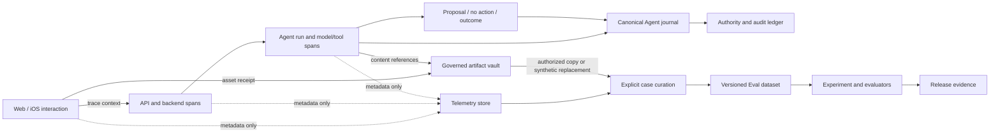

# Eval and observability platform

**Snapshot:** 2026-08-29
**Status:** Draft research and implementation decision brief
**Decision question:** How should Talent Signal trace one user interaction and
evaluate the resulting Agent behavior without turning private candidate data or
model reasoning into an uncontrolled log store?
**Audience:** Product and engineering owners deciding the first implementation
slice.

## Executive brief

Talent Signal should build one provider-neutral trace spine across the browser,
API, backend, Agent runtime, model calls, tools, and observed outcomes, while
keeping raw messages, images, files, prompts, and outputs in a separately
authorized content vault. A trace should explain that content existed, which
version and hash participated, who and what was authorized, and what happened;
it should not duplicate sensitive content into general telemetry.

This matters now because the repository already has a strong Agent journal and
audit boundary, but those records start inside the backend. They cannot yet
answer one end-to-end question such as “which UI submission, prompt version,
model turn, tool sequence, proposal, review, and outcome produced this result?”
The missing layer is correlation plus an Eval lifecycle, not another Agent
framework.

Three findings drive the recommendation:

1. **Observation:** current Agent runs already preserve definition, Prompt,
   model, policy, context, and tool fingerprints, bounded usage, tool events,
   outputs, and terminal receipts. They should become an Agent-specific
   projection of the trace, not be replaced.
2. **Interpretation:** copying all user and model content into logs would make
   debugging easier briefly but would break the project's purpose, access,
   retention, deletion, and evaluation boundaries.
3. **Recommendation:** adopt an OpenTelemetry-compatible envelope, a governed
   artifact reference model, and a versioned Dataset → Experiment → Evaluation
   loop. Use a replaceable self-hosted trace viewer only for synthetic or
   policy-filtered telemetry.

The recommended sequence is to make one synthetic Web Agent journey fully
traceable, add deterministic safety and path Evals, then add human annotation
and carefully sampled online Evals. No vendor purchase or prompt-registry
migration is required for the first slice.

The first decisions required are whether to run a short Phoenix bake-off as the
developer trace viewer, what initial trace/artifact retention defaults are, and
which two or three Eval suites gate releases.

## What exists and should be preserved

The current system already contains most of the durable Agent control plane:

- `agent_runs` owns account, user, Pursuit, capture, objective, immutable
  definition, provider, model, budget, context manifest, fingerprints, status,
  usage, and terminal receipt;
- `agent_run_evidence` freezes ordered, authorized fragment references and
  content hashes;
- `agent_run_events` and `agent_tool_calls` preserve monotonically ordered,
  fingerprinted tool and terminal events;
- `agent_run_outputs` separates validated from quarantined output;
- canonical `audit_events` records domain and authority changes separately;
- checked-in synthetic Eval manifests and backend evaluation programs already
  test idempotency, source authority, deletion, recovery, and Agent control
  boundaries.

Those are stronger product semantics than a generic LLM tracing product can
provide. The design therefore adds correlation and projections around them.

## Platform boundary

The platform has four data planes with different authority and retention.

| Plane | Owns | Must not own |
| --- | --- | --- |
| Canonical product and Agent state | Evidence, reviewed state, proposals, approvals, outcomes, Agent journal, audit | General analytics or mutable Eval labels |
| Telemetry | Trace/span timing, status, identifiers, versions, hashes, costs, errors, sampled safe metadata | Candidate truth, authorization, raw message/file/image bodies |
| Governed artifact vault | Authorized Prompt render, model input/output, tool arguments/results, file/image bytes or derivatives when capture is allowed | Searchable global logs or automatic Eval datasets |
| Eval registry | Versioned synthetic/approved examples, evaluator specs, experiments, scores, human annotations, release decisions | Live product truth or authorization to act |

An artifact reference may connect the planes. It is a scoped capability, not a
public URL. Resolving it rechecks account, user role, purpose, source authority,
retention, deletion, and environment at read time.



## Core identity and correlation model

Every event uses server-issued or cryptographically random identifiers. Human
names, email addresses, message text, filenames, and URLs are not identifiers.

| Object | Meaning | Lifecycle |
| --- | --- | --- |
| `session_id` | One scoped UI working session, not a login identity | Rotates on sign-out, account switch, or expiry |
| `interaction_id` | One user intent such as submit, approve, cancel, or retry | Stable across a safe retry of the same intent |
| `trace_id` | One distributed execution caused by an interaction or scheduled task | W3C trace context; may contain many backend and Agent spans |
| `span_id` / `parent_span_id` | One timed unit of work and its causal parent | Immutable telemetry identity |
| `request_id` | One HTTP attempt | New on retry; linked to the stable interaction |
| `task_id` | One durable authorized task | Survives process restart and async continuation |
| `agent_run_id` | Existing bounded Agent execution | Remains owned by the Agent control plane |
| `artifact_ref` | Read-time-authorized pointer to content | Revoked before asynchronous deletion |
| `prompt_version` | Immutable source version plus rendered fingerprint | Code-owned initially; trace stores both |
| `dataset_version` | Immutable selection and content snapshot for an experiment | New version on any example change |
| `experiment_id` | One candidate system version run over one dataset version | Immutable and comparable |

Only `traceparent` and a strict allowlist of non-sensitive baggage cross process
boundaries. Account and user authorization are recomputed from the server
session; they are never trusted from trace baggage.

## Trace topology

The root span represents an authorized intent, not a page view. Page navigation
and usability analytics may link to the same session but should remain separate
traces.

```text
interaction.submit                                  SERVER/INTERNAL root
├─ ui.validate                                      INTERNAL
├─ upload.prepare                                   CLIENT
│  └─ artifact.store                                SERVER
├─ http POST /api/...                               CLIENT → SERVER
│  ├─ auth.verify                                   INTERNAL
│  ├─ handler.pursuit_agent_run                     INTERNAL
│  ├─ db.transaction                                CLIENT
│  ├─ context.compile                               INTERNAL
│  └─ agent.invoke pursuit-momentum                 INTERNAL
│     ├─ model.chat <model>                         CLIENT
│     ├─ tool.execute read_pursuit                  INTERNAL
│     ├─ model.chat <model>                         CLIENT
│     ├─ tool.execute read_evidence                 INTERNAL
│     ├─ model.chat <model>                         CLIENT
│     ├─ tool.execute stage_pursuit_proposal        INTERNAL
│     ├─ output.validate                            INTERNAL
│     └─ journal.commit                             INTERNAL
└─ ui.result_rendered                               linked browser span/event
```

Async jobs start a new trace only when there is a meaningful scheduling gap.
They carry a span link to the originating trace plus the durable `task_id` and
`agent_run_id`; they do not fake a continuously open parent span across hours
or restarts.

### Required span fields

All spans carry only the smallest applicable subset:

```text
service.name, service.version, deployment.environment
trace_id, span_id, parent_span_id
ts.interaction.id, ts.task.id, ts.agent.run.id
ts.account.hash, ts.surface, ts.operation.name
ts.data.classification, ts.content.capture_status
ts.code.revision, ts.contract.version, ts.policy.version
status, error.type, error.code, retry.attempt
duration, input/output byte counts, token counts, estimated cost
```

Model spans additionally carry current OpenTelemetry `gen_ai.*` attributes
where stable enough: provider, requested and response model, operation,
conversation/session identifier, Prompt name/version, finish reasons, token
usage, and tool name/type. Talent Signal-specific mappings live in one adapter
module so experimental convention changes do not leak throughout the codebase.

## Content, files, images, and Prompt capture

“Trace every user input” means preserve lineage for every submitted content
part. It does not mean record every keystroke or duplicate every byte into the
telemetry backend.

Each submitted turn creates an ordered content manifest:

```text
InteractionContentPart
├─ id, interaction_id, ordinal
├─ kind: text | image | document | audio | other
├─ source_asset_id / governed_fragment_id
├─ mime_type, byte_size, content_hash
├─ capture_status: reference_only | encrypted_full | minimized_derivative | redacted
├─ purpose, data_classification, authorization_scope
├─ retention_policy_id, expires_at
├─ created_by, created_at
└─ deletion_state, deleted_at
```

Rules:

- telemetry receives IDs, kind, MIME type, size, hash, capture status, and error
  state; it receives no binary, base64, OCR body, document text, or filename by
  default;
- the existing source/asset owner stores user-authorized files and images;
  large Prompt renders and model/tool payloads use encrypted artifact objects
  with the same account and purpose boundary;
- derived OCR, thumbnails, embeddings, cached Prompt renders, Eval copies, and
  exports register as deletion dependencies;
- a content-view action is itself audited, rate-limited, and tied to a purpose;
- source revocation first prevents resolution of every artifact reference, then
  asynchronously deletes registered derivatives and records the result;
- production traces cannot be promoted into an Eval dataset with one click.
  Curation requires a preview, redaction or synthetic replacement, named
  purpose, reviewer, dataset, and retention decision.

Prompt capture stores four different facts instead of one ambiguous `prompt`
field:

1. immutable template/definition source ID and version;
2. template fingerprint and code revision;
3. ordered context manifest with IDs, versions, inclusion reasons, and hashes;
4. optional governed rendered-Prompt artifact reference.

The current `system_prompt` and `context` fingerprints remain valuable even
when rendered content is unavailable or deleted.

## Reasoning and “thinking”

The platform must not promise access to hidden chain-of-thought. It records only
what the provider API actually returns and classifies it explicitly:

| Capture status | Meaning | Default handling |
| --- | --- | --- |
| `unavailable` | Provider exposes no reasoning artifact | Record effort, tokens, timing, tool sequence, and outcome only |
| `summary` | Provider returns a user-visible reasoning summary | Governed output artifact; safe preview may be available |
| `provider_block` | Provider returns a signed/structured thinking block | Encrypted, restricted artifact; not used as candidate truth |
| `redacted` | Provider or policy withholds the content | Preserve type, order, size/hash when available, and redaction reason |
| `continuity_token` | Opaque value needed for the next provider turn | Encrypt, restrict to the run, expire with it, never render in the UI |

Even when visible, reasoning is model output, not evidence. Evals should judge
observable tool selection, arguments, evidence use, output, safety behavior,
latency, and outcome. A polished rationale cannot rescue an unsupported answer
or prohibited action.

## Frontend instrumentation contract

Do not install blanket click tracking, DOM snapshots, session replay, or
keystroke capture on relationship surfaces. Use explicit semantic events at
product decision points.

| Event | When emitted | Safe properties |
| --- | --- | --- |
| `agent_composer_opened` | Scoped composer becomes usable | surface, relationship-context ID hash, prompt-definition version |
| `agent_submission_started` | User intentionally submits | interaction ID, content-part kinds/counts, total bytes, objective length bucket |
| `attachment_selected` | File/image enters local staging | interaction ID, kind, MIME family, size bucket; no name/path |
| `attachment_upload_completed` | Server receipt is verified | asset ID, hash, minimized/full status, duration, retry count |
| `agent_submission_cancelled` | User cancels before completion | phase, elapsed bucket, no draft body |
| `agent_result_rendered` | Current scoped response is visible | trace/run IDs, disposition, block count, citation count, latency |
| `evidence_reference_opened` | User inspects a cited source | reference ID, source kind, authority state; audit content access separately |
| `proposal_review_opened` | Review surface is visible | proposal ID/version, item count, stale/current |
| `proposal_item_changed` | User edits/accepts/rejects one item | item ID, decision, epistemic type; no edited body in analytics |
| `external_action_previewed` | Exact-effect preview is visible | action/target type, permission state, version |
| `external_action_decided` | User approves, edits, or cancels | decision, action ID/version, idempotency key hash |
| `outcome_observed` | Destination readback completes | effect status, attempt count, reconciliation/reversal availability |
| `agent_feedback_submitted` | User labels an answer or run | trace/span ID, label schema/version, optional governed comment ref |

All events use a shared typed envelope and are tested at the component boundary.
The browser creates an `interaction_id`, starts or joins trace context, and sends
both on the request. The server returns `trace_id`, `task_id`, and `agent_run_id`
in a safe receipt so later render, feedback, and review events link to the same
execution. A page reload restores only durable IDs and current canonical state;
it does not mark an old trace current.

## Backend, function, Agent, and tool instrumentation

### Backend

- Fastify request hooks create/continue server spans and attach request IDs,
  authenticated account hash, route template, status, and safe error codes.
- Domain service functions get explicit spans only at meaningful boundaries:
  authorization, context compilation, model/provider call, validation,
  transaction, external connector, retry/reconciliation, and deletion.
- Database auto-instrumentation records operation and table/statement class but
  never bind values or full SQL containing content.
- Structured application logs include `trace_id` and `span_id` so operators can
  move from a log error to the exact trace.
- Jobs persist `task_id`, originating trace link, idempotency key hash, attempt,
  lease/checkpoint, and terminal receipt before execution is reported complete.

### Agent runtime

The existing Agent journal remains the durable sequence. Add or derive spans
for:

- scope compilation and evidence authority checks;
- Agent definition and provider start;
- every provider/model turn;
- every requested tool, including denied calls;
- tool validation, gateway execution, and result;
- structured-output validation or quarantine;
- proposal/no-action commit;
- budget, cancellation, provider failure, and terminal receipt.

Each tool span records tool name/version, call ID, allowed/denied status,
argument/result fingerprints, schema version, error code, duration, and optional
governed input/output artifact references. It does not record raw arguments in
general logs. The database `agent_run_events.sequence` maps to
`ts.agent.event.sequence` so replay can prove ordering after a restart.

## Logs, traces, metrics, and audit are different products

| Signal | Question | Example | Delivery/retention expectation |
| --- | --- | --- | --- |
| Trace | What path did this execution take? | model turn → denied tool → no action | Sampled, high-cardinality, short-lived metadata |
| Log | What diagnostic fact did code emit? | provider timeout with safe error code | Structured, searchable, no bodies, linked to trace |
| Metric | Is the system changing at scale? | p95 Agent latency, no-action rate | Aggregated, low-cardinality, longer lived |
| Audit | Who or what changed authority or state? | user approved proposal version 3 | Complete, append-only, account-scoped, not sampled |
| Eval | Was behavior acceptable against a criterion? | cited-evidence precision passed | Versioned result linked to evaluator and frozen input |

Initial metrics should cover request latency/error/rate, upload failure and
bytes, Agent terminal status, model latency/tokens/cost, tool selection and
denial, context size, output quarantine, stale/retry/recovery, user feedback,
proposal acceptance/edit/rejection, and external outcome verification. Metrics
must not use candidate, filename, URL, Prompt text, or free-form error messages
as labels.

Sampling is policy-driven:

- 100% metadata traces for authorization denial, quarantine, unknown external
  outcome, deletion failure, cross-account rejection, Agent failure, and manual
  feedback;
- 100% audit events for authority and external-effect transitions;
- lower-rate success traces after volume justifies sampling;
- content capture is an independent authorization decision and is never enabled
  merely because a trace was sampled;
- tail sampling happens after redaction and before export.

## Eval model

```text
EvalSuite
├─ id, name, purpose, owner, version, status
├─ dataset_version_id
├─ evaluator_spec_versions[]
├─ segment definitions and release thresholds
└─ safety veto policy

DatasetVersion
├─ immutable ordered ExampleVersions[]
├─ source: synthetic | approved_redacted | incident_reconstruction
├─ content manifest, authorization, retention, reviewer
└─ creation code revision and checksum

Experiment
├─ dataset_version_id
├─ candidate system manifest
│  ├─ code, Agent definition, Prompt, model, policy, tool/schema versions
├─ baseline_experiment_id
├─ execution environment and seed/config
└─ per-example trace IDs and outcomes

EvaluationResult
├─ subject: trace | span | output | tool_call | outcome
├─ evaluator ID/version/type/model/Prompt
├─ label/score, pass/fail/abstain, explanation
├─ cited evidence/artifact refs
├─ order/randomization metadata
└─ reviewer/override/supersession history
```

### Evaluator types and order

1. **Deterministic checks:** schema validity, evidence-reference membership,
   tool allowlist, identity/authorization boundary, no external effects,
   idempotency, status transitions, deletion, latency and budget.
2. **Task/path checks:** expected or forbidden tools, partial-order constraints,
   grounded proposal fields, correct abstention/no-action, recovery behavior.
3. **Human review:** atomic labels with evidence, ambiguity, edit reason, and
   adjudication; this creates the gold set.
4. **Model judges:** narrow rubric items only, blind to provider/author identity,
   with cited evidence, structured output, swapped pair order, calibrated
   against human gold cases, and an explicit abstain path.
5. **Outcome Evals:** whether the user accepted/edited/rejected a proposal and
   whether an approved external effect was verified, reconciled, or reversed.
   These are observations, not proof of candidate quality.

An aggregate score never overrides an identity, provenance, privacy,
authorization, or external-write safety veto. Do not evaluate personality,
protected traits, “culture fit,” candidate worth, or acceptance probability.

### First release-gating suites

The smallest useful first suite is synthetic and covers:

- clear evidence produces one review-only proposal with exact citations;
- ambiguous identity, speaker, date, or authorization produces clarification,
  quarantine, or no-action rather than a fact;
- a requested out-of-scope evidence read is denied and disclosed safely;
- an unsupported or polished answer fails groundedness;
- tool order and budgets are respected, including failure and cancellation;
- retry/restart produces one terminal receipt and no duplicate proposal;
- deletion or source revocation makes dependent artifacts unresolvable and
  prevents stale replay;
- no Agent path causes an external write.

Every regression report shows overall pass/fail, safety vetoes, segment deltas,
confidence intervals or sample counts where meaningful, changed cases, and
direct links to traces and evidence. A mean score alone cannot gate a release.

## Eval workbench information architecture

The native UI should be quiet and investigation-led rather than a dashboard of
scores.

1. **Runs:** filterable trace list by time, environment, surface, Agent
   definition, Prompt/model version, terminal status, error, feedback, and Eval
   state. Default columns are status, intent type, duration, cost, tool count,
   feedback, and privacy/capture status.
2. **Trace detail:** a causal waterfall/tree with UI, HTTP, backend, model, tool,
   validation, journal, and outcome spans. Selecting a span opens Overview,
   Input/Output references, Events, Evals, Logs, and Provenance tabs. Sensitive
   content is closed and unavailable unless the current user can resolve it.
3. **Datasets:** immutable versions, case origin, authorization, retention,
   segments, reviewer, and change history. Production-to-dataset curation is a
   review flow, not a toggle.
4. **Experiments:** baseline/candidate comparison at suite, segment, case, trace,
   and span levels, with regressions and safety vetoes first.
5. **Evaluators:** code/rubric/model version, calibration set, stability results,
   owner, last review, and known limitations.
6. **Annotation queue:** blinded atomic questions, source evidence beside the
   output, abstain/conflict options, and adjudication history.
7. **Operations:** telemetry health, dropped spans, redaction failures, queue
   lag, storage/retention, deletion receipts, and evaluator drift.

The UI never labels a person as good/bad or ranks candidates. Attention sorting
is about broken executions, unsupported claims, and unreviewed risk.

## Product comparison and adoption decision

Current platforms converge on the same useful loop: trace production behavior,
annotate failures, curate versioned datasets, run comparable experiments, and
attach deterministic, human, or model Evals.

| System | Pattern worth adopting | Why it is not canonical product state |
| --- | --- | --- |
| OpenTelemetry GenAI | Vendor-neutral spans for inference, retrieval, memory, tools, usage, and Prompt versions | GenAI conventions are still evolving and intentionally leave application authorization and content governance to the product |
| Phoenix | OpenTelemetry/OpenInference trace viewer, annotations, versioned datasets, experiments, evaluator traces, self-hosting | Generic data and access semantics do not replace Talent Signal evidence authority or deletion graph |
| Langfuse | Multimodal tracing, Prompt versions linked to traces, feedback, Eval and dataset loop, self-hosting | Adopting its full data plane would duplicate current Agent/audit state and add operational weight |
| LangSmith | Threads/traces plus dataset, evaluator, experiment, and CLI workflows | Strong workflow reference but unnecessary coupling to a LangChain-owned service |
| Braintrust | Immutable experiment snapshots, scorers, attachments, production-to-dataset workflow | Useful experiment semantics; vendor storage is not automatically authorized for candidate evidence |
| OpenAI Evals/graders | Deterministic and model graders with per-sample results and multimodal inputs | Provider-specific and does not express Talent Signal's cross-provider Agent control plane |

**Recommendation:** own the OpenTelemetry adapter, artifact references, Agent
journal bridge, Eval registry, and release policy. For the first implementation,
compare the native trace detail UI with a self-hosted Phoenix projection using
only synthetic data. Keep Phoenix if it materially accelerates developer
diagnosis without weakening account, retention, and deletion controls; otherwise
remove it without changing instrumentation.

## Delivery sequence

### Slice 1 — one synthetic trace

- Add typed trace and interaction contracts to the shared package.
- Start W3C trace context in the Web Agent submission and continue it through
  Next.js and Fastify.
- Add one OpenTelemetry adapter and local collector/exporter.
- Bridge existing `agent_run_id` and Agent journal sequence into spans.
- Render a developer-only trace detail for one synthetic Agent journey.
- Prove no raw text, image bytes, filenames, Prompt renders, or tool bodies
  appear in exported telemetry.

### Slice 2 — governed artifacts and logs

- Add the ordered interaction content manifest and encrypted artifact reference
  service using existing account/source lifecycle controls.
- Instrument model turns, tools, validation, retries, deletion, and structured
  logs.
- Add redaction tests, dropped-span metrics, artifact access audit, revocation,
  expiry, and deletion receipts.
- Run the synthetic Phoenix bake-off if selected.

### Slice 3 — offline Eval loop

- Add versioned suites, datasets, examples, evaluator specs, experiments, and
  results.
- Import existing checked-in synthetic fixtures without changing their source
  authority.
- Implement deterministic safety/path evaluators and baseline comparison.
- Add CI release output with trace links, changed cases, segment results, and
  safety vetoes.

### Slice 4 — human and online learning

- Add blinded annotation queues, adjudication, feedback linkage, and evaluator
  calibration.
- Allow deliberate, reviewed production-case curation with redaction or
  synthetic replacement.
- Add sampled asynchronous online Evals and alerts; never block the user request
  on an LLM judge.
- Promote repeated, human-confirmed failure modes into deterministic tests or
  versioned rubrics.

Do not begin with ClickHouse, Kafka, universal auto-instrumentation, prompt
editing from production UI, session replay, arbitrary SQL dashboards, or live
production content export. Add scale infrastructure only after measured volume
or query latency demands it.

## Verification and release gate

An implementation slice is not complete until one synthetic case proves:

1. the browser, Next.js route, Fastify handler, backend function, Agent run,
   provider turn, tool call, validated output, and terminal receipt share an
   inspectable causal chain;
2. the trace can be found from the user-visible receipt and the Agent run can be
   found from the trace;
3. a file and image appear as ordered governed references with correct type,
   size, hash, capture status, and deletion dependency, without bytes or names
   in telemetry;
4. Prompt, model, code, policy, context, tool, and schema versions are frozen;
5. permission denial, timeout, retry, cancellation, quarantine, no-action,
   restart recovery, and deletion are distinguishable;
6. logs correlate by trace/span ID, metrics remain low-cardinality, and audit is
   complete and unsampled;
7. a versioned Eval run reproduces the case, attaches atomic results, and fails
   the release on a safety veto;
8. account-B cannot discover the trace, artifact, dataset case, annotation, or
   even the existence of account-A content.

## Reconsideration signals

Revisit the storage and viewer choice when trace volume makes PostgreSQL
queries or retention unworkable, when a vendor proves account-scoped deletion
and access semantics equal to the canonical system, when OpenTelemetry GenAI
reasoning/multimodal conventions stabilize, or when measured evaluator volume
justifies a separate analytics store.

## Evidence trail

### Repository evidence

- `docs/architecture.md` — canonical truth, model, human-decision, and effect
  boundaries; current.
- `docs/agent-system.md` — Agent task, context, capability, journal, approval,
  outcome, and evaluation boundaries; current.
- `apps/backend/src/database/023_agent_control_plane.sql` — durable Agent run,
  evidence, event, tool-call, output, and no-action schema; current code.
- `apps/agent/src/runner.ts` and `apps/agent/src/types.ts` — bounded Agent runtime,
  fingerprints, budgets, tool mediation, and journal sequence; current code.
- `packages/contracts/src/agentSchemas.ts` — public Agent run and receipt
  contract; current code.
- `evals/overnight-cross-surface-v1.json` and
  `apps/backend/src/evaluation/runAgentControlPlaneEvaluation.ts` — current
  synthetic and executable evaluation evidence; dated/current implementation.
- `docs/research/cloud-screenshot-processing-privacy.md` — current research on
  raw content, logging, Eval, retention, and deletion boundaries.

### Current external evidence

- [OpenTelemetry semantic conventions](https://opentelemetry.io/docs/specs/semconv/)
  define portable names and attributes across traces, logs, and metrics.
- [OpenTelemetry GenAI spans](https://github.com/open-telemetry/semantic-conventions-genai/blob/main/docs/gen-ai/gen-ai-spans.md)
  cover inference, retrieval, memory, and tool execution; they explicitly treat
  instructions, inputs, and outputs as sensitive and recommend content capture
  be off by default or moved to separately controlled storage.
- [Phoenix overview](https://arize.com/docs/phoenix) documents its
  OpenTelemetry/OpenInference tracing, annotations, Prompt workbench, versioned
  datasets, experiments, and self-hosted deployment.
- [Phoenix datasets](https://arize.com/docs/phoenix/learn/datasets-and-experiments/datasets-concepts)
  document immutable dataset evolution and the production/human-reviewed case
  curation loop.
- [Phoenix evaluator tracing](https://arize.com/docs/phoenix/evaluation/llm-evals/evaluator-traces)
  treats evaluators as observable model programs rather than opaque scores.
- [Langfuse overview](https://langfuse.com/docs) documents OpenTelemetry-based,
  multimodal tracing plus Prompt management, feedback, datasets, experiments,
  manual labels, custom Evals, and model judges.
- [Braintrust experiments](https://www.braintrust.dev/docs/evaluate/run-evaluations)
  document immutable, comparable experiment snapshots and attachments.
- [LangSmith CLI](https://docs.langchain.com/langsmith/langsmith-cli) exposes
  trace, thread, dataset, evaluator, and experiment objects as scriptable
  primitives.
- [OpenAI graders](https://platform.openai.com/docs/api-reference/graders)
  document deterministic, similarity, and model-based grader forms including
  multimodal inputs.

External feature claims are a 2026-08-29 snapshot and are not product decisions.
The OpenTelemetry GenAI convention is explicitly in development, so the adapter
must remain versioned and replaceable.
