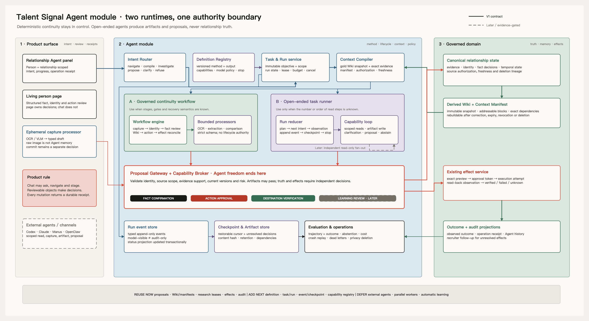

# Talent Signal Agent module blueprint

> Reviewed: 2026-08-07
> Role: architecture proposal and implementation-gap analysis
> Authority: research; this document does not override canonical product or
> architecture decisions

## Purpose

This document answers a narrower question than the canonical
[Agent system](../agent-system.md):

> Given Talent Signal's current code, which Agent modules should exist, which
> existing components should remain deterministic, and where should open-ended
> model autonomy stop?

The answer is not a general recruiter Agent. Talent Signal should have one
proposal-centric control plane with two runtime classes:

1. a governed continuity workflow for known relationship-state transitions;
2. a durable, open-ended task runner for bounded investigation and synthesis.

Both runtimes may create artifacts and proposals. Neither runtime owns
relationship truth, identity decisions, fact confirmation, action approval, or
effect verification.

## Executive decision

The module should be designed around this invariant:

> Agent freedom exists only inside an authorized task. Every path back into
> relationship truth or an external effect crosses a non-model authority
> boundary.

That produces four distinct product components:

- **Ephemeral processor:** OCR or VLM converts a user-selected source into a
  typed draft. This is an AI function, not an Agent.
- **Continuity engine:** deterministic domain workflows preserve identity,
  evidence, temporal state, review, approval, recovery, and deletion.
- **Agent task runtime:** an event-driven loop handles only tasks whose read
  path cannot be known in advance.
- **Proposal and capability boundary:** existing domain services validate
  proposals, collect independent decisions, execute authorized effects, and
  verify destinations.

The main design error to avoid is turning the Agent runtime into a second
domain backend.

## Architecture



The editable source is
[`talent-signal-agent-module-blueprint.excalidraw`](../talent-signal-agent-module-blueprint.excalidraw).

### Reading guide

- The left column is the product contract: scoped intent, structured review,
  and operation receipts.
- The center is the proposed Agent module. The green lane is the governed
  workflow; the violet lane is the open-ended runner.
- The red boundary is where model autonomy ends. Artifacts may pass through,
  but facts, identity, learning, and effects require independent authority.
- The right column remains the governed domain and source of truth.
- Solid paths are the V1 contract. Dashed paths are evidence-gated later
  scope, not uncertain present-day facts.

The bottom strip is the implementation summary:

- reuse proposals, Wiki and manifests, research leases, effects, and audit;
- add definition, task, run, event, checkpoint, and capability contracts;
- defer external Agent access, parallel workers, and automatic learning.

## What the implementation already proves

The current system is more mature at governance than at Agent execution.

| Capability | Executable evidence | Judgment |
| --- | --- | --- |
| Typed model draft | [`ark.ts`](../../apps/web/lib/server/ark.ts) and [`ai-analysis.ts`](../../apps/web/lib/server/ai-analysis.ts) | Strong bounded extraction, but provider policy and schemas are split across Web-owned paths. |
| Proposal validation | [`proposals.ts`](../../apps/backend/src/modules/proposals.ts) | Strong proposal gateway: exact evidence, speaker, identity, temporal supersession, source authorization, and prohibited inference are checked outside the model. |
| Independent fact decision | [`decisions.ts`](../../apps/backend/src/modules/decisions.ts) | Strong authority separation: a proposal does not become temporal state without a recruiter decision. |
| Wiki and task context | [`wiki.ts`](../../apps/backend/src/modules/wiki.ts), [`chat.ts`](../../apps/backend/src/modules/chat.ts) | Strong immutable snapshot and Context Manifest semantics. Chat is currently a deterministic compiler, not an open-ended Agent. |
| Recoverable bounded research | [`research.ts`](../../apps/backend/src/modules/research.ts) and [`014_research_retrieval_jobs.sql`](../../apps/backend/src/database/014_research_retrieval_jobs.sql) | Strong seed for durable work: approved scope, leases, retry, partial results, recovery, and freshness already exist. |
| Effect control | [`actions.ts`](../../apps/backend/src/modules/actions.ts) | Strong exact-preview approval, capability grant, idempotency, attempt, observation, outcome, and unknown-result reconciliation. |
| Agent product history | [`agentHistory.ts`](../../apps/backend/src/modules/agentHistory.ts) | Useful derived product projection. It is not an Agent run event log and should not be made one. |
| Product-scoped operations | [`agent-ui-command.ts`](../../apps/web/lib/agent-ui-command.ts) and [`relationship-workspace-app.tsx`](../../apps/web/components/relationship-workspace-app.tsx) | The Agent is correctly scoped to one person and relationship, and returns staged or completed operation receipts. The current command router is intentionally narrow. |
| Provider-neutral contracts | [`resourceSchemas.ts`](../../packages/contracts/src/resourceSchemas.ts) and [`schemas.ts`](../../packages/contracts/src/schemas.ts) | Strong domain contracts, but there is no shared Definition, Run, Event, Checkpoint, Artifact, or Capability contract. |

### Strong today

- evidence and identity are governed before use;
- current state is temporal and source linked;
- proposed understanding, confirmed fact, approved action, and observed outcome
  are different records;
- source authorization and identity freshness are enforced at use time;
- deletion and authorization changes retract derived knowledge;
- external-effect ambiguity remains `unknown` until observed;
- deterministic workers already use idempotency and recoverable leases.

### Partial today

- `ChatTask` has a task identifier and Context Manifest, but no durable Task or
  Run entity;
- public research has a domain-specific task and recovery job, but no shared
  Agent event or checkpoint contract;
- model processors are surface-adjacent and use separate provider policies;
- the current capability grant is effect-specific rather than a typed Agent
  capability registry;
- audit events explain domain operations, but do not record model requests,
  capability decisions, observations, checkpoints, budgets, or stop reasons.

### Missing today

- versioned Agent definitions;
- immutable authorized tasks and attempted runs;
- one run reducer and explicit state machine;
- typed append-only run events with visibility classes;
- restorable checkpoints and first-class artifacts;
- a provider-neutral capability registry and policy decision point;
- trajectory evaluation, budget enforcement, cancellation, and bounded stop;
- one external boundary for Codex, Claude, Manus, OpenClaw, or n8n.

This gap is narrower than “build an Agent platform.” The domain control plane
already exists. The missing work is a durable execution shell around
replaceable model work.

## Lessons from the compared Agent systems

| System | Adopt | Reject or constrain |
| --- | --- | --- |
| Claude Code | Separate durable instructions, reusable method, tools, hooks, permissions, and isolated workers. | Do not use a long prompt as policy or assume a subagent creates a hard security boundary. |
| Pi | Keep the runtime kernel small and expose lifecycle events. | Do not externalize sandbox and permission responsibility in a product handling private candidate evidence. |
| Codex | Separate core execution from product surfaces through typed commands and events. | Do not reproduce an operating-system-sized control plane before multiple real surfaces need it. |
| Manus | Treat the output as an artifact and preserve restorable task context. | Do not give the Agent a general computer or authenticated browser over candidate data. |
| n8n | Keep known stages in a visible deterministic workflow and place human review around consequential tools. | Do not make n8n the source of truth, authorization system, or exactly-once effect boundary. |
| OpenClaw | Treat channels as adapters and keep identity, session, and routing explicit. | Do not let a channel identity become a tenant, person identity, or durable relationship record. |
| TaxHacker | Keep extractors as strict, replaceable AI functions. | Do not promote bounded extraction to an Agent merely because a model is involved. |
| OpenMontage | Use versioned definitions, canonical artifacts, checkpoints, and hard validators. | Do not leave mandatory stage transitions or quality gates only in instructions. |
| TradingAgents | Give parallel workers different evidence, permissions, or objectives. | Do not create recruiter personas that debate without independent information. |
| OpenHands | Use typed append-only run events and derive run state with a reducer. | Do not event-source the entire domain or let model-based risk classification replace hard policy. |

The synthesis is deliberate:

- **TaxHacker outside:** bounded processors;
- **n8n in the middle:** deterministic continuity workflow;
- **OpenHands/Codex inside the open lane:** event-driven Task and Run;
- **Talent Signal around all of them:** proposal, human decision, and verified
  effect boundaries.

## The three architectures must remain distinct

### Product architecture

The user sees a relationship-scoped collaborator beside a living person page.

The Agent panel owns:

- intent capture;
- clarification;
- meaningful progress;
- source-linked artifacts;
- operation receipts;
- resumption of waiting work.

Structured product objects own:

- identity review;
- fact confirmation;
- conflict resolution;
- source authorization;
- action preview and approval;
- effect reconciliation;
- merge and reversal.

The panel should deep-link to those objects rather than reproducing their
decision controls inside free-form chat.

### System architecture

The system owns:

- authentication and tenant scope;
- source authorization and freshness;
- task and run lifecycle;
- context compilation;
- model and tool policy;
- idempotency, leases, retry, and cancellation;
- proposal and effect boundaries;
- audit, retention, deletion, and evaluation.

PostgreSQL remains the transactional source of truth. The Agent runtime is a
module in the modular backend, not a separate microservice at first.

### Agent architecture

The open-ended runner owns only this loop:

```text
authorize task
→ compile immutable context
→ propose one next intent
→ validate outside the model
→ execute one bounded capability
→ record observation
→ checkpoint
→ continue, wait, abstain, or stop
```

It does not own the domain transition performed after a proposal is accepted.

## Proposed module boundaries

| Module | Owns | Must not own |
| --- | --- | --- |
| Intent Router | Classify an explicit user request into navigate, compile, investigate, propose, clarify, or refuse. | Domain mutation, hidden broadening of scope, or free-form tool selection. |
| Definition Registry | Versioned method, eligible capabilities, context policy, output contract, model policy, budget, and stop conditions. | Tenant facts, mutable run state, or provider secrets. |
| Task Service | One immutable user-authorized objective, person and relationship scope, purpose, retention, budget, and definition version. | A model transcript or implicit permission inferred from chat. |
| Run Service | Attempt state, lease, pinned context, budget use, cancellation, waiting state, and terminal reason. | Relationship truth or external effect state. |
| Context Compiler | Minimum relevant snapshot, evidence references, prior artifacts, capability schemas, and inclusion reasons after use-time authorization checks. | Unbounded Wiki dumps, stale cached evidence, policy authored by retrieved content, or silent cross-context retrieval. |
| Governed Workflow Adapter | Known state transitions and pause/resume around existing review gates. | Open-ended planning or replacement of existing domain services. |
| Open-ended Run Reducer | One next-intent cycle, typed observations, checkpoints, and stop. | Direct SQL, arbitrary shell/browser, fact confirmation, identity binding, or effect execution. |
| Capability Registry and Policy | Typed reads and artifact operations; risk, scope, parameter, budget, and temporal checks. | Model self-authorization or provider-specific prompts. |
| Proposal Gateway | Validate and link fact, action, identity-review, research, or learning proposals to governed evidence and current versions. | Treat a proposal as a decision. |
| Capability Broker | Resolve an approved exact effect into an adapter attempt and independent destination observation. | Replanning, model reasoning, or optimistic success. |
| Event Store and Reducer | Append-only run history and current run projection. | Raw candidate source content or the domain event history for facts and effects. |
| Checkpoint and Artifact Store | Restorable progress and useful outputs that remain non-authoritative. | Automatic promotion into the Wiki or confirmed state. |
| Evaluation and Operations | Trajectory, outcome, cost, abstention, recovery, deletion, and release gates. | Candidate worth, personality, fit, or acceptance prediction. |

## Durable concepts

### Definition

A Definition should begin as versioned TypeScript configuration, not an
editable database prompt. It includes:

- stable identifier and version;
- recognizable task type;
- required subject and relationship scope;
- ordered context policy;
- eligible capability identifiers;
- output artifact and proposal schemas;
- provider and model policy;
- step, time, token, cost, and tool budgets;
- stop, abstain, wait, retry, and cancellation conditions;
- evaluation rubric version.

Store the Definition identifier and version on every Task and Run. Move
Definitions into a dynamic registry only after real tenant-specific methods
justify the extra authority and migration burden.

### Task

A Task is one immutable authorization envelope:

- actor, account, person, and relationship context;
- objective and completion criteria;
- purpose and data classification;
- definition version;
- permitted capability classes;
- time horizon and retention class;
- budget and deadline;
- creation source and idempotency identity.

Editing the objective creates a new Task version or successor Task. It does not
silently change an active Run.

### Run

A Run is one attempt:

- queued, running, waiting for decision, waiting for retry, completed,
  abstained, failed, cancelled, or expired;
- one pinned knowledge snapshot and Context Manifest;
- one definition and model-policy version;
- one lease owner and expiry while executing;
- accumulated token, cost, tool, and wall-time budget;
- terminal reason independent from model wording.

Only the Run reducer updates Run projection state. A worker claims the lease;
the model never does.

### Event

The Agent event log is append-only and scoped to a Run. Events need:

- account, task, run, sequence, event type, actor, and time;
- causation and correlation identifiers;
- idempotency identity;
- payload schema version and content reference or digest;
- visibility: `model_visible`, `surface_visible`, or `audit_only`;
- sensitivity and retention class.

Examples include context compiled, model requested, intent proposed, policy
denied, capability started, observation recorded, artifact produced, proposal
submitted, decision requested, checkpoint saved, budget exhausted, and run
stopped.

The event log must not copy raw evidence. It points to governed evidence or
artifacts so authorization and deletion remain enforceable.

### Checkpoint

A Checkpoint contains:

- run event cursor;
- current short plan;
- completed subgoals;
- unresolved questions and decision references;
- artifact identifiers;
- remaining budget;
- pinned context identities;
- safe resume reason.

It is a restorable boundary, not a model-written summary treated as truth.

### Artifact

Artifacts include briefs, contradiction packets, question sets, source maps,
drafts, and proposed knowledge patches.

Every artifact carries:

- type and schema version;
- content hash and storage reference;
- producer definition, run, model, and tool versions;
- evidence and artifact dependencies;
- person and relationship scope;
- sensitivity, authorization, and retention;
- draft, proposed, accepted, retracted, expired, or deleted status.

Acceptance may lead a domain service to create a proposal or compile a new
view. The artifact itself never becomes fact.

### Proposal reference

Do not create a generic JSON proposal table that competes with existing domain
tables. The Agent runtime records a typed reference to:

- an analysis assertion proposal;
- an action proposal;
- an identity-review case;
- a bounded research authorization request;
- a future learning proposal.

The owning domain service keeps validation and decision semantics.

## Capability design

The first capability registry should be code-defined and schema-validated.

| Class | Initial examples | Default |
| --- | --- | --- |
| Scoped read | Read one gold Wiki snapshot, one authorized evidence excerpt, one current relationship scope, one prior artifact. | Automatic inside pinned Task scope; authorization and freshness rechecked at use time. |
| Artifact write | Create or revise one Task-scoped artifact. | Automatic within retention, sensitivity, and budget policy. |
| Proposal | Submit a fact, action, research, or learning proposal with provenance. | Allowed only through the owning domain service; creates no authority. |
| Internal reversible | Create or snooze one attention item. | Reviewable, undoable, and separately audited. |
| External or device write | Contacts, Calendar, messaging, ATS, CRM. | Exact current preview, explicit approval, execution recheck, observation, and reconciliation. |
| Prohibited | Confirm fact, bind or merge identity, rank people, infer personality or protected traits, use generic production SQL/browser/shell. | Never registered. |

Each capability contract should declare:

- input and output schemas;
- read, internal-write, external-write, or prohibited effect class;
- eligible task definitions;
- account, person, relationship, destination, and parameter scope;
- authorization and freshness dependencies;
- idempotency and retry semantics;
- timeout and budget cost;
- observation and verification method;
- retention and data-provider policy;
- compensation or reconciliation path.

The current action service already implements the hardest part of the external
effect contract. The Agent runtime should call that service by proposal
reference; it should not create a second execution path.

## Context and memory

The existing Wiki and Context Manifest are the correct foundation.

The Context Compiler should assemble, in order:

1. immutable safety and prohibited-inference boundaries;
2. Task objective, scope, completion criteria, budget, and stop policy;
3. Definition method and eligible capability schemas;
4. current checkpoint, plan, and unresolved decisions;
5. relevant confirmed temporal state;
6. clearly labeled conflicts and interpretations;
7. exact authorized evidence excerpts;
8. prior observations and artifacts.

Every item has an inclusion reason and restorable reference. Model-visible
context is a filtered view over the manifest, not the manifest itself.

The runtime must distinguish:

- source memory: governed evidence;
- episodic memory: Run and domain history;
- semantic memory: confirmed state and Wiki projections;
- procedural memory: reviewed playbooks;
- operational memory: Agent Definitions and capability contracts.

No model output moves between these stores without a typed transition and the
appropriate human or system decision.

## Product interaction design

The current “Agent beside the living page” direction is structurally correct.
It should evolve through typed intent and receipts rather than a more
anthropomorphic chat.

### Composer behavior

The composer may route to:

- navigation;
- deterministic brief compilation;
- source or identity review;
- open-ended investigation;
- artifact creation;
- fact or action proposal;
- clarification;
- refusal.

An ambiguous request must produce a clarification object before a Task is
authorized. An intent classifier may be model-assisted, but its output is a
strict union and it grants no capabilities.

### Progress

Show durable stages that survive reload:

- task authorized;
- context compiled;
- investigating existing evidence;
- waiting for source or identity review;
- artifact ready;
- proposal staged;
- waiting for fact confirmation;
- waiting for action approval;
- verifying destination;
- completed, abstained, failed, or cancelled.

Avoid simulated “thinking” text. Progress should correspond to an event,
checkpoint, decision, or observable effect.

### Receipts

Every operation receipt should name:

- person and relationship scope;
- what changed or did not change;
- artifact or proposal identifier;
- snapshot and Context Manifest;
- evidence and authorization state;
- required next human decision;
- external effect status when applicable;
- safe resume or recovery action.

## Recommended first open-ended Agent

Start with a **relationship contradiction investigator**, not a general
researcher, outreach Agent, or multi-Agent recruiter.

### Objective

Investigate one visible conflict in one relationship and produce a
source-linked clarification packet.

### Initial capabilities

- read the pinned gold Wiki;
- read exact authorized evidence behind the conflicting blocks;
- compare temporal state and provenance;
- create a structured contradiction artifact;
- propose one clarification question or `no_action`.

### Explicitly unavailable

- public web research unless the recruiter separately approves an exact seed
  and domain;
- new identity binding;
- fact confirmation;
- person merge;
- external messaging, calendar, contact, ATS, or CRM write;
- generic browser, shell, filesystem, or database access.

### Stop contract

Stop when the runner has:

- explained the conflict without resolving it;
- cited the relevant evidence and time boundaries;
- produced one clarification packet;
- proposed one recruiter-owned question or `no_action`;
- or abstained because evidence, identity, scope, authorization, or budget is
  insufficient.

A useful initial budget is one model at a time, no more than eight reasoning
cycles, a small evidence-excerpt budget, a short wall-time deadline, and no
parallel workers.

This slice tests the missing runtime semantics without risking an external
effect.

## Language and framework decision

### Keep TypeScript

Use TypeScript for the first Agent module because:

- contracts already span Next.js, Fastify, and the shared client;
- the effect and authorization paths are implemented in TypeScript;
- one schema language reduces drift between model output, API validation, and
  persisted events;
- a second Python control plane would create duplicate identity, policy,
  telemetry, and deployment boundaries before it creates product value.

Python remains acceptable behind a typed adapter for a specialized model or
data tool. It should not own Task or Run lifecycle.

### Keep PostgreSQL

Use PostgreSQL for:

- Tasks, Runs, events, checkpoints, artifact metadata, proposal references,
  leases, budgets, and idempotency;
- transactional append-event plus update-run-projection;
- recoverable workers using the lease pattern already proven by public
  research and source-authorization compilation.

Do not add Kafka merely to call the design event-driven. The append-only Run
table is a local control-plane contract, not a demand for distributed event
sourcing.

### Do not adopt an Agent framework yet

Do not begin with LangGraph, Temporal, n8n, or a provider-specific Agent SDK.
First implement the semantic contract:

- Definition;
- Task;
- Run;
- Event;
- Checkpoint;
- Artifact;
- capability decision;
- proposal reference;
- stop and recovery.

Reconsider a durable workflow engine when observed work has multi-hour waits,
many independent timers, complex compensation, operationally expensive custom
leases, or multiple worker services. Reconsider an Agent graph framework when
several open-ended task types share a stable reducer that the current code can
no longer express clearly.

n8n remains useful at the connector edge or for customer-specific
orchestration, always behind the same capability and proposal boundaries.

## Suggested physical layout

Keep the first implementation inside the modular backend:

```text
packages/contracts/src/
  agentSchemas.ts

apps/backend/src/agent/
  definitions.ts
  intentRouter.ts
  taskRuns.ts
  runReducer.ts
  eventStore.ts
  contextCompiler.ts
  capabilityRegistry.ts
  policy.ts
  artifacts.ts
  proposalGateway.ts
  evaluator.ts
  providers/
  definitions/
```

Existing domain modules remain owners:

```text
apps/backend/src/modules/
  proposals.ts
  decisions.ts
  identityResolution.ts
  personMerges.ts
  research.ts
  wiki.ts
  actions.ts
  sourceAuthorization.ts
```

Do not extract a reusable `packages/agent-runtime` until a second application
or runtime genuinely needs the same reducer. Pi's small-kernel lesson applies:
stabilize the seam before publishing a framework.

## Boundary and failure decisions

| Boundary case | Required behavior |
| --- | --- |
| Ambiguous person or relationship | Do not authorize the Task against a guessed scope. Create or open identity review. |
| Historical identity handle | May appear as comparison evidence; cannot select, bind, or expand retrieval authority. |
| Cross-context relevance | Similarity never widens scope. The Context Compiler must have explicit authorized relationship dependencies. |
| Source authorization changes during a Run | The next capability use rechecks authorization. Stop or wait; do not continue from cached excerpts. |
| Identity freshness expires during a Run | Remove the clue from authoritative context and require fresh human binding. |
| Wiki snapshot changes | The Run stays pinned. A materially changed objective or truth cursor creates a successor Run after review. |
| Prompt injection in a source, page, file, or tool result | Content remains untrusted data. It cannot change Definition, policy, capabilities, budget, or approval. |
| Invalid structured model output | Record the failure and retry only within Definition policy and budget. Never partially apply. |
| Provider fallback | Record provider, model, schema, and prompt version. Fallback is a new model attempt, not invisible equivalence. |
| Duplicate Task or capability request | Reuse by idempotency identity and current scope. |
| Crash before a read or artifact write | Resume from the last committed event and checkpoint. |
| Crash after an external write may have occurred | Inspect destination state through the existing effect reconciliation path; never blind retry. |
| Run exceeds step, token, cost, time, or tool budget | Stop with a system-authored terminal reason and a partial artifact when safe. |
| Agent claims completion | The reducer checks Definition completion criteria; model wording is only an event payload. |
| Parallel work | Only independent read scopes may fan out. Workers emit artifacts; one parent owns synthesis and proposal submission. |
| Source deletion | Artifact dependencies retract or delete content; audit retains identifiers and safe lineage, not private source text. |
| External Agent access | Use short-lived, Task-scoped capabilities. No production SQL, generic browser, or generic shell over candidate data. |
| Learning | Repeated corrections may create a learning proposal. No silent change to Definition, policy, or recruiter preference. |

## Evaluation contract

Evaluate the system at four separate layers.

### Runtime correctness

- valid state transitions and terminal reasons;
- exactly one writer lease per Run;
- event sequence and idempotent replay;
- crash before and after capability execution;
- wait and resume across process restart;
- budget, cancellation, and deadline enforcement.

### Grounding and privacy

- every material artifact claim resolves to authorized evidence;
- no cross-person or cross-relationship leakage;
- revoked, expired, or deleted sources disappear at use time;
- prompt-like source content cannot modify policy;
- raw source content does not leak into run events or general logs.

### Judgment

- contradiction detection and explanation;
- clarification usefulness;
- `no_action` and abstention quality;
- prohibited inference rejection;
- correction rate and recruiter review effort.

### Outcome and operations

- artifact acceptance or revision;
- fact and action proposal acceptance as separate measures;
- external effect verification and unknown-result recovery;
- wall time, model cost, tool count, and human decision count;
- deletion and retention completion.

Trajectory and outcome both matter. A good artifact produced through an
unauthorized or unrecoverable path is a failed Run.

## Implementation sequence

### Phase 0: preserve current semantics

- name the bounded processors, continuity workflow, Agent runtime, proposal
  gateway, and capability broker explicitly;
- add no new autonomy;
- freeze representative recovery and boundary evaluations.

### Phase 1: add the durable shell

- add Definition, Task, Run, Event, Checkpoint, Artifact, and Proposal Reference
  schemas;
- implement one reducer and PostgreSQL lease worker;
- record a deterministic relationship-brief Run in shadow mode;
- compare its receipts with current Chat, Context Manifest, and audit results;
- do not change current domain behavior.

### Phase 2: add one read-only open-ended task

- ship the contradiction investigator;
- use existing Wiki and exact evidence reads;
- create an artifact and optional clarification proposal;
- test crash, expiry, deletion, budget, abstention, and prompt injection.

### Phase 3: converge provider and capability policy

- move durable model calls behind provider-neutral backend adapters;
- keep ephemeral raw-image processing data-minimizing and separately governed;
- centralize model admission, data classification, telemetry, retry, and
  version recording;
- expose only typed capabilities.

### Phase 4: connect proposals to the existing effect boundary

- allow an Agent to stage an action proposal;
- preserve independent fact confirmation and action approval;
- reuse current exact-preview execution and observation;
- do not let the Agent execute merely because it proposed.

### Phase 5: external access and parallelism

- expose short-lived scoped read, capture, artifact, and proposal contracts;
- add Codex, Claude, Manus, OpenClaw, or n8n adapters only after the internal
  boundary is stable;
- add read-only fan-out only after artifact fan-in and evaluation are proven.

## Rejected alternatives

### One autonomous recruiter Agent

Rejected because the core product contains high-consequence identity, truth,
privacy, and external-effect transitions whose paths are already known.

### Multi-agent role organization

Rejected for the ordinary relationship loop. Recruiter, analyst, critic, and
risk-manager personas do not create independent evidence or authority.

### Replace the backend with n8n or LangGraph

Rejected because the existing transactional domain state and effect
reconciliation are the valuable control plane. A graph may orchestrate work,
but cannot replace those semantics.

### Event-source the whole product

Rejected because the domain already has explicit relational authority records
and audit lineage. Append-only events are added only for Agent Run continuity.

### Move every model call into one durable runtime

Rejected because an ephemeral screenshot processor has a different data
minimization and user-review contract from a durable Agent task. Provider
policy should converge; source retention semantics should not be flattened.

### Store the Agent transcript as memory

Rejected because transcript, evidence, task state, artifact, confirmed state,
and procedural learning have different authority and deletion lifecycles.

## Reconsider when

Revisit this proposal when:

- users repeatedly need a broader consequence class and safe delegation has
  measurable value;
- several open-ended definitions prove a stable shared runtime seam;
- custom leases and waits create greater operational risk than a specialized
  durable-workflow engine;
- external Agent clients need a stable public protocol;
- parallel read workers improve quality or latency on a fixed evaluation set;
- reviewed learning repeatedly changes future behavior safely.

Until then, the desired aesthetic is restrained:

> a quiet relationship product with a small Agent kernel, a strong
> deterministic spine, and an authority boundary that remains stronger than
> the model.
