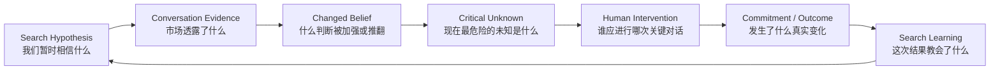

# Talent Signal 思想底稿

## 我们如何理解猎头、这个行业，以及为什么要做这个产品

> 状态：项目长期判断，不是当前功能说明
> 适用边界：高价值、关系驱动的独立猎头与精品寻访，不试图解释所有大批量招聘
> 相关材料：[候选人动量链路深度调研](deep-research-candidate-momentum-loop.md)

---

## 一、最重要的结论

猎头不是替企业“找到几份简历”。

猎头真正承接的是一个组织无法仅靠职位描述、数据库和面试流程独立完成的任务：

> **在需求尚不清楚、优质供给不可见、关键信息不对称、双方承诺不断变化的情况下，持续逼近真实，降低一次重要人才决策的不确定性，并促成一段值得双方投入的长期承诺。**

因此，猎头不是简历中介，而是三种角色的合体：

1. **组织问题的诊断者**：帮助客户发现“要招谁”背后真正要解决的业务问题。
2. **人才市场的做市者**：把原本不会相遇、不会交换真实信息的双方带到可信对话中。
3. **高风险决定的不确定性承包商**：找出当前最危险的未知，推动它在决定窗口关闭前被解决。

猎头最终交付的也不应该被理解为“一个人”，而是：

> **一个被人才市场反复检验过的组织判断，以及建立在真实理解之上的双向承诺。**

Talent Signal 如果值得存在，就不应只是帮助猎头记住更多信息、发送更多消息或管理更多候选人。它应该帮助猎头维护一个 search 中不断变化的真实：

- 我们现在相信什么；
- 这些判断来自什么证据；
- 哪些事实已经过期；
- 公司与候选人之间存在什么矛盾；
- 还有哪一个未知最可能改变结果；
- 谁应该在什么时刻介入；
- 介入之后，原来的判断是否被证实或推翻。

一句话定义：

> **Talent Signal 是高信任人才寻访的决策与学习系统。**

它的使命不是让招聘流程更自动，而是：

> **让高信任人才寻访中不断变化的真相可见、可验证、可行动，让每一次关键判断随证据进化，而不是随聊天消失。**

---

## 二、先拆掉行业里的几个默认假设

今天大多数招聘软件，以及不少猎头公司的管理方式，都建立在一组很少被重新审查的假设上。

| 行业默认假设 | 更接近现实的判断 |
|---|---|
| 客户知道自己要招什么，只需把 JD 交给猎头执行 | 客户通常知道症状，却未必知道真正需要解决的组织问题 |
| 人才是一种已经存在、等待被搜索的库存 | 人才是否愿意移动，会被时机、关系、信任和新理解共同改变 |
| Search 是从很多人逐步筛到一个人的漏斗 | Search 是用市场对话不断修正组织假设的学习过程 |
| 找不到人，主要是搜寻覆盖不足 | 很多项目在 sourcing 之前就已经因为错误 mandate、内部不一致或价值主张不成立而失败 |
| 更多候选人意味着更高成功率 | 过多无关选项会稀释判断；好猎头的价值常常是减少错误可能性 |
| 记录了对话，就拥有了真相 | 摘要只是压缩文本；真相必须有来源、时间、上下文和可反驳性 |
| 候选人状态可以用一个最新字段表达 | 人的判断会变化，旧判断为何失效与新判断本身同样重要 |
| 发出消息、安排面试就代表项目在前进 | 活动量不等于不确定性减少，也不等于承诺增加 |
| 客户是买方，候选人是被交付的对象 | 高价值寻访中双方都在做重大选择，猎头必须同时服务两边的真实 |
| AI 越自治，产品越 AI-native | 在信任型业务里，错误自治可能直接消耗最稀缺的资产：关系 |

这些假设共同形成了旧系统：

`职位 → 搜索 → 人才池 → 流程阶段 → offer → 入职`

它适合管理已经明确的流程，却不擅长表达真正决定高价值 search 成败的东西：

- 角色定义是否仍然成立；
- 客户内部是否真的一致；
- 候选人的公开表态与真实顾虑是否相同；
- 新出现的市场证据是否推翻了原来的判断；
- 双方是否只是“感兴趣”，还是已经形成可兑现的承诺。

Talent Signal 不应把这个旧系统再做一遍，只是加上 AI。

---

## 三、我们采用的七条基础事实

以下不是永恒真理，而是这个项目当前采用、并愿意接受现实检验的基石假设。

### 公理一：企业不是在购买履历，而是在购买未来结果

一个岗位存在，是因为组织希望某个未来变得可能：完成转型、进入市场、重建团队、改变增长曲线或降低某种风险。

所以“像不像过去的成功者”只能是线索，不能成为人才判断的终点。真正的问题是：

> 这个人是否可能在这个组织、这个阶段、这些约束下，创造我们需要的未来结果？

### 公理二：人不是静态库存，而是有主体性的决策者

候选人的意愿不是数据库里的固定属性。它会随着家庭、身份、风险认知、领导者可信度、机会叙事和双方互动质量变化。

“不看机会”可能在一次可信对话后变成愿意了解；“很感兴趣”也可能因为一次失信迅速归零。

因此，关系不是包裹在交易外面的软性因素。关系参与创造交易本身。

### 公理三：最重要的信息通常不是公开信息

真正决定结果的内容——客户的内部矛盾、候选人的真实顾虑、不可公开的边界、某个人的信任程度——很少完整存在于 JD、简历或公开资料里。

高价值信息只能在足够信任、足够具体、允许反悔的对话中逐步出现。

### 公理四：Search 会改变参与者，而不只是发现参与者

客户会因为市场反馈重新理解岗位；候选人会因为深入交流重新理解自己；猎头也会因为连续证据修正原来的 mapping 和判断。

所以 search 不是“先知道答案，再执行答案”，而是一个让答案逐渐显现的过程。

### 公理五：注意力有限，而决定窗口会关闭

机会、预算、候选人的耐心、竞对 offer、家庭窗口和组织共识都有时间性。

信息晚三天被理解，可能等于从未被理解。猎头的核心资源不是联系人数量，而是把有限注意力投到最可能改变结果的未知上。

### 公理六：错误匹配的代价高、反馈慢，而且由多人承担

一次高级人才误聘可能在数月之后才显现，成本由候选人、团队、业务与猎头共同承担。短期 placement 并不必然代表长期成功。

因此，系统不应只优化“更快成交”，而要优化“更早暴露不匹配”与“更高质量的双向承诺”。

### 公理七：承诺只能由人形成，不能由系统伪造

AI 可以整理证据、发现矛盾、提醒窗口、准备问题，但不能替一个人承担职业选择，也不能替猎头兑现信任。

一次被系统自动发送的“正确消息”，如果绕过了上下文和关系判断，仍可能是错误行动。

---

## 四、从这些事实推导出的猎头本质

推导链如下：

1. 企业购买的是未来结果，但自己未必能准确描述需要什么
   → 猎头首先要帮助形成并持续修正 **Search Thesis（搜索命题）**。

2. 优质人才不是公开库存，关键事实存在于私人对话
   → 猎头必须先获得交流许可与信任，才能接触真正有决策价值的信息。

3. 候选人的意愿会被对话和过程改变
   → 猎头不是把固定供给搬给固定需求，而是在构造一个双方能够认真判断彼此的市场。

4. 每次市场对话都可能改变对岗位和人的理解
   → 候选人反馈不能只留在候选人记录里，还必须反向更新客户与 search 判断。

5. 注意力有限、窗口会关闭
   → 猎头最重要的日常决定，不是“今天联系谁”，而是“今天必须先解决哪个未知”。

6. 错误匹配代价高、反馈慢
   → 猎头必须保存判断形成、改变和被验证的过程，而不只是最终结论。

7. 最终承诺只能由人形成
   → 系统应增强人的判断与关系能力，不能越过人去表演判断。

因此，我对猎头最简洁的定义是：

> **猎头是一门以信任为基础、以市场对话为方法、以降低重要人才决策的不确定性为工作的专业。**

---

## 五、我对这个行业的十七个非共识判断

### 1. 大多数失败的 search，并不是从“找不到人”开始的

它们更早就失败了：客户没有对要解决的问题形成一致理解，岗位只是历史模板，成功标准互相冲突，或者这个机会对目标人才根本不成立。

Sourcing 只是让这些问题更晚、更昂贵地暴露。

### 2. 猎头的第一产品不是 candidate list，而是 Search Thesis

人才名单是搜索命题在市场中的一次投影。命题错了，名单越长，浪费越大。

一个成熟的 Search Thesis 应说明：

- 组织真正要改变什么；
- 为什么必须是现在；
- 什么结果才算成功；
- 哪些能力可迁移，哪些背景只是代理变量；
- 目标人才为什么可能愿意承担这件事；
- 当前证据支持什么，又反驳什么。

### 3. 候选人不是漏斗里的水

漏斗模型暗示人是被动流失的同质单位。但候选人会观察、解释、比较、改变主意，也会因为过程质量重新判断客户。

对人的流程管理不能只问“在哪个 stage”，还要问“他现在如何理解这个机会，以及为什么发生了变化”。

### 4. 关系不是联系次数，而是获得真实信息与进行有效干预的许可

CRM 可以告诉我们上次什么时候联系，却无法单独说明：

- 对方愿不愿意讲真实顾虑；
- 我们是否理解他的长期动机；
- 在关键时刻，我们的建议是否有分量；
- 我们是否有资格推动下一次困难对话。

这才是关系的工作定义。

### 5. 信任不是“软技能”，而是人才市场的交易基础设施

没有信任，信息会被美化、隐藏或延迟；没有真实信息，所谓匹配只是双方公关材料的相似度。

信任降低的不是情绪成本，而是信息失真和错误承诺的概率。

### 6. 好猎头不只是增加选项，更重要的是减少无意义的可能性

市场通常奖励“更多候选人、更多触达、更多 pipeline”。但高级决策真正稀缺的是清晰度。

好猎头通过更准确的问题、更强的证据与更坦诚的排除，让双方更快知道什么不成立。减少错误可能性，本身就是价值。

### 7. 候选人的拒绝，不只是候选人状态，也是市场对客户命题的反证

如果多个高相关人才独立表达同一顾虑，产品不应创建五个分散的“candidate objection”。它应提示：

> 我们原来关于岗位、领导者、薪酬、地域或公司叙事的哪个判断可能错了？

候选人对话是 search 的传感器。

### 8. “下一步行动”不是足够深的产品答案

提醒用户发消息很容易。真正困难的是判断：

> 哪个尚未解决的不确定性，最可能改变双方的决定？

下一步行动必须服务于这个未知。否则产品只是在加速忙碌。

### 9. 最有价值的产品输出，有时是“证据不足”

生成式产品天然倾向给出答案，但重要决策中，虚假的清晰比暂时没有答案更危险。

“我们还不知道，而且缺的是哪类证据”应该是一种高质量完成态，而不是系统失败。

### 10. 猎头效率不应该用消息速度定义，而应该用“抵达真实的速度”定义

更快写 outreach、更多自动 follow-up，只降低了操作延迟。真正重要的是：

- 多快发现 mandate 不成立；
- 多快听到候选人的真实反对；
- 多快暴露双方错误预期；
- 多快让关键决策者进入同一事实空间。

我们应该优化 **time to truth**，而不只是 time to task completion。

### 11. 客户与候选人必须在产品模型中对称

如果系统只记录候选人的顾虑、承诺和变化，却不记录客户的迟疑、内部依赖、承诺违约和角色变化，它就会复制行业权力偏见，而不是描述真实。

候选人不是待管理的风险源，客户同样会制造不确定性。

### 12. 不存在脱离情境的“最佳候选人”

人的价值不能被压缩成一个跨岗位通用分数。真正可讨论的是：

- 对某个具体结果，当前有哪些支持证据；
- 哪些关键条件尚未验证；
- 哪些风险来自人，哪些来自组织环境；
- 双方能否共同形成成功所需的条件。

所以系统可以排列“猎头下一步工作的优先级”，不能排列“人的价值”。

### 13. AI 最应该替代的不是猎头，而是猎头的遗忘、认知漂移和自我欺骗

AI 擅长持续记忆、跨对话对照、发现矛盾、回到证据、提醒时间和保持结构一致。

它不擅长替人承担信任、理解沉默的分量、判断何时应该挑战客户、在承诺冲突中选择立场。

最好的 AI 不是替专家下结论，而是让专家无法轻易忘记自己为什么下过这个结论，也无法在新证据出现后假装什么都没变。

### 14. 真正的 AI-native，不是把聊天框放进 ATS

AI-native 的关键是让产品的基础对象从静态字段变成可更新、可追溯、可反驳的判断：

`证据 → 主张 → 状态变化 → 未知 → 干预 → 结果 → 学习`

如果数据模型仍然只有最新字段和 pipeline stage，AI 最终只会生成更流畅的旧工作流。

### 15. Talent Signal 应是 system of evolving belief，而不仅是 system of record

传统系统擅长回答“最后记录了什么”。这个产品更应该回答：

- 我们当时为什么相信它；
- 哪条新证据改变了判断；
- 现在还有什么互相矛盾；
- 哪个判断从“推测”变成了“承诺”；
- 这次干预最后是否有效。

它不是替代 ATS，而是补上 ATS 很少表达的认知层。

### 16. 这个产品真正的壁垒不是对话数据，而是“判断如何被纠正”的数据

转录和摘要会快速商品化。更难复制的是：

- 哪条证据让资深猎头改变了判断；
- 用户为什么推翻 AI 建议；
- 哪个问题真正暴露了隐性顾虑；
- 哪次介入修复或破坏了动量；
- placement 之后，原来的判断是否经得住结果。

这是一套带纠错和结果的专业判断语料，而不是原始聊天语料。

### 17. AI 不会平均地替代猎头，它会把行业从中间撕开

依靠公开信息搬运、简历转发、机械协调和记忆优势的价值会被迅速压缩；能够诊断组织问题、获得私人真实、形成市场判断、处理承诺冲突的专业价值会更稀缺。

所以 Talent Signal 不应该帮助“简历中介”更便宜地维持旧模式。它应该帮助真正的顾问型猎头扩大判断质量，并把个人经验变成可积累的机构能力。

---

## 六、Talent Signal 真正应该维护什么

### 核心对象不是 Candidate Profile，而是 Search Thesis

Candidate Profile 仍然重要，但它只是某个人在某个 assignment 中的局部视图。产品真正需要持续维护的是一组相互关联的对象：

1. **Search Thesis**
   这个组织为什么招人、期待什么未来结果、哪些假设正在被市场验证。

2. **Evidence**
   谁在什么时间、什么上下文中表达或观察到了什么；原文和来源必须可回看。

3. **Belief / Claim**
   我们基于证据暂时相信什么。它必须区分：
   - 已知 `Known`
   - 未知 `Unknown`
   - 矛盾 `Contradicted`
   - 已承诺 `Committed`
   - 已过期 `Expired`
   - 被取代 `Superseded`

4. **Tension / Critical Unknown**
   当前什么矛盾或未知最可能改变结果。

5. **Intervention**
   为减少某个关键未知而设计的人类行动，不是泛化的任务提醒。

6. **Commitment**
   谁明确答应了什么、条件是什么、有效期到什么时候。兴趣不是承诺。

7. **Outcome / Learning**
   行动发生了什么，原判断是否被证实，下一个 search 应学到什么。

8. **Relationship Context**
   某个人在特定关系和 assignment 中扮演什么角色，系统拥有什么权限；不能把候选人语境中的敏感事实泄漏到其他关系视图。

### 产品主循环

这条循环比单向招聘漏斗更接近高价值寻访的真实工作。

---

## 七、AI 与人的边界

### 应该交给 AI 的

- 从截图、消息、会议和笔记中提取候选事实；
- 把主张绑定到精确证据、说话人、时间与上下文；
- 发现新旧事实冲突、承诺过期和重复询问；
- 将单个候选人的反馈汇总为 search-level 市场信号；
- 提醒哪些 Search Thesis 假设正在被反复反驳；
- 提议“下一个最值得解决的未知”和相应问题；
- 在人批准后执行低风险、可撤销、可审计的操作；
- 跟踪干预结果，并把用户修正转成学习数据。

### 必须留给人的

- 判断什么对这段关系真正重要；
- 决定何时相信、质疑或挑战一条信息；
- 理解沉默、犹豫、身份、尊严和风险承受；
- 在客户与候选人利益冲突时作出专业选择；
- 决定由谁、用什么语气、在什么时刻发起关键对话；
- 承担承诺、谈判和失信的后果；
- 判断什么时候应该继续，什么时候应该诚实地停止。

### 一个重要原则

**Human in the loop 不能只是默认勾选后的确认按钮。**

如果 AI 已经替用户决定了“什么是真的、什么最重要、给谁发什么”，最后让人点一下批准，这不是人类监督，只是把责任转嫁给用户。

产品应该把人的注意力留给真正需要判断的位置：

- 身份是否正确；
- 证据是否支持该主张；
- 这条变化是否足以改变 Search Thesis；
- 哪个未知值得优先解决；
- 这段关系是否允许这样的行动。

---

## 八、我们真正优化什么

### 最终结果

> **形成高质量、可持续的双向承诺，并在入职后的真实结果中得到验证。**

placement 是重要事件，但不是完整答案。一个因信息失真、压力推动或错误预期形成的 placement，不应该被产品当成纯粹成功。

### 更早可观察的北极星指标

> **关键不确定性在决定窗口关闭前被解决的比例。**

这比“生成了多少摘要”“创建了多少任务”更接近产品价值。

可辅助观察：

- 从新证据到关键判断更新的时间；
- 重要矛盾未被看见或逾期的比例；
- 重复向候选人询问已表达信息的次数；
- Search Thesis 因市场证据被修正的频率与质量；
- 推荐干预被用户接受、修改、拒绝的原因；
- 干预后是否真的减少未知、增加承诺或及时结束错误方向；
- 客户与候选人是否认为过程更真实、更被理解；
- 入职后 6–12 个月，原有成功假设是否成立。

### 不应该成为北极星的指标

- 自动发送了多少消息；
- 处理了多少候选人；
- 生成了多少摘要；
- 自动填写了多少字段；
- 用户在产品里停留多久；
- AI 推荐的接受率；
- 单纯的 placement 数量。

这些数字可能增长，同时产品对真实决策毫无帮助。

---

## 九、这个项目明确不做什么

1. **不把人做成跨情境的统一分数。**
2. **不把候选人排序包装成猎头任务优先级。**
3. **不静默监听所有私人对话，只因为技术上可以。**
4. **不让新事实覆盖旧事实后不留痕迹。**
5. **不在证据不足时生成确定结论。**
6. **不默认自动联系候选人，不拿关系资产训练自治幻觉。**
7. **不把客户当永远正确的买方，也不把候选人当库存。**
8. **不把更多页面、更多字段、更多 agent 当成产品进步。**
9. **不替代 ATS/CRM 做完整流程记录。**
10. **不以提高短期成交率为理由，牺牲候选人的知情、尊严和长期利益。**
11. **不假装每个 search 都应该成功；及时结束错误方向也是专业结果。**
12. **不把猎头专家的方法完全固化成僵硬 SOP；系统应保留例外、异议和专业判断。**

---

## 十、每个功能都必须通过的审判

任何新功能在进入路线图前，都应该回答：

1. 它帮助我们发现或解决了哪个关键不确定性？
2. 它是否让 Search Thesis 更接近真实，还是只增加了活动量？
3. 它的结论能否回到精确证据？
4. 当新证据出现时，它是否允许旧判断被推翻？
5. 它是在增强人的判断，还是悄悄替人作出了价值判断？
6. 它是否对客户和候选人采用了同样严格的事实标准？
7. 如果它出错，会损害数据，还是会损害一段关系？
8. 用户是否能看见、修改、拒绝并追踪它的影响？
9. 它产生的数据能否帮助下一次判断更好？
10. 如果没有这个功能，用户真正损失的是什么？

如果答案只是“节省几次点击”或“看起来更 AI”，它大概率不属于产品核心。

---

## 十一、我们也可能是错的

第一性原理不是正确性的护身符。以下证据出现时，我们应该修正甚至放弃这套判断：

### 假设一：用户真正缺的是判断系统，而不只是轻量提醒

如果真实用户长期只使用截图提取、日历提醒和 CRM 写回，从不回看 Search Thesis、不处理矛盾、也不基于市场证据修正判断，那么“认知与学习系统”可能不是足够强的真实需求。

### 假设二：解决关键未知会改善 search 结果

如果在足够多的真实项目中，“更早识别并解决关键未知”与更高质量承诺、更少意外退出或更好入职结果没有关系，我们的核心因果链就是错的。

### 假设三：高信任猎头愿意把隐性判断外化

如果优秀猎头认为外化判断的成本持续高于收益，或者担心组织化记录削弱个人优势，产品不能只归因于用户抗拒改变；它必须重新设计价值交换。

### 假设四：AI 可以在不伤害关系的前提下参与这一过程

如果候选人和猎头持续认为提取、记忆或建议本身侵犯了私人对话边界，即便满足法律要求仍无法建立信任，产品必须收缩数据范围和 AI 权限。

### 假设五：判断纠错与结果数据能够形成壁垒

如果用户修正高度个人化、无法迁移，结果反馈又过慢或不可获得，那么它可能只是一种产品质量机制，而不是商业壁垒。

### 假设六：我们选择的市场边界足够重要

这份判断只适用于高价值、关系驱动的 search。若目标用户实际上主要从事高批量、低接触、强标准化招聘，则这个产品哲学与市场并不匹配，不应该硬把现实解释成愿景。

---

## 十二、这家公司为什么值得存在

如果 Talent Signal 只是让猎头每天多处理二十个人，它不值得成为一家公司。大平台、ATS 和通用 AI 最终都能完成这件事。

它值得存在的理由应该更大，也更难：

> **让依赖个人记忆、直觉和私人对话的高价值人才判断，第一次能够保留其证据、时间、矛盾与变化；既不把人简化成分数，也不让专业判断随从业者离开而消失。**

长期看，它应该完成一次能力迁移：

`明星顾问个人脑中的经验`

→ `可回溯但不僵化的判断过程`

→ `团队能够共同修正的搜索认知`

→ `随每次真实结果持续增长的机构智慧`

这不是把专家标准化，而是让专家的判断能够被记住、被挑战、被证明，也被下一次 search 使用。

---

## 十三、最后的产品宣言

我们不相信人才是一种等待匹配的库存。

我们相信每个重要人才决定，都是两方在不完整信息中对未来作出的共同下注。

我们不把猎头理解为更高效的简历搬运者。

我们把猎头理解为组织问题的诊断者、人才市场的做市者、真实信息的守护者，以及关键承诺的推动者。

我们不追求让 AI 看起来像一个无所不能的猎头。

我们追求让 AI 成为证据的保管者、矛盾的发现者、时间的守望者和专家自我欺骗的对手。

我们不以自动化程度衡量产品先进性。

我们以它是否帮助人更早看见真实、更诚实地改变判断、更尊重地作出承诺来衡量。

我们最终要保护的，不是一条 pipeline。

> **我们要保护的是：在正确的人与正确的问题真正相遇之前，那些微弱、易失、却足以改变决定的信号。**
